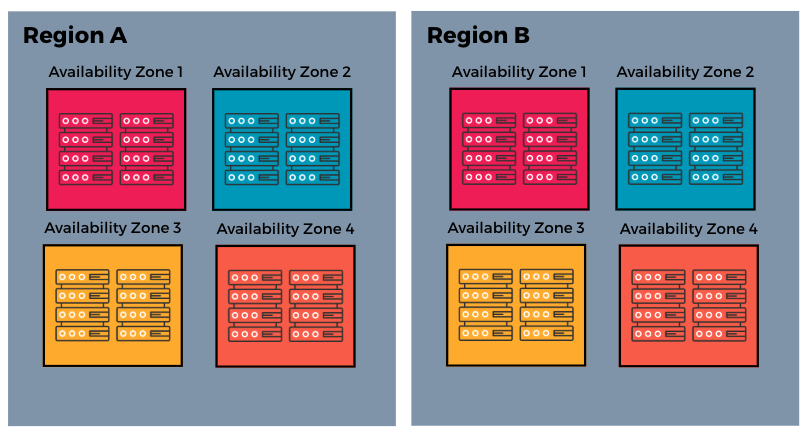

# Introduction to Load Balancing & Availability Zones

## Learning Goals

- Explain what a load balancer is and describe its role in distributing traffic across multiple servers.
- Compare common load balancing routing strategies and identify the appropriate use case for each.
- Define an availability zone and describe its relationship to a cloud region and physical infrastructure.
- Explain how distributing servers across availability zones reduces the impact of a localized failure.

## Load Balancing

When an application is deployed to a single server, every request that comes in is handled by that one machine. This works well when traffic is low and predictable, but it creates two problems as an application grows. First, a single server has a finite amount of resources. When the number of incoming requests exceeds what that server can handle, performance degrades and requests begin to fail. Second, a single server is a single point of failure. If that server goes offline for any reason, the entire application becomes unavailable.

One solution to both of these problems is to run multiple instances of the application and distribute incoming traffic across them. But this introduces a new question: when a user sends a request, how does it know which instance to go to? A **load balancer** answers that question. A load balancer is a component that sits between the user and a fleet of servers. It receives every incoming request and directs it to one of the available servers based on a set of rules. 
- From the user's perspective, they are communicating with a single address. 
- Behind the scenes, the load balancer is distributing their requests across many servers.

*Fig. Requests from multiple clients travel across the internet to a load balancer, which distributes each request to one of several available servers.*

## Routing Strategies

A load balancing algorithm is the set of rules a load balancer follows to determine which server should handle each incoming request. These algorithms fall into two categories: static and dynamic.

**Static load balancing** algorithms follow fixed rules and do not take the current state of the servers into account when making routing decisions. They are simpler to configure and work well when servers are similar in capacity and requests are similar in the amount of work they require.

**Dynamic load balancing** algorithms examine the current state of the servers before making routing decisions. Since they factor in real-time conditions, they can distribute traffic more efficiently when servers have different capacities or when requests vary significantly in how long they take to process.

Each of these categories can be subdivided further by specific routing strategies. We'll look at some common options for each algorithm next!

### Static Load Balancing

- **Round-robin** is the simplest routing strategy. The load balancer distributes requests to each server in turn, cycling through them in order. The first request goes to server one, the second to server two, the third to server three, and then the cycle repeats. Round-robin works well when servers are roughly equal in capacity and requests require roughly equal amounts of processing.

- **Weighted round-robin** builds on the round-robin method by allowing different weights to be assigned to each server based on its capacity. A server with a higher weight receives a proportionally larger share of incoming requests. For example, if server A has a weight of three and server B has a weight of one, server A will receive three requests for every one request that server B receives. This is useful when servers in a fleet have different amounts of resources available.

- **IP hash** uses the client's IP address to determine which server handles its requests. The load balancer runs the IP address through a hashing function that converts it to a number, which is then mapped to a specific server. Since the same IP address always produces the same result, the same client is always routed to the same server. 

### Dynamic Load Balancing

- **Least connections** routes each incoming request to the server that currently has the fewest active connections. Unlike round-robin, which distributes requests evenly by count, least connections distributes them based on current load. This avoids sending new requests to servers that are already under heavy load.

- **Weighted least connections** builds on the least connections method by allowing different weights to be assigned to each server based on its capacity. When a new request arrives, the load balancer considers both the number of active connections and the weight of each server before deciding where to route the request. This means a more powerful server can be assigned a higher weight and will therefore handle a larger share of connections before the load balancer considers it equally loaded to a less powerful server.

- **Least response time** routes requests to the server that has both the fewest active connections and the lowest average response time. Response time is the total time a server takes to process a request and send a response back. By combining these two factors, this algorithm ensures that requests are routed to servers that are not only less busy but also performing well, which can result in faster response times for users.

- **Resource-based** routing distributes traffic by analyzing the current resource usage of each server. Specialized software called an agent runs on each server and reports metrics such as CPU usage and available memory back to the load balancer. Before routing a request, the load balancer checks whether a server has sufficient free resources to handle it. This is the most precise dynamic algorithm because it routes based on what a server can actually handle at that moment rather than using connections or response time as a proxy for load.

## Health Checks

A load balancer is only useful if it is routing traffic to servers that are actually able to handle requests. To ensure this, load balancers use health checks. A **health check** is a periodic request that the load balancer sends to each server to verify that it is running and responsive. The load balancer sends these requests at a defined interval, for example every 30 seconds, to a specific endpoint on the server. If the server responds as expected, the load balancer considers it healthy and continues routing traffic to it. If the server fails to respond, or responds with an error, the load balancer marks it as unhealthy and removes it from rotation. Once a server that was previously unhealthy begins responding to health checks successfully again, the load balancer can add it back into rotation.

Health checks make a system more resilient without requiring manual intervention. If a server crashes or becomes unresponsive at any point, the load balancer detects the failure automatically and redistributes traffic to the remaining healthy servers. From the user's perspective, the application continues to function even though one of the servers behind the load balancer is no longer available. 

Removing an unhealthy server from rotation does not fix the underlying problem. The server still needs to be investigated and repaired. Health checks give a system the ability to protect users from a degraded server, but they are not a substitute for monitoring and diagnosing the root cause of the failure.

## Availability Zones

Load balancing solves the problem of distributing traffic across multiple servers, but it does not on its own address a more fundamental question: what happens if the physical infrastructure those servers run on fails? A single data center, no matter how well maintained, is vulnerable to localized failures. A power outage, a cooling system failure, or a network disruption can take an entire facility offline. If all of a system's servers are running in that one location, the application goes down with it regardless of how many servers are behind the load balancer. Cloud providers address this problem through availability zones.

A **region** is a geographic area where a cloud provider operates infrastructure. Examples of regions include the eastern United States, western Europe, and Southeast Asia. Each region is a distinct location, and cloud providers typically operate many regions around the world. Within each region, a cloud provider operates multiple availability zones. An **availability zone** is a physically separate data center, or cluster of data centers, within a region. Each availability zone has its own independent power supply, cooling system, and network connections. This physical separation means that a failure in one availability zone, such as a power outage, does not affect the others.

*Fig. Two cloud regions, each containing four availability zones. Each availability zone is a physically separate location with its own independent infrastructure.*

Major cloud providers typically offer three or more availability zones per region. This gives development teams the ability to distribute their infrastructure across multiple isolated locations within a geography that still keeps data and users relatively close together. The key concept behind availability zones is fault isolation. Since each availability zone is physically separate and independently powered, a failure in one zone is contained within that zone and does not propagate to others, which makes them useful for building resilient systems. To take advantage of fault isolation, a team deploys their application across multiple availability zones rather than concentrating everything in one. How that distribution works in practice is where load balancers and availability zones come together.

## Load Balancers and Availability Zones Working Together

Load balancing and availability zones are most powerful when used together. On their own, each concept addresses a different problem. A load balancer distributes traffic across multiple servers, and availability zones protect against localized infrastructure failures. Combined, they form the foundation of a highly available system, which refers to a system designed to remain operational and accessible even when individual components fail.

In a single-zone deployment, all of an application's servers run in one availability zone. A load balancer can still distribute traffic across those servers, but if the zone itself goes offline, every server in the fleet becomes unreachable at once. The load balancer has no healthy servers left to route traffic to, and the application goes down.

In a multi-zone deployment, instances are distributed across multiple availability zones. The load balancer routes incoming traffic across all of the healthy instances regardless of which zone they are running in. If one availability zone goes offline, the load balancer detects that the instances in that zone are no longer responding to health checks and removes them from rotation. Traffic is then redistributed to the instances running in the remaining healthy zones, and the application continues to serve users. From the user's perspective, the application remains available. They may not notice anything at all, though the system is now operating with reduced capacity until the affected zone recovers or new instances are launched in another zone to compensate.

Distributing infrastructure across multiple availability zones increases the resilience of a system, but it comes with trade-offs. Running instances in multiple zones means running more instances overall, which increases infrastructure costs. Cloud providers also typically charge for data that travels between availability zones, which can add up in systems where instances communicate frequently with each other or with a shared database.

Multi-zone deployments are also more complex to configure and maintain than single-zone deployments. There are more components to manage, more failure scenarios to plan for, and more considerations around how data stays consistent across zones. For most production applications that serve real users, these trade-offs are worth making. For development and staging environments, or for internal tools with low availability requirements, a single-zone deployment is often the more practical choice.

## Summary

In this lesson, we explored two foundational concepts in cloud infrastructure: **load balancing** and **availability zones**. A load balancer sits between users and a fleet of servers, distributing incoming traffic according to a routing algorithm. 
- **Static algorithms** follow fixed rules
- **Dynamic algorithms** factor in the real-time state of each server. 

**Health checks** allow the load balancer to detect unhealthy servers and remove them from rotation automatically. **Availability zones** extend this resilience to the physical infrastructure level: by distributing servers across multiple isolated data centers within a region, a team ensures that a localized failure in one zone does not take the entire application offline. 

When load balancing and availability zones are used together, traffic is automatically rerouted away from any zone that goes offline, keeping the application available to users. This increased resilience comes with higher infrastructure costs and greater operational complexity, trade-offs that are generally worth making for production applications but less necessary for development environments and internal tools. These concepts will come up again throughout the rest of the curriculum as we look more closely at how cloud systems are designed to stay reliable under real-world conditions.

## Check for Understanding

### !challenge
<!-- Question 1 -->
* type: multiple-choice
* id: d4639afc-cc91-4660-ba58-d3b414d39a63
* title: Load Balancing & Availability Zones

##### !question
Your team maintains several servers behind a load balancer. Two of the servers were recently upgraded and now have significantly more CPU and memory than the others. Which routing strategy would best take advantage of the upgraded servers' additional capacity?
##### !end-question

##### !options
a| Round-robin, because it distributes requests evenly across all servers in turn.
b| Least connections, because it routes requests to the server with the fewest active connections.
c| Weighted round-robin, because it allows different weights to be assigned to each server based on its capacity.
d| IP hash, because it maps each client to a specific server based on their IP address.
##### !end-options

##### !answer
c|
##### !end-answer

#### !explanation 
Weighted round-robin allows you to assign a higher weight to the more powerful servers so they receive a proportionally larger share of incoming requests. Round-robin would treat all servers equally regardless of their capacity, which means the upgraded servers would be underutilized.
#### !end-explanation 
### !end-challenge

<!-- Question 2 -->
### !challenge
* type: multiple-choice
* id: 560a02d8-8306-4701-846b-b6756c1c7358
* title: Load Balancing & Availability Zones

##### !question
A load balancer is configured with health checks that run every 30 seconds. One server in the fleet begins responding to requests with errors due to a memory leak. Which of the following is true about how the load balancer will react?
##### !end-question

##### !options
a| The load balancer restarts the unhealthy server and continues routing traffic to it while it recovers.
b| The load balancer removes the unhealthy server from rotation automatically, but this does not fix the underlying problem on the server.
c| The load balancer permanently removes the unhealthy server from the fleet and replaces it with a new one.
d| The load balancer continues routing traffic to all servers equally, including the unhealthy one, until a developer intervenes.
##### !end-options

##### !answer
b|
##### !end-answer

#### !explanation 
Health checks allow the load balancer to detect an unhealthy server and stop sending traffic to it automatically, which protects users from receiving errors. However, the load balancer cannot repair the server itself. The memory leak still needs to be investigated and resolved by the team.
#### !end-explanation 
### !end-challenge

<!-- Question # 3 -->
### !challenge
* type: multiple-choice
* id: bcfe63ee-0090-4b1e-839e-3fcd3a6a55ac
* title: Load Balancing & Availability Zones

##### !question
A team runs their application on three servers, all located in a single availability zone. A power outage takes that availability zone offline. Compare this outcome to a deployment where one server runs in each of three availability zones with a load balancer in front.
##### !end-question

##### !options
a| Both deployments experience an outage, because a power outage always affects all availability zones in a region simultaneously.
b| The single-zone deployment goes down entirely, but the multi-zone deployment continues serving users because the load balancer reroutes traffic to the servers in the unaffected zones.
c| The single-zone deployment goes down entirely, and the multi-zone deployment also goes down because the load balancer itself is located in the failed zone.
d| Both deployments stay online, because load balancers automatically restart servers in a different availability zone when one goes offline.
##### !end-options

##### !answer
b|
##### !end-answer

#### !explanation 
Availability zones are physically separate with independent power supplies, so a failure in one zone does not affect the others. In the multi-zone deployment, the load balancer detects that the server in the failed zone is no longer responding to health checks, removes it from rotation, and continues routing traffic to the servers in the remaining healthy zones.
#### !end-explanation 
### !end-challenge