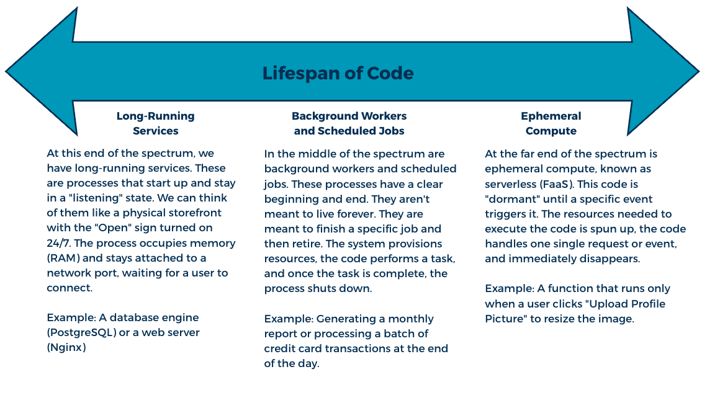

# Long-Running versus Ephemeral Compute

## Learning Goals
- Differentiate between persistent, long-running versus ephemeral, short-lived execution models and begin to identify appropriate use cases for each.
- Explain the architectural shift required to move from stateful to stateless compute.
- Recognize the importance of idempotency and retry logic in distributed, short-lived systems.
- Analyze a system's requirements to determine which components should live indefinitely versus on-demand.

### The Compute Lifespan

In traditional computing, software was often tightly coupled with a specific piece of hardware. If you turned the computer off, the software stopped working. In the cloud, the code has been decoupled from the physical machine, which allows developers to determine exactly how long a piece of code should stay active.

To understand the differences in lifespans, cloud engineers often use the ["Pets vs. Cattle"](https://cloudscaling.com/blog/cloud-computing/the-history-of-pets-vs-cattle/) analogy, first coined by Randy Bias. Traditionally, servers were like pets. You gave them names (e.g., "Production-DB-01"), you nurtured them, and if they crashed, you worked hard to nurse them back to health. In the cloud, we treat servers like cattle in a herd. They are identified by numbers, and if one becomes unhealthy, you don't fix it because you can replace it with a new one. This shift in mindset is what makes modern cloud scaling possible.

We can visualize the lifespan of code as a continuum. On one end, we have code that can live for years, and on the other end, we have code that can live for less than a second. The diagram below explains this continuum with a couple of examples.

*Fig. The lifespan of code can be visualized as a continuum with one end being long-lasting processes and the other being very short-lived processes. [(Full size image)](assets/code-lifespan.png)*

Why does this lifespan matter? As a developer, choosing where our code falls on this continuum changes how we write it. If our code lives for a long time, we can rely on its internal memory. If our code is ephemeral, we must assume it will forget everything the moment it finishes executing. Therefore, when we move from long-running to ephemeral compute, we aren't just changing how long our code runs, but we are also changing how the code "thinks." We will dive deeper into each of these 3 lifespans we just introduced below. 

#### Long-Running Services

While the cloud has made ephemeral compute popular, long-running services are still important to systems. A long-running service is a process that starts up, initializes its environment, and then enters a state where it stays active indefinitely, waiting to handle requests. We can think of a long-running service like a power plant where it does not turn off when we flip a switch off. It is always ready for the moment when we flip a switch on and the response is almost instantaneous.

Long-running services are defined by their persistence. Since the process does not terminate after a single task, it maintains a consistent presence in the system’s memory and network. This means that a person or a cloud provider's system is responsible for the health of the process and if the service crashes, it must be manually or automatically restarted. In the Infrastructure as a Service (IaaS) and Platform as a Service (PaaS) models, long-running instances are the default. However, constant availability can incur greater cloud computing costs since the instances running processes, services, or applications are always on. 

Workload characteristics, like a need for stability and consistent performance, would help determine if the use of instances in long-running environment are necessary or not. These needs should be balanced with cost-saving strategies and operational efficiency to keep cloud spending within an organization's budget.

#### Background Workers and Scheduled Jobs

If a long-running service is like a power plant that is always on, background workers are like the maintenance crew that clocks in, performs a specific list of tasks, and clocks out. In a typical web application, we don't want our main API to get bogged down by heavy lifting. If a user uploads a high-resolution profile picture, the API shouldn't make the user wait while it resizes the image into a different format. Instead, the API hands that task off to a background worker. These workers run independently of the main user request.

We also encounter tasks that don't need to respond to a specific user action but instead need to happen at a regular interval. These scheduled jobs are cron jobs. While a standard background worker might wait for a specific user action to trigger it, these jobs are tied strictly to the clock. We might configure a task to execute every night at 2:00 in the morning after peak traffic has subsided to perform essential tasks like generating daily financial reports. In this model, we aren't paying for idle resources to keep the financial reporting code active all day. Instead, the process has a very clear lifespan: it initializes at the scheduled time, performs its task, and shuts down immediately after. 

These processes aren't "always on" like servers that are always waiting for a network request, but they often run on the same long-lived infrastructure. As developers, we care about this distinction because it changes how we measure success. For our web APIs, we monitor "uptime". For background workers and scheduled jobs, we monitor "completion." 

#### Ephemeral Compute

As we move further down the continuum from pet toward the cattle side of the analogy, we reach ephemeral computing. This is often referred to in the industry as serverless computing (FaaS). While our background workers might live on a server that stays powered on, ephemeral compute takes the concept of a task-defined lifespan to its logical extreme. In this model, the code doesn't exist in a running state at all until a specific event triggers it.

When an event occurs, perhaps a user uploads a file to a storage bucket or an external service sends a request, the cloud provider instantly provisions a small, isolated container and injects our code, executes it, and then immediately destroys the container. This strategy, often called "scaling to zero", ensures that resources that are no longer being used to execute a task will automatically be suspended. This strategy replaces the need for persistent, idle infrastructure with on-demand resources which allows organizations to save on cloud computing costs. However, this cost-saving strategy also comes with the challenge of needing to account for the cold starts that are associated with serverless computing like we previously mentioned. Understanding strategies for mitigating cold starts is out of scope for this lesson, but feel free to explore your curiosity!

### Stateless versus Stateful Environments

The shift to ephemeral computing forces us to change how we think about data and memory. In a stateful environment, like a long-running service, we can store a variable and trust that it will still be there when the next request arrives. The process remembers its state. However, with ephemeral computing, our code is stateless because the environment is wiped clean the moment a task is finished executing. Our code effectively has "short-term memory loss."

To succeed in this environment, we have to change how we write our logic. When we write code for ephemeral compute, we treat every execution as if it is the very first time the code has ever run. Instead of relying on stored data, we need to design our code take simply take an input, perform a calculation on it, and return the output. If data is required for a process to execute then that data should be passed through by function parameters or event payloads. Serverless compute tasks can also integrate with other services or databases to externalize state.

To illustrate how we might bridge this gap in practice, here are a couple of examples of how we might structure our logic when the data we need isn’t included in the initial event:
- When an event payload contains a unique identifier, like `userId`, we could utilize database lookups. Instead of passing an entire user profile through a network request. which would be bulky and potentially insecure, we write our function to take that ID and query a persistent database like PostgreSQL or MongoDB. This allows the function to remember information about the user (like the user's preference or subscription status) by pulling that data from our externalized state.
- When an event payload has limited size and large files cannot be sent along with the request, then we could integrate the use of an object storage service. If a user uploads a high-resolution photo, the request payload doesn't contain the photo itself. The request contains a "pointer" or a file path to the photo. Our function receives that path, accesses the storage service, downloads the file into its temporary execution environment, processes it, and then pushes the result out. This allows us to handle massive amounts of data without ever worrying about the size limits of the initial request.

Ultimately, by decoupling our logic from data, we shift the responsibility of memory away from the code and onto a robust ecosystem of supporting services, allowing our compute to remain fast, flexible, and stateless.

### Retries and Idempotency

When we move to a distributed system where code might only live a few seconds, we have to accept that things will occasionally fail and plan for these failures. A network blip, a temporary database lockout, or a cloud provider’s internal hiccup might kill a function halfway through its job. Since these environments are short-lived, we cannot bring them back to a healthy state like we would a long-running server. Instead, we have to design a safe-to-fail environment. To make our systems resilient, we rely on two core concepts: retries and idempotency. 

Most modern cloud platforms handle failure by implementing automatic retries. If an ephemeral function crashes or fails to return a successful response, the platform will simply spin up a new instance and try again. While this is a powerful safety net, it introduces a significant risk. If our function was in the middle of a task, like charging a credit card, and it crashed after the task was done but before it could report success, the automatic retry would result in the task being performed a second time. In this example, a customer might be charged multiple times for one transaction.

To prevent these kinds of errors, we must ensure our logic is idempotent. An idempotent operation is one that can be performed multiple times without changing the result beyond the initial application. In practice, we often achieve this by using idempotency keys, which are unique identifiers, or some other transaction IDs. Before our code executes a critical action, it checks our externalized state to see if that specific ID has already been marked as "processed." If it has, the function simply exits with a success message without repeating the work. In the example above, to ensure a customer's credit card is not incorrectly charged, we can write our code to check for a unique key and if that key is already associated with a credit card charge then the function can return without charging the user again. In this way the system is safe to fail because the tasks are safe to repeat.

### Which Model When?

Choosing between these lifespans is rarely an "all or nothing" decision. Most modern architectures we will encounter use a hybrid approach that plays to the strengths of each model depending on the use cases associated with business needs. We typically keep our core API as a long-running service because we want the lowest possible latency for our users and we have a predictable, steady flow of traffic. These are the components we monitor closely for health and performance, ensuring they are always ready to respond.

However, we offload the heavy or unpredictable work to ephemeral compute. If our application suddenly goes viral and 10,000 people upload photos at once, we don't want our main API to crash under the pressure of processing all those files. By using ephemeral functions, the cloud can instantly spin up 10,000 tiny workers to handle the load in parallel and then remove them once the work is done. This allows us to balance the stability of long-running services with the infinite scalability and cost-efficiency of the ephemeral model.

## Summary

The question "how long does code live?" is one of the most fundamental questions we ask when designing for the cloud. We’ve seen that as the lifespan of our code shrinks, our architecture must evolve.

- Long-running services provide persistent memory and instant availability but require us to manage "pets" and pay for idle time.
- Background workers allow us to move heavy tasks out of the user's path, living only as long as the task itself, but often on the same instances as our long-running services.
- Ephemeral compute offers the ultimate flexibility and cost savings, but requires us to implement stateless logic and idempotent design.

By understanding this continuum, we can stop treating the cloud like a simple remote hard drive and start treating it like a dynamic, living ecosystem where every piece of code exists exactly as long as it needs to.

## Check for Understanding

<!-- Question 1 -->
### !challenge
* type: multiple-choice
* id: d5c342c3-2830-4851-8d84-0adcf1f2fbc5
* title: Long Running & Ephemeral Compute

##### !question
We are building a service that processes user-uploaded PDFs to extract text. We’ve decided to use an ephemeral function with serverless computing to handle the extraction because the traffic is bursty and can happen at irregular intervals. Where should we store the information related to progress status (e.g., "Extraction is 50% complete") so that a user cans see it on their dashboard? 
##### !end-question

##### !options
* In a global variable inside the function code.
* In a local temporary folder on the function's execution environment.
* In an external database or cache.
* In the function's internal RAM.
##### !end-options

##### !answer
* In an external database or cache.
##### !end-answer

#### !explanation 
Since ephemeral computing is stateless, any data stored in RAM, global variables, or local disks vanishes the moment the function finishes its task or when the environment is destroyed. To ensure the progress status persists and can be read by other parts of our system, we must externalize that state to a persistent, shared location like a database.#### !end-explanation 
#### !end-explanation 
### !end-challenge

<!-- Question 2 -->
### !challenge
* type: multiple-choice
* id: 9e6a13e4-36f6-4678-9451-241e6868fa4a
* title: Long Running & Ephemeral Compute

##### !question
We have an ephemeral function that sends a "Welcome Email" to new users. We noticed that occasionally, due to network timeouts, the cloud provider retries the function, resulting in some users receiving the same email two or three times. What is the most effective way to make this operation idempotent?
##### !end-question

##### !options
* Increase the timeout of the function so it has more time to finish.
* Before sending the email, check a database to see if a "WelcomeEmailSent" flag exists for that specific userId.
* Disable automatic retries in the cloud provider's settings.
* Use a faster email API to reduce the chance of a timeout.
##### !end-options

##### !answer
* Before sending the email, check a database to see if a "WelcomeEmailSent" flag exists for that specific userId.
##### !end-answer

#### !explanation 
Idempotency ensures that performing an operation multiple times has the same effect as doing it once. By checking for a unique identifier (the idempotency key) before acting, we ensure that even if the cloud provider triggers a retry, our code remembers that it already succeeded and skips the duplicate action.
#### !end-explanation 
### !end-challenge

<!-- Question # 3 -->
### !challenge
* type: multiple-choice
* id: 0073ad5e-e26b-4806-866d-d5329abcbe8a
* title: Long Running & Ephemeral Compute

##### !question
We are designing a real-time collaborative code editor (similar to VS Code Live Share) where multiple developers need a constant, low-latency connection to a shared session to see each other's typing in real-time. Which compute model is the most appropriate for managing these active connections?
##### !end-question

##### !options
* Ephemeral compute (serverless functions)
* Long-running services (IaaS or PaaS instances)
* Scheduled jobs (cron jobs)
* Short-lived background workers
##### !end-options

##### !answer
* Long-running services (IaaS or PaaS instances)
##### !end-answer

#### !explanation 
Real-time features require a persistent, always-on connection between the client and the server to maintain low latency. Ephemeral compute is a poor fit here because it is designed to shut down after a few minutes, which would constantly drop the users' connections and force "cold starts" every time someone typed a character.
#### !end-explanation 
### !end-challenge