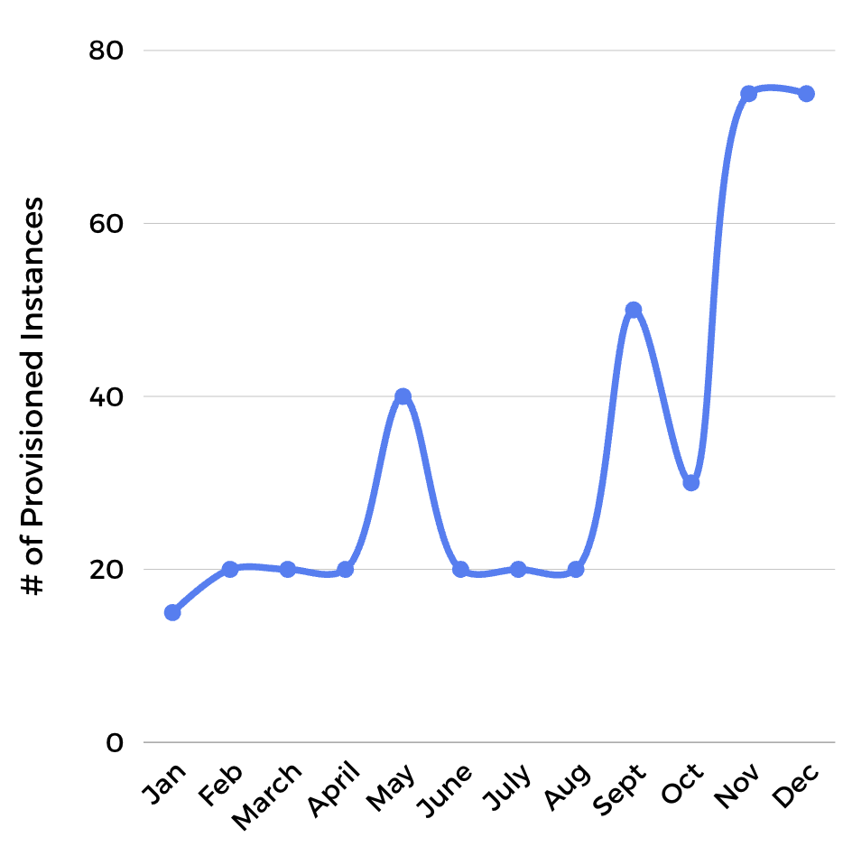

# Problem Set: Compute and Execution Models

## Lesson Review

<!-- Question 1 -->
### !challenge
* type: multiple-choice
* id: 98f884cd-74b0-493a-9ebf-17711cafe22e
* title: Lesson Review

##### !question
A startup is launching a new API. They need full control over the operating system because they must install custom networking software. They are comfortable managing patches and scaling policies. Which compute model is most appropriate?
##### !end-question

##### !options
* FaaS (Function as a Service)
* PaaS (Platform as a Service)
* IaaS (Infrastructure as a Service)
* SaaS (Software as a Service)
##### !end-options

##### !answer
* IaaS (Infrastructure as a Service)
##### !end-answer

#### !explanation 
IaaS is the only model that provides root access to the virtual machine, allowing for the installation of custom networking software, kernel modules, or specific OS configurations that are abstracted away in PaaS and FaaS.
#### !end-explanation 
### !end-challenge

<!-- Question 2 -->
### !challenge
* type: multiple-choice
* id: f16dfe3a-b249-4199-be23-950a5fed059e
* title: Lesson Review

##### !question
A retail website prepares for Black Friday by provisioning additional compute capacity two weeks in advance based on projected traffic. During the event, capacity remains fixed unless engineers manually intervene. Which scaling approach is primarily being used?
##### !end-question

##### !options
* Horizontal Auto-scaling
* Manual Scaling
* Scale-to-Zero
* Vertical Auto-scaling
##### !end-options

##### !answer
* Manual Scaling
##### !end-answer

#### !explanation 
Because the capacity was increased in advance and remains fixed regardless of real-time fluctuations (unless an engineer intervenes), this is a manual, provisioned scaling approach. It contrasts with auto-scaling, which reacts dynamically to traffic.
#### !end-explanation 
### !end-challenge

<!-- Question 3 -->
### !challenge
* type: multiple-choice
* id: e92728cf-5b4d-4f4e-beb0-3b2c0c3dd2a7
* title: Lesson Review

##### !question
Which statement best describes the tradeoff between IaaS and serverless computing?
##### !end-question

##### !options
* IaaS offers higher developer velocity, while serverless offers more granular hardware control.
* IaaS requires less operational overhead, while serverless requires manual OS patching.
* IaaS provides maximum control over the environment, while serverless minimizes management burden at the expense of environmental flexibility.
* There is no tradeoff, both models require the same amount of infrastructure management.
##### !end-options

##### !answer
* IaaS provides maximum control over the environment, while serverless minimizes management burden at the expense of environmental flexibility.
##### !end-answer

#### !explanation 
The selection matrix shows that as you move from IaaS to serverless, you gain speed (velocity) when it comes to developing software and reduce maintenance, but you lose the ability to customize the underlying OS or hardware.
#### !end-explanation 
### !end-challenge

<!-- Question 4 -->
### !challenge
* type: multiple-choice
* id: 96199d23-5472-4061-ab01-c2baf6ef0a57
* title: Lesson Review

##### !question
An e-commerce site runs continuously on provisioned virtual machines. The team manually increases capacity during peak seasons (see diagram below). Which compute and scaling model combination is being used?

##### !end-question

##### !options
* IaaS with Manual Scaling
* PaaS with Auto-scaling
* FaaS with Consumption-based Scaling
* IaaS with Scale-to-Zero
##### !end-options

##### !answer
* IaaS with Manual Scaling
##### !end-answer

#### !explanation 
Virtual machines are the hallmark of IaaS. Because the capacity is "provisioned" (always on) and adjusted manually by the team rather than automatically by a policy, it is a manual scaling model.
#### !end-explanation 
### !end-challenge

<!-- Question 5 -->
### !challenge
* type: multiple-choice
* id: ec8c0396-d247-4db0-a91f-b3837b66750d
* title: Lesson Review

##### !question
A small internal tool originally ran as a long-running VM service with steady traffic. Over time, usage becomes unpredictable with extreme spikes and long idle periods. What is the most likely reason the team might reconsider its compute model?
##### !end-question

##### !options
* To gain more control over the Linux kernel version.
* To reduce costs by switching to a consumption-based model (FaaS) that scales to zero during idle periods.
* To increase the operational tax required to maintain the tool.
* Because long-running VMs are the most efficient way to handle unpredictable, spiky traffic.
##### !end-options

##### !answer
* To reduce costs by switching to a consumption-based model (FaaS) that scales to zero during idle periods.
##### !end-answer

#### !explanation 
When traffic becomes intermittent or spiky, a provisioned VM is inefficient because you pay for the idle time. Moving to a model that scales to zero (like FaaS) ensures you only pay for actual execution time, significantly reducing the cloud bill.
#### !end-explanation 
### !end-challenge

## Case Study Review

Read this [case study](https://www.qovery.com/blog/how-doordash-migrated-from-heroku-to-aws) about how DoorDash migrated from Heroku to AWS. DoorDash is a major food delivery platform that started its journey on a Platform as a Service (PaaS) called Heroku before migrating to Infrastructure as a Service (IaaS) using Amazon Web Services (AWS) and Docker. As you read, look for the tipping points that required them to change their compute model.

Using the information from this case study and what we covered in this lesson, answer the following questions.

<!-- Question 1 -->
### !challenge
* type: multiple-choice
* id: 93aecbcf-cdd3-4206-8e84-bebcf78224e1
* title: Case Study Review

##### !question
In the early days of DoorDash, the team chose Heroku (a PaaS) even though it was more expensive per server than raw AWS instances (IaaS). Why was a high-abstraction model like Heroku the correct choice for a small startup team at that stage?
##### !end-question

##### !options
* Because Heroku is always cheaper than AWS, regardless of team size or scale.
* Because it allowed the small team to delegate the operational overhead (OS patching, scaling) to the provider and focus entirely on building product features.
* Because Heroku is the only compute model that supports the Ruby on Rails language.
* Because PaaS models provide more granular hardware control than IaaS models.
##### !end-options

##### !answer
* Because it allowed the small team to delegate the operational overhead (OS patching, scaling) to the provider and focus entirely on building product features.
##### !end-answer

#### !explanation 
For a small team with limited headcount, the human cost of managing infrastructure is higher than the direct cloud bill. By choosing PaaS, they minimized their operational overhead, trading higher service costs for faster developer velocity.
#### !end-explanation 
### !end-challenge

<!-- Question 2 -->
### !challenge
* type: multiple-choice
* id: 2372beeb-6e59-4784-856e-2e669d3770d3
* title: Case Study Review

##### !question
As DoorDash grew, they hit a point where the PaaS model could no longer meet their technical needs, specifically regarding how they handled background tasks and specific networking configurations. Based on the lesson, what hard limitation or configuration challenge often forces a company to migrate from a PaaS to a model like IaaS?
##### !end-question

##### !options
* The need for scale-to-zero capabilities.
* The requirement to only use standard, pre-installed language runtimes.
* The need for custom kernel tuning, specific filesystem access, or lower-level networking control not exposed by the PaaS provider.
* The desire to pay more for managed services to reduce engineering effort.
##### !end-options

##### !answer
* The need for custom kernel tuning, specific filesystem access, or lower-level networking control not exposed by the PaaS provider.
##### !end-answer

#### !explanation 
High-abstraction models like PaaS/FaaS limit your access to the underlying OS. When an application reaches a certain complexity, requiring custom network protocols or specialized system-level optimizations, the team must move to IaaS to gain the necessary access.
#### !end-explanation 
### !end-challenge

<!-- Question 3 -->
### !challenge
* type: multiple-choice
* id: 6f19d9b1-8f55-4066-ba02-70043878bdab
* title: Case Study Review

##### !question
While the case study focuses on their move to IaaS (EC2) for their core app, modern DoorDash uses a Multi-Model Architecture. Why wouldn't DoorDash move their entire, high-traffic core ordering system into a FaaS (Serverless) model like AWS Lambda?
##### !end-question

##### !options
* Because FaaS does not support modern programming languages.
* Because the high, constant volume of orders would be significantly more expensive on a pay-per-request FaaS model compared to provisioned IaaS servers.
* Because FaaS allows for too much control over the underlying operating system.
* Because FaaS models do not allow for any scaling in production.
##### !end-options

##### !answer
* Because the high, constant volume of orders would be significantly more expensive on a pay-per-request FaaS model compared to provisioned IaaS servers.
##### !end-answer

#### !explanation 
For steady traffic that never drops to zero, provisioned billing (IaaS/PaaS) is almost always cheaper. FaaS is optimized for spiky or intermittent traffic. Using FaaS for a constant, million-request-per-hour stream would be more expensive.
#### !end-explanation 
### !end-challenge

## Design Challenge

You are a founding engineer at a new startup building a real-time traffic alert application. The MVP for this application gas 3 features:
- Feature A: An API that receives intermittent traffic from 10 users per hour sending location data.
- Feature B: A heavy data-processing engine that runs for 4 hours every night to calculate traffic trends.
- Feature C: A legacy mapping tool that only runs on a specific, older version of Ubuntu Linux.

<!-- Feature A -->
### !challenge
* type: multiple-choice
* id: d5f5a4be-706d-487a-a008-803029e366bf
* title: Design Challenge

##### !question
Select the best compute model for feature A.
##### !end-question

##### !options
* IaaS
* PaaS
* FaaS
##### !end-options

##### !answer
* FaaS
##### !end-answer

#### !explanation 
Since traffic is low and intermittent (10 users/hour), FaaS is the most cost-effective choice because it scales to zero and only charges per execution.
#### !end-explanation 
### !end-challenge

<!-- Feature B -->
### !challenge
* type: checkbox
* id: c66f94f9-5215-4081-b5a5-f7265c92d243
* title: Design Challenge

##### !question
Select the best compute model for feature B.
##### !end-question

##### !options
* IaaS
* PaaS
* FaaS
##### !end-options

##### !answer
* IaaS
* PaaS
##### !end-answer

#### !explanation 
The 4-hour execution duration exceeds the strict provider timeouts typical of FaaS, requiring a provisioned environment that allows for long-running processes.
#### !end-explanation 
### !end-challenge

<!-- Feature C -->
### !challenge
* type: checkbox
* id: 4071d381-08a7-47bf-ab94-3ce4a44ddd43
* title: Design Challenge

##### !question
Select the best compute model for feature C.
##### !end-question

##### !options
* IaaS
* PaaS
* FaaS
##### !end-options

##### !answer
* IaaS
##### !end-answer

#### !explanation 
Because the tool requires a specific, older version of Ubuntu, the team needs the OS-level control only provided by IaaS to configure the environment exactly as required.
#### !end-explanation 
### !end-challenge