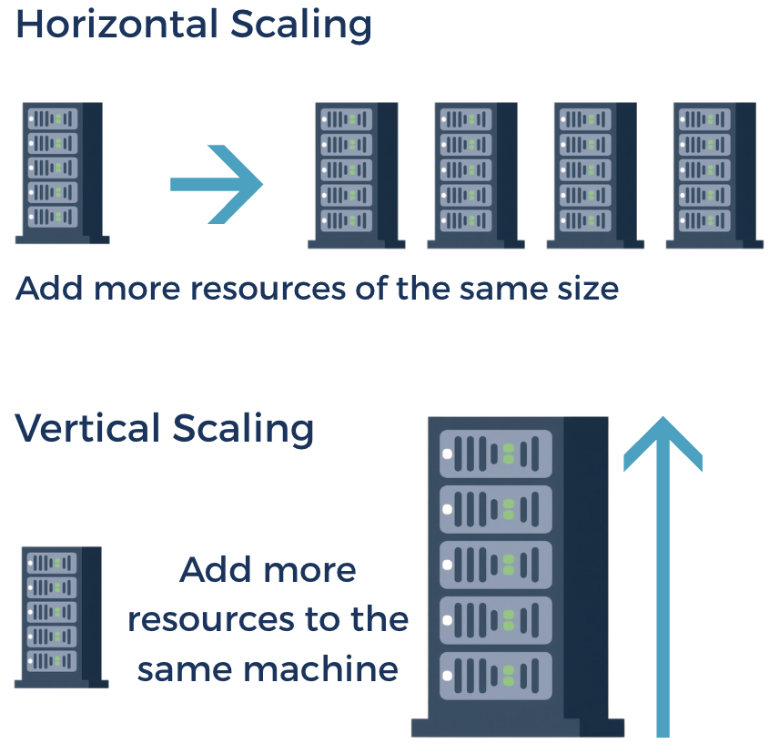

# Scaling Models: How Systems Respond to Load

## Learning Goals
- Differentiate between horizontal and vertical scaling and identify when to use each
- Compare manual scaling, auto-scaling, and event-driven scaling 
- Understand the warm-up time during scaling and instant scaling
- Explain the relationship between capacity planning and cloud elasticity
- Evaluate a workload's characteristics to select the most appropriate scaling strategy

### Horizontal versus Vertical Scaling

Scalability refers to a system's ability to grow (or shrink when needed). A system can be scaled up, down, or out according to how much load there is. The amount of load a system receives can change for many reasons. For example, an application used by school children has less traffic late in the evening than compared to the middle of the school day. An e-commerce site could have a surge in traffic during Black Friday and the traffic decreases after the sale. A new party-planning application might have fewer users when it first launches, but as more people learn about it and begin to use it then its traffic increases.

We want to develop applications that can dynamically adapt to changes in load to prevent instances from being overloaded and minimize downtime or quality degradation. To understand how systems respond to load, a developer must understand the two primary directions in which a system can grow. This is often referred to as "scaling out" with horizontal scaling versus "scaling up" with vertical scaling.

*Fig. Horizontal scaling adds more resources like virtual machines to your system to spread out the workload across them. Vertical scaling increases the capacity of an existing system.*

#### Horizontal Scaling: Scaling Out

Horizontal scaling involves adding more resources of the same size to a system. If a developer has deployed an application to one cloud instance, the capacity of this instance can get overwhelmed as more customers use the application. Adding more instances is a way to introduce additional resources that work together to handle the increase in customer traffic. 

Scaling out can be relatively simple because a developer can just add more instances while the old ones are still running, which means downtime can be avoided. With additional instances, a system's availability and fault-tolerance can be increased because distributing traffic across more instances lowers the risk of total failure. Furthermore, a system's performance could be improved because with horizontal scaling because its ability to handle more concurrent user requests simultaneously improves overall system response times and capacity.

However, horizontal scaling increases the complexity of a system. While scaling out can improve performance and help serve a larger amount of traffic, it introduces challenges in maintaining data consistency across the distributed instances. Maintaining data consistency across multiple nodes requires some kind of data replication mechanism, which can add more overhead to your system and an increase operational costs.

Another consideration that needs to be addressed relates to how incoming traffic be distributed across multiple instances. Implementing and managing effective load balancing mechanisms adds overhead and complexity to the infrastructure. In addition to increased system complexity, utilizing more cloud instances means incurring greater costs to run them.

#### Vertical Scaling: Scaling Up

Vertical scaling is the process of adding more power to an existing resource. When an application begins to experience performance lag due to increased demand, a developer can "scale up" by upgrading the hardware specifications of the current cloud instance. In a cloud environment, this typically means increasing CPU, RAM or expanding network for an instance, which essentially turns a "small" virtual machine into a "large" or "extra-large" one.

The primary benefit of vertical scaling is its architectural simplicity. Since the application continues to run on a single instance, the developer does not need to change the application's code or worry about the complexities of distributed systems. There is no need for a load balancer to sit in front of the machine, and because all the data stays in one place, the developer avoids the difficult challenges of data synchronization and consistency that come with having multiple nodes. For many early-stage applications or internal tools with predictable growth, this "one big box" approach can be a straightforward path to better performance.

However, vertical scaling has its own set of limitations too. First, it often introduces mandatory downtime because in most cloud environments, an instance must be stopped and restarted to apply the new hardware specs, which can temporarily take the application offline for users. Second, vertical scaling creates a single point of failure. If that one powerful instance suffers a hardware crash or a software hang, the entire application goes down because there are no other instances to pick up the slack.

Finally, vertical scaling has a "physical ceiling". Every cloud provider has a limit on the maximum size of a single instance. Once a developer has upgraded to the most powerful machine available, there is nowhere left to grow except to switch to a horizontal model. Additionally, more powerful instances can come with a higher price tag, meaning that increasing a machine's power also increases the cost to run it in the cloud.

### Scaling Strategies

After reviewing how a system can grow, let's look at who or what initiates that growth. In a modern cloud environment, the goal is often to move away from human intervention and toward automated, data-driven responses. In cloud computing, teams need to devise a scaling strategy to determine the approach they will take to determine when to add or remove resources to adapt to changing demand. Teams choose a strategy based on how predictable their traffic is and how much operational effort they want to invest in monitoring the system. Ideally, a well formulated scaling strategy helps systems perform well during busy periods, keeps costs tied to usage, and offers room to grow smoothly too. We will review the three main approaches to scalability in the cloud: manual scaling, auto-scaling, and event-driven scaling.

#### Manual Scaling

Manual scaling, the most basic approach, is the process of manually adjusting the resources (such as CPU, memory, or storage) allocated to an application or the number of instances to handle changing loads, like customer traffic. With manual scaling, engineers or administrators assess the system's resource requirements based on projected traffic or workload and manually increase or decrease capacity by provisioning more or removing excess instances and resources.

- Advantages:
    - Cost Certainty: The developer knows exactly how many instances are running and exactly what the bill will be at the end of the month.
    - Simplicity: Does not require the developer to configure complex scaling policies, thresholds, or health checks.
    - Predictability: There are no "surprises" where an automated system scales up unnecessarily due to a bug or a temporary traffic blip. 

- Disadvantages:
    - Slow Response: By the time a human notices a traffic spike and logs in to add resources, the application may have already crashed for many users.
    - Operational Fatigue: Requires constant monitoring. If a spike happens at 3:00 AM, the system stays overwhelmed until an engineer wakes up.
    - Wasteful: Developers often over-provision (leave extra servers running "just in case"), which can lead to higher costs for idle resources.

#### Auto-Scaling

Auto-scaling uses a set of predefined rules or triggers to adjust resources automatically. The cloud provider platform constantly monitors specific metrics (such as average CPU utilization or memory usage) and responds accordingly by increasing or decreasing instances or resources. This strategy is useful for ensuring optimal performance and cost-efficiency without manual intervention, particularly for unpredictable or fluctuating workloads.

- Advantages:
    - Hands-off Reliability: The system handles the daily fluctuations in traffic (such as more users during the day, fewer users at night) without any human intervention.
    - Automatic Fault Tolerance: The system detects unhealthy instances and replaces them automatically, maintaining the desired capacity without manual intervention.
    - Optimized Costs: The system "scales in" (removes instances) during low-traffic periods, which ensures the team only pays for what is actually needed.

- Disadvantages:
    - Complexity: Requires careful tuning. If the thresholds are too sensitive, the system might scale up and down constantly (a problem known as "thrashing").
    - Lag Time: Metrics are often trailing indicators. By the time the average CPU hits 80%, the system might already be struggling, and it still takes time to boot new instances.
    - Configuration Overhead: Auto-scaling policies require initial research to understand what settings need to be configured. Developers must define health checks and grace periods to ensure the system doesn't keep unhealthy instances in rotation.

#### Event-Driven Scaling

Event-driven scaling is another automated method for adjusting cloud resources. Instead of scaling based on changes in metrics related to resource usage, scaling occurs based on events like database updates, API calls, or file uploads. This strategy can offer a fast response to sudden bursts of traffic and allows the system to scale down to dormancy when no event are occurring, which further reduces cloud related costs. 

- Advantages:
    - True Elasticity: This is the most responsive model because it scales nearly instantly in direct proportion to the number of incoming events.
    - Maximum Cost Savings: As the event rate decreases, the system terminates idle instances to reduce costs, which could mean that the team does not pay incur any costs when the application is not being used.
    - Reduced Scope: The developer is not responsible for managing the underlying fleet of instances, load balancers, or patching schedules.

- Disadvantages:
    - Cold Starts: If the code hasn't run in a while, the very first user might experience a delay while the cloud provider initializes the environment.
    - Resource Limits: Event-driven functions usually have stricter, hard-coded resource limits.
    - Loss of Control: The developer cannot easily tweak the underlying system if the application requires a specialized environment.

### Warm-up Time: Why Scaling Isn't Instant

In an ideal world, scaling would be instantaneous. However, in production environments, there is a delay between the moment a scaling rule is triggered and the moment that the new resources are actually ready to handle user traffic. This gap is known as warm-up time which is when systems, applications, or services are gradually brought online to ensure stability, optimize performance, and allow resources to adjust to new workloads. If the warm-up time is not factored into a chosen scaling policy then a team could end up incurring additional, unnecessary costs and poor performance. 

When a scaling event occurs, the cloud provider must perform several steps before an instance is "healthy", such as:
1. Provisioning: Allocating the physical hardware into different virtual machines.
2. Booting: Loading the operating system.
3. Initialization: Running startup scripts, installing security patches, or pulling a Docker container image, etc.
4. Application Startup: Starting the actual code.

The different cloud service models we looked at earlier (IaaS, PaaS, and FaaS) each have different factors that impact how long the warm-up sequence takes.

- IaaS: Scaling with the IaaS model can have the longest warm-up times because it involves provisioning raw infrastructure including OS installation, network configuration, and middleware setup.
- PaaS: Scaling with the PaaS model can be much faster because instances are already on and configured. Since the underlying OS is already running, the system only needs to start the application's specific environment.
- FaaS: Scaling with the FaaS model is typically the fastest, often ready in milliseconds to a few seconds, because it leverages an existing pool of resources. Similar to PaaS, since the cloud provider manages all underlying infrastructure, there's no wait time for operating systems to boot or software to configure.

### !callout-info

## The Cold Start Challenge

Sometimes systems can feel laggy when scaling events occur because of cold starts, which are typical for applications using serverless computing and not uncommon for applications running on instances (PaaS). A cold start happens when the cloud computing platform needs to scale up but there is no active infrastructure ready to handle the request. This can look like an event occurring, and then the platform needs to spin up resources, like with event-driven scaling with FaaS, or a threshold is met and new instances need to be provisioned, like auto-scaling with PaaS.

This occurs because, the provider freezes or deletes resources that are not being used to save money. The cloud provider must "start from scratch" to provision resources, load the environment, and initialize the code. This results in latency before the user receives a response.

If you would like to learn more about cold starts and scaling in the cloud, follow your curiosity!

### !end-callout

### Capacity Planning and Elasticity

In the final part of this lesson, we will look at the strategic side of scaling. How does a developer decide how many total resources their system needs to handle traffic? In modern cloud architecture, the goal is to balance the stability of a fixed plan with the flexibility of an automated system. Developers must navigate the space between having enough resources to stay reliable and also keep cloud costs manageable. Teams do so with capacity planning and designing systems that can leverage the characteristics of cloud elasticity. 

Capacity planning is the strategic process of determining what the baseline load of an application is. Instead of guessing, developers look at historical data to identify the minimum amount of infrastructure required to keep the system running smoothly under normal conditions. By maintaining a set amount of resources that are always on, developers can ensure that the most critical parts of the application are never subject to latency from cold starts. If there are too many resources deployed, then idle resources running increase cloud spending. If the plan is too conservative, a sudden surge in users will overwhelm the system, which could lead to slow response times, higher error rates, or total system failure. 

Cloud elasticity relates to how organizations can quickly increase or decrease their resources dynamically in response to rapid or unexpected fluctuations in load without causing disruptions to their users. This might sound similar to scalability, but scalability is planned, persistent, and relates to longer-term growth. In elastic systems, the infrastructure expands and contracts automatically as a response to real-time changes in demand.

Ultimately, capacity planning and cloud elasticity are complementary strategies that both work to optimize cost and performance, with elasticity automating short-term adjustments while capacity planning manages long-term, structural resource needs. 

## Summary

Modern cloud scalability is the ability of a system to adapt to fluctuating workloads by either scaling up by increasing the power of a single resource or scaling out by adding more resources. To manage this growth, teams employ scaling strategies ranging from manual intervention to automated auto-scaling and event-driven models that each offer a different balance of operational control and cost-efficiency. While cloud elasticity allows systems to dynamically shrink or expand to match real-time demand, organizations must also conduct capacity planning to establish a baseline that mitigates the warm-up times and cold start latencies inherent in different service models. Ultimately, a successful scaling design ensures that an application remains performant and reliable during traffic spikes while remaining cost-effective during periods of low activity.

## Check for Understanding

<!-- Question 1 -->
### !challenge
* type: multiple-choice
* id: 0bc24607-9c9f-43fb-99b8-5774903801a2
* title: Scaling Models

##### !question
A video streaming service sees a massive spike in traffic every Friday night at 8:00 PM when a new show drops. Which strategy would be the most effective to ensure the system is ready before users start watching the show?
##### !end-question

##### !options
* Event-driven scaling, because it reacts to each user request.
* Manual or scheduled scaling, because the spike is predictable and avoids warm-up delays.
* Vertical scaling, because it's easier to add RAM to one server than to boot ten.
* Scaling down idle resources, because it saves the most money during the week.
##### !end-options

##### !answer
* Manual or scheduled scaling, because the spike is predictable and avoids warm-up delays.
##### !end-answer

#### !explanation 
If a spike is predictable, you can scale ahead of the load to avoid the warm-up latency that occurs with reactive auto-scaling.
#### !end-explanation 
### !end-challenge

<!-- Question 2 -->
### !challenge
* type: multiple-choice
* id: 1a5f0200-fe2f-4f57-baff-5692389441d2
* title: Scaling Models

##### !question
An application currently runs on a single, very large virtual machine that developers are responsible for deploying, maintaining and supporting. The developer notices that when the server reaches 90% CPU, the whole site becomes sluggish. Why would horizontal scaling be preferred over vertical scaling for this problem?
##### !end-question

##### !options
* Scaling Out is always cheaper than Scaling Up.
* Vertical scaling usually requires a restart (downtime) and has a hardware "ceiling."
* Horizontal scaling is the only way to use Serverless functions.
* Vertical scaling is impossible in a cloud environment.
##### !end-options

##### !answer
* Vertical scaling usually requires a restart (downtime) and has a hardware "ceiling."
##### !end-answer

#### !explanation 
Vertical scaling is limited by hardware and often requires downtime to resize the instance.
#### !end-explanation 
### !end-challenge

<!-- Question # 3 -->
### !challenge
* type: multiple-choice
* id: 895024da-3f67-4a58-bd1b-276687a029b0
* title: Scaling Models

##### !question
A developer uses serverless computing for an image-processing task. A user complains that the very first image they upload each morning takes 10 seconds to process, but every image after that takes only 200ms. What is the technical term for this delay?
##### !end-question

##### !options
* Provisioning lag
* Horizontal bottleneck
* Cold start
* Under-provisioning
##### !end-options

##### !answer
* Cold start
##### !end-answer

#### !explanation 
Serverless computing has the challenge of cold starts which are caused by initializing a fresh environment after a period of inactivity.
#### !end-explanation 
### !end-challenge