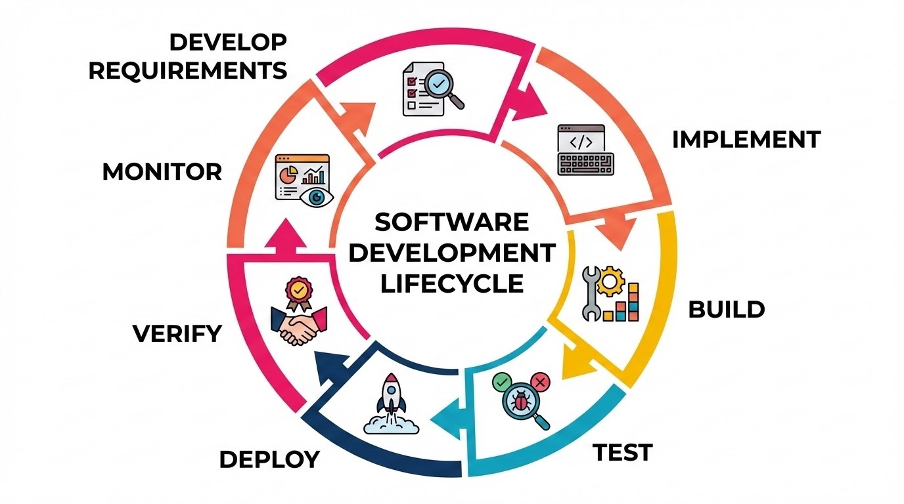

# Release Lifecycles & Environments

When we're starting our software development journey, our focus is generally on the coding side: creating something that meets particular needs and features. But we know that the journey doesn't stop once we have an application working on our machine. We need to release products out into the world where other folks can access them! 

So, what happens between "code is merged" and "users see the change"? The answer is the release lifecycle! We have used platforms that allow us to deploy front ends, backends, and databases, but this is just one step in a typical application's release lifecycle. This lesson will dive into how organizations at scale create reliable processes for shipping well-tested, secure products. 

## Learning Goals

- Describe the steps of the release lifecycle
- Define what a release pipeline is at a high level
- Describe the differences between common deployment environments

## Vocabulary and Synonyms

| Vocab | Definition | Synonyms | How to Use in a Sentence |
| --------- | --------- | -------- | --------- |
| Environment | An isolated instance of infrastructure and application configuration used at a specific stage of the release lifecycle, each serving a distinct purpose in validating and delivering software. | Deployment environment, tier, stage | "The bug only appeared in the production environment because the staging environment was configured with a smaller dataset that didn't trigger the edge case." |
| Environment Parity | Keeping different environments, such as development, staging, and production environments, as structurally similar as possible. | Environment consistency, dev-prod parity | "Because we maintained environment parity, we caught a bug in staging before it could reach users; the staging environment was close enough to production to surface the issue." |
| Release Pipeline | A sequence of stages and their actions that application code moves through on the way to production. Example of pipeline stages are: build, test, and deploy. Each stage has its own steps to perform. | Deployment pipeline, CI/CD pipeline, delivery pipeline | "The release pipeline automatically builds the application, runs unit and integration tests, deploys to staging, and waits for approval before pushing to production." |
| Artifact | A versioned, deployable output produced by a build process, such as a compiled binary, container image, or packaged application bundle. | Build output, release package, deployable, binary | "After the test step in the release pipeline completes, it publishes a Docker image artifact to our container registry so it can be deployed to the staging environment." |
| Software Release Lifecycle | The end-to-end process by which software moves from development through testing, staging, and deployment into production. | Release process, deployment lifecycle, software delivery lifecycle | "Our team follows a software release lifecycle that requires every change to pass automated tests and a manual review before it can be promoted to production." |

## The Release Lifecycle

We are likely familiar with some version of the software development lifecycle: 

  
*Fig. The software development lifecycle steps: Develop Requirements, Implement, Build, Test, Deploy, Verify, and Monitor.*

After a developer implements the feature and commits code, the **release lifecycle** governs the last 5 elements:
1. **Build**: Turn raw source code into runnable artifacts and store them for testing and deployment. Artifacts are the concrete files that get promoted through environments and ultimately deployed to production.
2. **Test**: Run automated and sometimes manual tests to ensure that new features work as expected and regressions have not been introduced.
3. **Deploy**: Make our code available somewhere other than our individual development machines. This does not only mean deploying to production environments. Modern development teams typically deploy to different environments in stages so new features can be tested before going to the production environment.
4. **Verify**: Validate that our infrastructure is suited for the changes being released. Ensure that the deployment is successful and does not generate unexpected issues.
5. **Monitor**: Continue to observe key metrics to ensure new issues do not appear. Revert changes and use operational recovery plans to address issues if they arise.

### Release Pipelines

The steps above make up the basic release flow that most organizations start with and customize to their needs. Closely related to the release lifecycle is the **release pipeline**. A release pipeline is all of the steps, both automated and manual, that an organization takes to ensure users can access a reliable, secure version of the company's software. Put another way, a release pipeline is an organization's specific plan for their release lifecycle. 

At each step of a release pipeline there are typically quality checks. 
- When there are no issues, the pipeline will move from step to step until the pipeline completes. 
- If one of these checks fails, the pipeline stops at that step and alerts the system that there was an error in need of investigation. 
 
We'll dive further into deployment automation later in this topic, but for now we should know that modern organizations and release flows try to automate as much of their release pipeline as possible to avoid manual, inconsistent, and error-prone releases.

## Environments

We've mentioned the production environment as the place where we deploy an application so that users can interact with it, but what exactly is an environment in the development world?

An **environment** is an isolated, independently configured instance of the infrastructure and software needed to run an application. When deploying applications or APIs through the Ada curriculum, we typically used two environments:
- our development machine
- the production environment where we deployed our code, using platforms like Render

This is a standard set up while learning, but it is not reflective of the environments that organizations use in their release processes. Common environments used by organizations include: development, staging (or pre-production), and production. Each environment serves a distinct purpose in the release lifecycle: 
- **Development Environment** - where engineers build and test changes locally or on shared infrastructure
- **Staging Environment** - closely mirrors production so that changes can be validated under realistic conditions before they reach users
- **Production Environment** - the live system that real users interact with
 
Keeping these environments separate ensures that experimental or untested changes never affect the experience of real users. For example, imagine a team is adding a new user authentication flow to a web application. Engineers develop and test the feature in a development environment first. Once it looks good, the change is promoted to staging, where it runs against a full-scale replica of the production database and infrastructure. While in staging, the team catches a bug in the password reset logic that only surfaces with typical production-scale data volumes. That bug gets fixed before the change ever reaches production, protecting users from a broken experience. 

### Environment Parity

Imagine a bug that doesn't exist on any developer's laptop but crashes production on the first deploy. The code is correct. The tests passed. On investigation, the culprit is found to be a mismatch between environments: maybe a library version differs, an environment variable is missing, or the local machine is running a different operating system than the production server. Environment parity is the practice of keeping development, staging, and production environments as structurally similar as possible. Same runtime versions, same dependency configurations, same infrastructure patterns, so that code behaves consistently as it moves through the release pipeline.

The value of environment parity becomes clearest in its absence. A payment service that works in local development might silently fail in staging because the database connection string format differs between environments, or because a secrets manager integration that exists in production was mocked out locally and never configured in staging. A team that has invested in environment parity catches these gaps in the staging environment, where a failed deployment is an inconvenience, rather than in production, where it becomes an outage. Tools like containerization and infrastructure-as-code (which we'll talk more about soon!) make parity easier to maintain by allowing us to define environment configurations in version-controlled files that can be applied consistently across every stage of the pipeline.

### Environments and Release Pipeline Steps

Our release pipelines will move through the steps of the release lifecycle, but it often is not a perfect one-to-one match to the release lifecycle steps we saw earlier. This is especially true as we fold in tools like staging environments. 

Release pipelines start with a build step, since we need to create artifacts before we can test them, but our testing might be split into multiple phases. Unit tests are commonly ran right after the build process, but then we might deploy our artifacts to a staging environment for integration tests or manual testing, and to verify that our configuration and infrastructure works with the changes. Only once the second layer of testing in the staging environment has passed do we then deploy again, this time to our production environment, and can conduct any extra verification and monitor health of the system. 

On many teams, our pipeline steps may look more like:
1. Build then store artifacts
2. Automated tests 
3. Deploy to staging
4. Integration testing and verification of the infrastructure meeting the application's needs
5. Deploy to production
6. Validation of release in production environment
7. Monitoring

## Summary

Once code is merged, it enters the **release lifecycle**: a multi-stage process covering build, test, deploy, verify, and monitor. A **release pipeline** is an organization's specific implementation of this flow, made up of automated, and possibly manual, steps with quality checks at each stage. If a check fails, the pipeline stops and raises an alert rather than letting a broken change advance. The **build stage** produces one or more **artifacts**: versioned, deployable packages that get promoted through environments throughout the release lifecycle rather than being rebuilt from scratch each time. Release pipelines move through the steps of the release lifecycle, but the exact steps of a pipeline may not match to the lifecycle steps perfectly depending on how we test and deploy our application. 

The environments code moves through (development, staging, and production) are kept intentionally isolated so untested changes never reach real users. **Staging environments** are designed to mirror production as closely as possible, which is the principle of **environment parity**. When we lose parity between our staging and production environments, bugs that only surface under real production conditions slip through undetected. Issues such as a library version mismatch, or a missing environment variable can cause code that passed every local test to fail on deploy. Tools like containerization and infrastructure-as-code can help teams enforce parity by defining environment configurations in version-controlled files.

## Check for Understanding

<!-- prettier-ignore-start -->
### !challenge
* type: ordering
* id: f68bc393-60d1-409a-9dc6-3999d787777e
* title: Release Lifecycles & Environments
##### !question

Place the following steps in the correct order for the release lifecycle:

##### !end-question
##### !answer

1. Build
1. Test
1. Deploy
1. Verify
1. Monitor

##### !end-answer
### !end-challenge
<!--prettier-ignore-end -->

<!-- prettier-ignore-start -->
### !challenge
* type: multiple-choice
* id: 431fa13e-cf3c-429a-bc9a-2f0fb4f7bc58
* title: Release Lifecycles & Environments
##### !question

Which statement best describes an "artifact" in a release pipeline?

##### !end-question
##### !options

* A log file generated when a deployment fails that helps engineers debug the issue
* A versioned, deployable output of the build process, such as a compiled binary or container image
* A configuration file that defines the infrastructure needed to run an application in each environment
* A copy of the source code repository that is stored separately from the main branch

##### !end-options
##### !answer

* A versioned, deployable output of the build process, such as a compiled binary or container image

##### !end-answer
##### !explanation

An artifact is the concrete, deployable package produced by the build step. It is versioned and immutable, meaning the same artifact is what gets promoted from staging to production rather than rebuilding from source each time. Artifacts are distinct from logs, infrastructure configuration files, and source code copies.

##### !end-explanation
### !end-challenge
<!--prettier-ignore-end -->

<!-- prettier-ignore-start -->
### !challenge
* type: multiple-choice
* id: 73e57b21-cfc4-46c1-b252-f0f21d286e43
* title: Release Lifecycles & Environments
##### !question

What is the primary purpose of having separate development, staging, and production environments in a release pipeline?

##### !end-question
##### !options

* To reduce the total number of servers an organization needs to maintain
* To ensure that experimental or untested changes never affect real users
* To allow multiple teams to deploy to production at the same time without conflicts
* To store different versions of application artifacts in separate locations

##### !end-options
##### !answer

* To ensure that experimental or untested changes never affect real users

##### !end-answer
##### !explanation

Keeping environments separate ensures that code is validated at each stage before it ever reaches users. A bug caught in staging is an inconvenience; the same bug reaching production may create an outage. The other options describe unrelated infrastructure concerns.

##### !end-explanation
### !end-challenge
<!--prettier-ignore-end -->