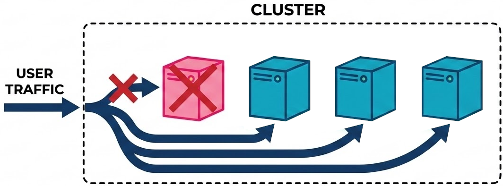

# Distributed Systems

## Learning Goals

* Define a distributed system and distinguish it from a centralized monolithic architecture.
* Identify the core strengths of distributed systems, including scalability, reliability, and durability.
* Distinguish between distributed systems at the infrastructure level and the service level within cloud environments.

## Vocabulary and Synonyms

| Vocab | Definition | Synonyms | How to Use in a Sentence |
| --- | --- | --- | --- |
| **Single Point of Failure** | A component in a system that, if it fails, will stop the entire system from working. | SPOF, Critical Failure Point | In a monolithic architecture, the **single point of failure** is the main server; if it goes down, the whole application becomes unavailable. |
| **Node** | An individual, independent computer or program within a larger network. | Instance, Host, Unit | We can add a new **node** to the cluster to help process the increasing number of incoming requests. |
| **Fault Tolerance** | The ability of a system to continue operating properly in the event of the failure of one or more components. | Resilience, Redundancy | Our architecture features high **fault tolerance** because the workload automatically shifts if a server goes down. |
| **State** | The stored information or status of a system at a specific point in time. | Condition, Data snapshot | In a distributed system, we must decide how to share the application's **state** across multiple independent nodes. |
| **Stateless** | A design principle where each node does not retain any information about previous interactions. | Ephemeral, Non-persistent | By designing our services to be **stateless**, we can easily scale them horizontally without worrying about data consistency. |
| **Message Queue** | A communication method where messages are stored in a queue until they can be processed by the receiving node. | Task Queue, Event Queue | We use a **message queue** to decouple our services, allowing them to communicate asynchronously and improve scalability. |

## Shifting from One to Many with Distributed Systems

When we first begin our journey in web development, we often build **monolithic centralized systems**. In this model, a single application handles every task—from processing logins to managing a database. While this is simple to build and deploy, it creates a "single point of failure." If that one application encounters an error or runs out of memory, the entire system goes dark for our users.

To build systems that can support millions of users across the globe, we move toward **distributed systems**. A distributed system is a collection of independent programs or computers (which we call **nodes**) that work together to achieve a common goal. To our users, the system feels like a single, seamless application, but behind the scenes, it is a coordinated effort between many moving parts.

### Contrasting Centralized and Distributed Architectures

In a monolithic, centralized system, all logic lives in one place. If we need more power, we have to "scale vertically" by buying a bigger, more expensive server. In a distributed system, we "scale horizontally" by adding more nodes. Because these nodes are independent, they communicate over a network. This introduces new challenges—like network latency—but it provides the flexibility we need to build modern, global software.

  
*Fig. Monolithic Centralized versus Distributed Architecture. The centralized system can scale vertically by replacing the server with a bigger one, but it remains a single point of failure. The varied colors in the distributed system indicate different system functions handled by that color of nodes. The distributed system can scale horizontally by adding more nodes, tailored to the area of functionality that needs to scale, and if one node fails, the others can continue to operate without interruption.*

## Leveraging the Strengths of Distributed Systems

By building systems in the cloud, we can immediately gain the benefits of using distributed resources that the cloud provider has built up over many years, without having to manage that underlying infrastructure ourselves. While we must still design our applications to take advantage of these distributed resources, the cloud gives us a powerful foundation to build on.

There are three core strengths of distributed systems: scalability, reliability, and durability.

### Scalability

Since nodes are independent, we can add or remove them based on demand. If our application sees a spike in traffic on a holiday, we can spin up fifty new nodes to handle the load and shut them down afterward to save costs.

Designing nodes to be independent and stateless allows us to scale horizontally without worrying about complex interdependencies. State, the information a system needs to function, must be minimized or shared in a way that doesn't create bottlenecks. Further, we can decouple node services by designing them to communicate through well-defined interfaces, allowing each to evolve and scale independently.

### Reliability

In a distributed system, the failure of one node does not mean the failure of the system. If one server in a data center loses power, our network of other nodes can pick up the slack, keeping the application online. Systems that can continue to operate in the face of failures are called **fault-tolerant**. This is a critical feature for any service that needs to be available 24/7.

  
*Fig. Reliable services are built on distributed systems that can automatically reroute traffic and recover from failures without user disruption.*

### Durability

By replicating data across multiple nodes, we ensure that information isn't lost. If a disk drive fails on one node, the data exists in several other locations, ready to be recovered.

For example, when we store a file in a cloud storage bucket, that file isn't just sitting on one hard drive. It is being distributed and replicated across multiple physical locations. This is why cloud services can promise "eleven nines" of durability—the math only works because the system is distributed.

### !callout-info

## n-Nines Terminology

Cloud providers often use the term "n-nines" to describe various aspects of service reliability and durability. For example, "five nines" (99.999%) uptime means that the service is expected to be unavailable for no more than about 5.26 minutes per year. "Eleven nines" (99.999999999%) durability means that if you store 10,000 objects, you can expect to lose one object every 10 million years.

This terminology helps us understand the level of reliability and durability we can expect from a service, and it is a direct result of the distributed nature of cloud infrastructure. The more nines, the more resilient the system is to failures, thanks to its distributed design.

### !end-callout

## Operating at the Infrastructure and Service Levels

When we work in the cloud, we encounter distributed systems at two distinct levels of abstraction. Understanding these levels helps us manage our applications effectively and take full advantage of the cloud's capabilities.

### The Infrastructure Level

At this level, we are looking at the "physical substrate" of the cloud. This includes the actual servers, fiber-optic cables, and virtual machine monitors (hypervisors). Distributed systems techniques are used here to coordinate thousands of physical machines so they can provide us with reliable compute and networking power. When we request a "Virtual Machine," a distributed controller finds a healthy physical node in a massive rack to host our instance.

### The Service Level

Built "on top" of the infrastructure level, the service level is where we interact with cloud offerings like databases, Identity and Access Management (IAM), and messaging queues. Each of these services is itself a distributed system. For instance, a cloud database is typically a distributed cluster of database engines working in sync. 

  
*Fig. The Distributed Layers of cloud providers.*

## Summary

Distributed systems represent a fundamental shift in how we think about computing. By moving away from a single, centralized server and toward a network of independent nodes, we gain the ability to build applications that are incredibly resilient and scalable. Whether we are looking at the physical hardware (infrastructure) or the managed tools we use to build apps (services), the cloud is built on the foundation of many parts working as one. As we move forward, we will see how these nodes talk to each other through events to keep the whole system in sync.

## Check for Understanding

<!-- >>>>>>>>>>>>>>>>>>>>>> BEGIN CHALLENGE >>>>>>>>>>>>>>>>>>>>>> -->

### !challenge

* type: multiple-choice
* id: 21fbb6cb-faa4-475b-a7fb-eb4e2cbceddd
* title: Distributed Systems

##### !question

What is the primary difference between a centralized system and a distributed system?

##### !end-question

##### !options

a| A distributed system runs on a single high-powered server.
b| A centralized system is composed of many independent nodes.
c| A distributed system consists of multiple independent nodes that appear as a single system to the user.
d| Distributed systems do not require a network to communicate.

##### !end-options

##### !answer

c|

##### !end-answer

##### !explanation

The primary difference between a centralized system and a distributed system is that a distributed system consists of multiple independent nodes that work together to appear as a single cohesive unit to the user. Distributed systems leverage the power of many nodes to provide scalability, reliability, and durability.

 

In contrast, a centralized system runs on a single server or instance, which can become a single point of failure. They are limited by the capacity and reliability of one machine.

##### !end-explanation

### !end-challenge

<!-- ======================= END CHALLENGE ======================= -->

<!-- >>>>>>>>>>>>>>>>>>>>>> BEGIN CHALLENGE >>>>>>>>>>>>>>>>>>>>>> -->

### !challenge

* type: checkbox
* id: 4e9c4f6e-00b2-402d-a1da-dc6463eb8075
* title: Distributed Systems

##### !question

Which of the following are considered core strengths of a distributed system?

##### !end-question

##### !options

a| Increased single-node complexity
b| Fault tolerance and reliability
c| Horizontal scalability
d| Data durability through replication

##### !end-options

##### !answer

b|
c|
d|

##### !end-answer

##### !explanation

The core strengths of a distributed system include:
- **Fault tolerance and reliability:** If one node fails, the system can continue to operate by rerouting traffic to healthy nodes.
- **Horizontal scalability:** We can add more nodes to handle increased load without needing to upgrade a single server.
- **Data durability through replication:** By replicating data across multiple nodes, we ensure that information is not lost even if one node experiences a failure.

 

Increased single-node complexity is, instead, a characteristic of centralized systems, where all logic and data are handled by one server, which can lead to bottlenecks and single points of failure.

##### !end-explanation

### !end-challenge

<!-- ======================= END CHALLENGE ======================= -->

<!-- >>>>>>>>>>>>>>>>>>>>>> BEGIN CHALLENGE >>>>>>>>>>>>>>>>>>>>>> -->

### !challenge

* type: multiple-choice
* id: b7b78f8b-4480-4438-bcfc-90c5b2d4d2f0
* title: Distributed Systems

##### !question

If a cloud provider coordinates multiple physical servers to ensure a Virtual Machine stays running even if hardware fails, at which level is the distributed system operating?

##### !end-question

##### !options

a| User Level
b| Application Level
c| Service Level
d| Infrastructure Level

##### !end-options

##### !answer

d|

##### !end-answer

##### !explanation

This scenario describes the **Infrastructure Level** of distributed systems. At this level, the cloud provider manages the physical hardware and network resources. When a Virtual Machine is running on a physical server, the provider uses distributed systems techniques to monitor the health of that server and automatically migrate the VM to another healthy server if a failure occurs. This ensures high availability and reliability for users without them needing to manage the underlying infrastructure.

 

A cloud database or messaging service would be examples of the Service Level.

 

Application and User Levels of cloud infrastructure were not discussed in this module, but they would involve the software and applications we build on top of the cloud services. Application-level distributed systems would include things like microservices communicating with each other, while user-level distributed systems would involve how end-users interact with the application.

##### !end-explanation

### !end-challenge

<!-- ======================= END CHALLENGE ======================= -->
