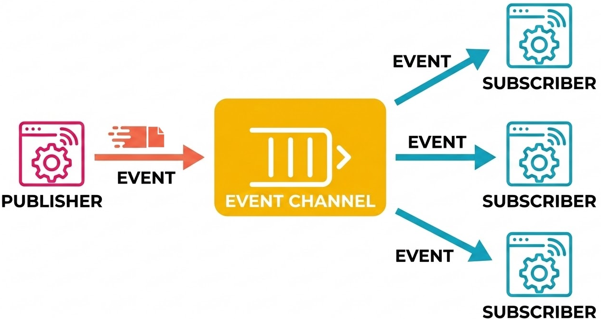

# Event-Driven Architecture

## Learning Goals
* Distinguish between synchronous (request-response) and asynchronous communication models.
* Explain the core components of an Event-Driven Architecture (EDA).
* Describe the flow of data through a Publish/Subscribe (Pub/Sub) model.
* Identify the benefits of decoupling services in a distributed cloud environment.

## Vocabulary and Synonyms

| Vocab | Definition | Synonyms | How to Use in a Sentence |
| --- | --- | --- | --- |
| **Event** | A significant change in state or an update within a system. | Message, Signal, Trigger | When a customer clicks "buy," the system produces an **event** to start the shipping process. |
| **Topic** | A category or channel to which events are published and subscribers can listen. | Channel, Subject, Stream | The "user-activity" **topic** receives events related to user interactions on the website. |
| **Payload** | The actual data carried within an event or message. | Body, Data, Content | The event's **payload** contained the user’s ID and the timestamp of the login. |

## Shifting Focus from Requests to Events

In our journey through full-stack development, we often rely on the **Request-Response** model. This is a synchronous way of communicating: a client sends a request to a server and waits, "blocked," until the server sends a response back. While this works well for simple web pages, it can create bottlenecks in large-scale cloud systems. If the server is slow or down, the client is stuck waiting.

To build secure, efficient, and resilient systems, we often move toward **Event-Driven Architecture (EDA)**. In this model, systems communicate by capturing and reacting to "events" as they happen.

Events are like announcements that something has occurred. For example, consider a photo upload service which uses a thumbnail service to generate thumbnails for use in a gallery view. In a Request-Response model, the upload service would need to wait for the thumbnail service to finish processing before it can respond to the user. This creates a bottleneck, as the upload service is "blocked" until it receives a response from the thumbnail service. In contrast, in an Event-Driven Architecture, the upload service can simply announce that a new photo has been uploaded, then continue its job uploading the next image. The thumbnail service can react to that event whenever it's ready.

We'll consider this example in more detail a little later in this lesson, but the key point here is that the upload service doesn't need to wait for the thumbnail service to finish before it can respond to the user. It doesn't even need to know that the thumbnail service exists!

Shifting to an event-driven approach allows our services to work **asynchronously**. Instead of a service calling another service and waiting for a result, it simply announces that something happened and moves on to its next task. This shift is vital for building distributed systems that can handle millions of users without crashing if one small part of the system lags.

### Events in the Browser, Events in the Cloud

In the browser, we are familiar with events like "click," "hover," or "submit." These events trigger JavaScript functions that update the user interface. We don't write code that sits there waiting for a click; instead, we set up listeners that react when the event occurs. The event source doesn't need to know the identities of the listeners. It just needs a way to announce that something happened, and the listeners will react accordingly. This is the essence of event-driven programming, though we'll see that it will be advantageous to push this separation even further in the cloud!

We've also seen asynchronous patterns in the browser, especially when making Web API calls. While promises and `async`/`await` may seem unrelated to the other browser events, they are essentially part of the same philosophy: we don't want to block the user interface while waiting for a response. Promises effectively allow us to say, "When this API call finishes, then do this." This is  the same concept behind registering code to run _when_ a button is clicked. In either case, we are reacting to an event (a click, or the arrival of an API response) rather than waiting for it to happen.

In the cloud, we have similar concepts but on a much larger scale. Events can represent anything from a user action (like uploading a file) to a system change (like a server going down). By designing our cloud applications to react to these events, we can create systems that are more flexible and resilient. For example, if a server goes down, instead of the entire application crashing, other services can react to that event and reroute traffic or spin up new resources to handle the load.

### The Benefits of Event-Driven Implementation

By adopting EDA, we gain a number of technical advantages that make our applications more robust. Since EDA is a type of distributed system, we see the scalability and resilience benefits mentioned earlier, as well as several advantages we haven't discussed yet:

| Benefit | How Implementation Provides It |
| --- | --- |
| **Scalability** | Services can scale independently. If one service experiences a surge in demand, it can scale up without affecting others. |
| **Resilience** | If one service fails, it doesn't bring down the entire system. Other services can continue to operate and even react to the failure. |
| **Flexibility** | Services can be developed and deployed independently. Teams can work on different services without worrying about tight coupling. Services need only know about the events they care about, not the details of how other services work. |
| **Responsiveness** | By reacting to events as they happen, applications can provide a more responsive user experience. For example, a notification service can immediately alert users when something important occurs. |
| **Integration** | EDA allows for easier integration of third-party services. New services can produce or subscribe to existing events without needing to change existing systems. |
| **Extensibility** | New features can be added by simply creating new services that react to existing events, without modifying the core application logic. |

## Communicating Through the Pub/Sub Model

Event Driven Architecture is a high-level strategy. It doesn't specifically say how we should structure our systems to enable it. When designing an event driven system we need to consider questions like:
- How do sources of events communicate with the services that react to those events?
- How do consumers know when an event has occurred?
- How do we ensure that events are delivered reliably and in a timely manner?

As we often see in development, these questions that EDA raises don't have one-size-fits-all answers. However, there are common patterns that have emerged to help us implement EDA effectively. One of the most popular is the Publish/Subscribe model.

**Publish/Subscribe (Pub/Sub)** is one of the most common patterns we use to implement EDA. In this model, we move away from direct "Point-A to Point-B" communication, such as we see with registering for a click event in the browser. Instead, we use an intermediary to manage the flow of information. A system producing an event doesn't need to know who is listening; it just announces that something happened. A system listening for an event don't need to know who produced the event; they just react when they receive it.

  
*Fig. The flow of an event from a single publisher through a central event channel to multiple interested subscribers.*

There are three primary roles in this system:
1.  **Publishers:** The services that generate events. They don't know who will receive the event; they just "publish" it to a specific topic. Publishers are also called "producers" because they produce events that other services will consume.
2.  **Event Channels:** This is an "infrastructure" layer that receives events, manages them, and ensures they get to the right place. This is often referred to as a "message broker" or "event bus." It acts as a go-between that decouples the producers from the consumers, allowing them to operate independently. The event channel is responsible for routing events to the correct subscribers based on the "topics" they are interested in. It also handles issues like retrying failed deliveries, ensuring messages are delivered in order, and managing the storage of events until they can be processed.
3.  **Subscribers:** The services that want to hear about certain events. They "subscribe" to a topic and react whenever the channel sends them a new message. Subscribers are also called "consumers" because they consume the events produced by the publishers.

### !callout-info

## Here Comes the (Event) Bus!

Many computer systems are organized around the concept of a "bus," which is a communication system that transfers data between components. A bus can take many different forms, but the core idea is that it provides a shared pathway through which information can flow.

Within a computer, a bus might be a physical set of wires that connects the CPU to memory and other peripherals. In software, a bus can be an architectural pattern that allows different parts of an application to communicate without being directly connected. This is often referred to as an "event bus" or "message bus."

In the context of EDA, the "event bus" is the central channel through which events are published and subscribed to. It allows for loose coupling between services, meaning that publishers and subscribers don't need to know about each other to communicate effectively. The event bus can handle various tasks such as routing messages, ensuring delivery, and managing subscriptions, making it an essential component of any event-driven system.

### !end-callout

In real-world cloud environments, there are many events that occur, which we can have other services listen for and respond to. Let's return to the hypothetical photo upload system mentioned earlier.

In our photo upload service, when a user uploads a photo, we will automatically generate a thumbnail version of that photo for use when the photo needs to be displayed as part of a user interface, such as a gallery view. We additionally want to analyze the photo for inappropriate content. Both of these tasks can be handled by separate services that react to the same event.

Using a Pub/Sub model, the upload service can publish an event like "A new photo has been uploaded!" to the event channel. The thumbnail service can subscribe to that event and start processing the photo to create a thumbnail whenever it receives the event. At the same time, a moderation service can also subscribe to the same event and start analyzing the photo for inappropriate content. Both services are working independently but reacting to the same event. Because they are decoupled, if the thumbnail service is slow or experiences an error, it won't affect the moderation service, and vice versa. And notice that the upload service doesn't need to know anything about the thumbnail or moderation services. It just announces that a new photo has been uploaded and moves on, allowing the other services to react to that event as needed.

![A flow diagram showing a "Photo Upload" event being published to an event channel, which then routes that event to both a "Thumbnail Service" and a "Moderation Service". The Photo Service initially stores the photo in a storage bucket, then publishes the event. The Thumbnail Service reacts to the event by creating a thumbnail and storing it in a separate bucket. The Moderation Service reacts to the same event by analyzing the photo for inappropriate content. If the Moderation Service flags the photo as inappropriate, it publishes a new event that the Thumbnail Service reacts to by deleting the thumbnail it created. A "Notification Service" is also shown subscribing to all events to alert the user about the status of their upload.](assets/eda-photo-upload.png)  
*Fig. The simple act of uploading a photo can trigger a series of complex actions. Events related to the initial upload (in orange) are published to the event channel, which then routes those events to the thumbnail service and the moderation service. Both services react to the same event but operate independently. If the moderation service decides to flag the photo as inappropriate, it can publish a new event (in pink) that the thumbnail service can react to by deleting the thumbnail it created. All events can be observed by a notification service that alerts the user about the status of their upload, such as "Your photo is being processed" or "Your photo has been flagged for review."*

Notice that the initial photo upload service acts only as a publisher. It doesn't need to know anything about the thumbnail or moderation services. The moderation service acts as both a subscriber (to the initial upload event) and a publisher (if it needs to flag the photo as inappropriate). The thumbnail service is only a subscriber, reacting to events but never producing them. In a more detailed diagram, it could send events about the completion of processing the thumbnail. The notification service is also only a subscriber in this diagram, reacting to all events to keep the user informed about the status of their upload.

This illustrates how services can have different roles in an event-driven system at different times, and how they can be decoupled from each other while still working together to achieve a common goal.

## Pub/Sub Model Tuning

The Pub/Sub model is a powerful pattern for implementing EDA, letting us think about how information flows through our system without worrying about the details of how services are connected. The specifics of how an event channel implementation manages messages can vary widely. It can be tailored to the needs of the application, but the core principles of Pub/Sub remain consistent:

- publishers produce events
- subscribers react to those events
- the event channel manages the flow of information between them

The following sections explore some of the ways that different Pub/Sub implementations can be tuned to meet the needs of specific applications.

### Delivery Order

Some event channels guarantee that messages are delivered in the order they were published. This is important for certain applications where the sequence of events matters. For example, if we have a series of events that represent a user's actions on a website, we want to ensure that those events are processed in the correct order to maintain an accurate representation of the user's behavior. Other event channels might allow for out-of-order delivery, which can be acceptable for applications where the order of events is not critical. For instance, if we are processing a stream of sensor data, it might not matter if the events are processed in the exact order they were generated, as long as all events are eventually processed.

### Delivery Guarantees

Some event channels guarantee that every message is delivered at least once. This means that if a message fails to be delivered, the system will retry until it succeeds. This is important for applications where losing a message could lead to data loss or inconsistent state. For example, in a financial application, we want to ensure that every transaction event is processed, _even if it means processing some events multiple times_. Note the importance of idempotency in service logic in this situation! Other event channels might allow for occasional message loss in exchange for higher performance. This can be acceptable for applications where the occasional loss of an event does not have significant consequences, such as in a real-time analytics dashboard where missing a few data points might not impact the overall insights.

### Message Filtering

In some Pub/Sub systems, subscribers can specify filters to only receive events that match certain criteria. For example, a subscriber might only want to receive events related to a specific user or a particular type of event. This allows for more targeted communication and can help reduce the amount of irrelevant information that subscribers need to process. In other systems, subscribers might receive all events and then filter them on their end, which can be less efficient but simpler to implement.

### Message Transformation

Some event channels offer the ability to transform messages as they pass through the channel. For example, a message might be enriched with additional data, or its format might be changed to match the needs of the subscriber. This can be useful for ensuring that subscribers receive messages in a format they can easily process, without requiring publishers to know the specific requirements of each subscriber. In other systems, messages are delivered in their original form, and subscribers are responsible for any necessary transformations.

### Message Retention

Some event channels retain messages for a certain period of time, allowing subscribers to retrieve past events. This can be useful for applications that need to process events that were published while they were offline or for debugging purposes. For example, if a subscriber goes down for maintenance, it can catch up on missed events once it comes back online. Other event channels might not retain messages at all, meaning that if a subscriber is not available when an event is published, it will miss that event entirely.

### Push vs. Pull

In some Pub/Sub systems, the event channel pushes messages to subscribers as soon as they are published. This can lead to lower latency, as subscribers receive events immediately. However, it can also lead to issues if a subscriber is overwhelmed with too many events at once. In other systems, subscribers pull messages from the event channel at their own pace. This allows subscribers to control the flow of events and can help prevent overload, but it might introduce additional latency as subscribers check for new messages.

### Topics

In some Pub/Sub systems, events are published to specific topics, and subscribers subscribe to those topics to receive relevant events. This allows for a more organized flow of information, as subscribers can choose to only receive events that are relevant to their interests. For example, in a news application, there might be separate topics for sports, politics, and entertainment, allowing users to subscribe only to the topics they care about. In other systems, there might not be a concept of topics, and all events are published to a single channel that subscribers listen to. This can be simpler to implement but might lead to subscribers receiving a lot of irrelevant information.

### Additional Tuning Options

There are many additional ways to tune the behavior of a Pub/Sub system. For example, some systems might offer different levels of durability for messages, allowing publishers to choose whether they want their messages to be stored persistently or not. Others might provide options for how messages are routed through the event channel, such as using different algorithms for load balancing or prioritizing certain types of events. Message batching is another common tuning option, where multiple messages can be grouped together and sent as a single batch to improve performance. Security features, such as encryption and access control, can also be important considerations when tuning a Pub/Sub system.

The key is that the Pub/Sub model provides a flexible framework for implementing EDA, and the specific tuning options can be tailored to the needs of the application.

## Summary

We have explored how Event-Driven Architecture allows us to build distributed systems that are more flexible than traditional Request-Response models. By using asynchronous communication, we decouple our services so they can fail or scale without bringing down the entire application. The Pub/Sub model provides the mechanical framework for this, using Publishers, Event Channels, and Subscribers to route information efficiently. As we move deeper into cloud architecture, these patterns will be our primary tools for ensuring our systems remain responsive and reliable.

## Check for Understanding

<!-- >>>>>>>>>>>>>>>>>>>>>> BEGIN CHALLENGE >>>>>>>>>>>>>>>>>>>>>> -->

### !challenge

* type: multiple-choice
* id: 60032cda-2a15-42f0-acd5-e029c9b7377d
* title: Event-Driven Architecture

##### !question

Which of the following best describes the core philosophy of Event-Driven Architecture?

##### !end-question

##### !options

a| Systems react to changes in state asynchronously rather than following a rigid, synchronous sequence.
b| Services must wait for a confirmation from a database before proceeding.
c| All services must be written in the same programming language to communicate.
d| A central server dictates exactly when every other service should start its work.

##### !end-options

##### !answer

a|

##### !end-answer

##### !explanation

Event-Driven Architecture is all about designing systems that react to changes in state (events) asynchronously. This allows for greater flexibility and resilience, as services can operate independently without waiting for each other. The other options describe more traditional, synchronous models of communication that EDA seeks to move away from.

##### !end-explanation

### !end-challenge

<!-- ======================= END CHALLENGE ======================= -->

<!-- >>>>>>>>>>>>>>>>>>>>>> BEGIN CHALLENGE >>>>>>>>>>>>>>>>>>>>>> -->

### !challenge

* type: ordering
* id: 9b4d948c-0224-4edd-b3c3-3046e4ba47ff
* title: Event-Driven Architecture

##### !question

Place the following steps in the correct order for a message traveling through a Pub/Sub system:

##### !end-question

##### !answer

1. A service signs up (subscribes) to a topic to watch for updates.
1. A Publisher emits an event to a specific topic.
1. The Event Channel routes the message to all interested parties.
1. A Subscriber receives the event and performs a specific task.

##### !end-answer

##### !explanation

Unless a service signs up to receive updates on a specific topic, the event won't be able to reach the Subscriber, no matter how many times the event is published. Once subscribed, after a Publisher emits an event, it goes to the Event Channel, which is responsible for routing that message to all interested parties. Finally, the Subscriber receives the event and performs whatever task it was designed to do in response to that event.

##### !end-explanation

### !end-challenge

<!-- ======================= END CHALLENGE ======================= -->

<!-- >>>>>>>>>>>>>>>>>>>>>> BEGIN CHALLENGE >>>>>>>>>>>>>>>>>>>>>> -->

### !challenge

* type: checkbox
* id: bec45bf8-5d9a-4a26-87d5-ea5f55dab117
* title: Event-Driven Architecture

##### !question

What are the primary differences between a traditional Request-Response model and an Event-Driven model?

##### !end-question

##### !options

a| Request-Response is typically synchronous, while EDA is typically asynchronous.
b| In Request-Response, the sender is "blocked" until it hears back; in EDA, the sender continues its work.
c| Request-Response typically requires the sender to know exactly which service will handle the request, while EDA allows for more decoupling between services.
d| EDA is only used for front-end development, while Request-Response is for the back-end.

##### !end-options

##### !answer

a|
b|
c|

##### !end-answer

##### !explanation

The Request-Response model is typically synchronous, meaning that the sender waits for a response before continuing. In contrast, Event-Driven Architecture is typically asynchronous, allowing the sender to continue its work without waiting. Additionally, in a Request-Response model, the sender often needs to know which specific service will handle the request, while EDA allows for more decoupling between services, as they communicate through an event channel rather than direct calls.

 

The front-end/back-end distinction is not a defining characteristic of either model. Both Request-Response and Event-Driven models can be used in front-end and back-end development, depending on the needs of the application.

##### !end-explanation

### !end-challenge

<!-- ======================= END CHALLENGE ======================= -->
