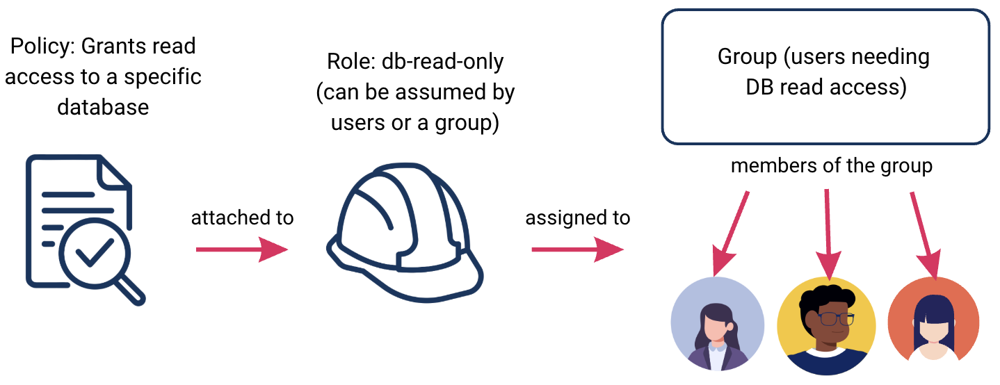

# Introduction to Identity and Access Management

## Learning Goals

- Explain the relationship between identity, authentication, and authorization.
- Define what a trust boundary is.
- Identify the core components of an IAM system.
- Apply the principle of least privilege when reasoning about how permissions should be scoped for users, services, and roles in a real-world system.
- Understand common authentication and authorization mechanisms.
- Distinguish between centralized and decentralized identity management and discuss the tradeoffs of each approach in modern software systems.

### Why Identity Management Matters

Modern software systems rarely operate in isolation. Applications often interact with databases, external APIs, third-party services, and other internal systems across distributed infrastructure and organizational boundaries. Within those systems, many different actors need access to resources: developers, end users, automated services, CI/CD pipelines, and more. Identity management is the discipline of defining who or what those actors are, what they are permitted to do, and how that is enforced. Without a structured approach to identity management, access control decisions tend to be made ad hoc with hardcoded credentials, overly permissive service accounts, shared passwords across teams, and no clear audit trail of who accessed what and when. These patterns create significant security vulnerabilities and operational risk.

Identity management governs three fundamental questions in any system:
- Who or what is making a request? This could be a human user, an application, a microservice, or an automated process.
- Are they who they claim to be? The system must be able to verify the identity of the requester before granting access.
- What are they allowed to do? Once identity is verified, the system enforces what resources and actions that identity is permitted to access.

In traditional on-premises infrastructure, network boundaries provided a layer of implicit protection. If you were on the internal network there was a degree of trust that was often assumed. Cloud environments fundamentally change this model. Resources are exposed over the public internet, infrastructure is dynamic and ephemeral, and the boundary between "inside" and "outside" a system is far less well-defined. In this context, identity becomes the primary security boundary. Cloud platforms provision and deprovision resources rapidly, teams and services are often distributed, and a single misconfigured permission can expose sensitive data or critical infrastructure at scale. This is not just a theoretical risk. some of the most significant cloud security incidents in recent years have been caused not by sophisticated attacks, but by misconfigured access policies.

Poor identity management has well-documented consequences:
- **Unauthorized access**: Weak or poorly scoped credentials allow actors to access resources they should not be able to reach.
- **Privilege escalation**: An attacker who gains access to a low-privilege account can exploit overly permissive policies to escalate their access to more sensitive systems.
- **Lack of auditability**: Without structured identity management, it becomes difficult or impossible to determine who accessed a resource, when, and why. This is critical for both incident response and compliance requirements.
- **Credential exposure**: Hardcoded or improperly stored credentials (API keys, passwords, tokens) are a persistent and common vulnerability in software systems.

Identity management is what gives a system the ability to answer these questions reliably, consistently, and at scale.

### Trust Boundaries

A **trust boundary** is the point in a system where the level of trust changes. On one side of a trust boundary, requests and data are treated as trusted. On the other side, they are treated as untrusted and must be verified before being acted upon. Every time data or a request crosses a trust boundary, the system must make a decision about whether to trust it, and on what basis.

Trust boundaries exist at many levels in a software system. The boundary between a public-facing API and an internal service is a trust boundary. The boundary between two microservices that belong to different teams is a trust boundary. The boundary between a user's browser and a web server is a trust boundary. Even within a single system, different components may operate at different trust levels.

Identifying trust boundaries is a foundational step in designing a secure system. If a system does not have a clear model of where its trust boundaries are, it cannot reliably enforce authentication and authorization at the right points. This leads to one of the most common classes of security vulnerabilities: implicitly trusting a request or a piece of data because of where it came from, rather than verifying it explicitly.

#### Trust Boundaries in Cloud Environments

In traditional on-premises infrastructure, the network perimeter often served as the primary trust boundary. Traffic inside the network was implicitly trusted, and traffic from outside was treated with caution. This model has significant limitations even in on-premises environments, but it becomes untenable in cloud environments where there is no well-defined perimeter.

In cloud environments, resources communicate across public and private networks, services are deployed and torn down dynamically, and the same infrastructure may serve multiple tenants. In this context, the network boundary alone cannot serve as a reliable trust boundary. A request that arrives from inside the same virtual network is not necessarily trustworthy. A service that was legitimate yesterday may have been compromised today. This is why identity becomes the primary trust boundary in cloud environments. Rather than trusting a request because of where it originates, a well-designed cloud system requires every request to be authenticated and authorized regardless of its origin. This principle is sometimes referred to as a **zero trust security** model: the assumption is that no request should be trusted by default, regardless of whether it originates inside or outside the system's network boundaries. Every request must be verified.

Identity and access management (IAM) is the mechanism through which trust boundaries are enforced in software systems. IAM defines which principals are trusted, under what conditions, and with what level of access. When a request crosses a trust boundary, the IAM system is what determines whether that request should be permitted to proceed. The concepts that follow in this lesson, including authentication, authorization, and the principle of least privilege, are all mechanisms for enforcing decisions at trust boundaries. Understanding that these mechanisms exist to protect trust boundaries gives them a purpose that goes beyond their individual definitions.

### Identity and Access Management (IAM) Fundamentals

IAM is the framework of policies, processes, and technologies used to manage digital identities and control access to resources within a system. IAM defines who or what can access a system, under what conditions, and with what level of permission. Before diving into the components and mechanisms of IAM systems, it is important to establish precise definitions for three terms that are often used interchangeably but represent distinct concepts: identity, authentication, and authorization. Conflating these concepts is a common source of confusion.

#### Identity

Identity refers to the set of attributes that define who or what an actor is within a system. An actor can be a human user, an application, a microservice, a device, or any other entity that interacts with system resources. Attributes that make up an identity might include a username, an account ID, an email address, or organizational metadata such as team or role. In IAM systems, the concept of identity is represented as a **principal**: the concrete, named entity that the system recognizes, authenticates, and assigns permissions to. A principal is the object the IAM system actually operates on. When a developer logs in, when a service makes an API call, or when an automated process reads from a database, each of those actors is represented as a principal in the IAM system.

It is worth noting that identity alone does not grant access to anything. It is simply a claim: "I am this entity." The system must then verify that claim and determine what that entity is permitted to do. Those are the jobs of authentication and authorization respectively.

#### Authentication

Authentication is the process of verifying that an actor is who or what it claims to be. When a user submits a username and password, or when a service presents a token, the system checks that credential against a known source of truth. If the credential is valid, the actor is considered authenticated. Authentication answers the question: "Is this actor actually who they claim to be?" It is important to understand that authentication is not a one-time architectural decision. Different systems and security requirements call for different authentication mechanisms, ranging from simple password-based verification to cryptographic certificates to multi-factor schemes. These mechanisms will be covered in detail later in this lesson.

#### Authorization

Authorization is the process of determining what an authenticated actor is permitted to do. Once a system has verified the identity of an actor, it must evaluate that actor's permissions against the action being requested. If the actor has sufficient permissions, the request proceeds. If not, it is denied.
Authorization answers the question: "Is this actor allowed to perform this action on this resource?" Authorization is always a separate step from authentication. A successfully authenticated actor is not automatically authorized to access every resource in a system. The scope of what an actor can do is governed by the policies and rules that have been explicitly assigned to their identity.

#### How Identity, Authentication, and Authorization Work Together

These three concepts form a sequential, dependent chain that underpins every access control decision in a system:
1. Identity establishes who the actor claims to be.
2. Authentication verifies that claim.
3. Authorization determines what that verified actor is permitted to do.

A useful way to think about this relationship is that each step is a prerequisite for the next. A system cannot authenticate an actor that has no identity, and it cannot make authorization decisions about an actor that has not been authenticated. This ordering is not just conceptual. It reflects how access control is actually enforced in well-designed systems. Consider a developer making a request to a cloud storage bucket. The developer's user account represents their identity. When they log in with their credentials, the system performs authentication to confirm they are who they claim to be. When they attempt to read a file from the bucket, the system performs authorization to check whether their account has been granted read access to that specific resource. Each step is distinct, and a failure at any point in the chain results in the request being denied.

### IAM Components

IAM systems are built from a set of common components that work together to define and enforce access control. While the specific implementation of these components varies across platforms and systems, the underlying concepts are consistent. The four core components are users, groups, roles, and policies. Users, groups, and roles are all types of principals: they are entities that the IAM system recognizes, authenticates, and assigns permissions to. Policies are not principals themselves, but rather the mechanism through which permissions are defined and attached to principals. We will review each component in greater detail below.

#### Users

A **user** is a principal that represents an actor in a system. That actor can be a human or a non-human entity such as an application, an automated process, or a workload. Users are typically assigned credentials, such as a username and password or an API key, that are used to authenticate them. Each user has a unique identity within the system and can be assigned permissions. It is worth distinguishing between two common categories of users:
- Human users are accounts associated with individual people, such as a developer, an administrator, or an end user of an application.
- Service accounts are accounts assigned to non-human actors such as applications, automated processes, and workloads, allowing them to authenticate and interact with other resources programmatically.

Both categories are managed as users within an IAM system, but they typically have different credential types, life cycles, and permission scopes.

#### Groups

A group is a collection of users that share a common set of permissions. Rather than assigning permissions to each user individually, permissions can be assigned to a group, and any user who is a member of that group inherits those permissions. This makes managing access significantly more scalable as a system grows. For example, an engineering team might have a group called `Engineering` that has read and write access to a shared code repository and a staging environment. When a new developer joins the team, adding them to the `Engineering` group is sufficient to grant them the appropriate access, without needing to configure permissions on a per-user basis. Groups are a organizational tool for managing users, not a security boundary in and of themselves. The permissions that matter are still defined at the policy level, which is covered below.

#### Roles

A **role** is a named set of permissions that can be assigned to a principal. Unlike a user or a group, a role is not tied to a specific identity. Instead, it is a reusable set of permissions that can be assumed by different users and groups. Once the role is assumed, the identity "becomes" the role and gains the role's permissions. The principal's access to the role is short term.

Roles are particularly important in cloud environments where automated processes, services, and applications need to access resources without human intervention. Rather than creating a dedicated user account with hardcoded credentials for each service, a role can be assigned to that service, granting it the permissions it needs for the duration of a task. When the task is complete, the role is no longer in use and no persistent credentials need to be stored.

It is also common for human users to assume roles temporarily in order to perform specific tasks that require elevated permissions. This is preferable to permanently assigning elevated permissions to a user account, as it limits the window of time during which those permissions are active.

#### Policies

A **policy** is a rule set that defines what actions a principal is permitted or denied for a given set of resources. Policies are the mechanism through which permissions are actually specified and enforced in an IAM system. Users, groups, and roles are all relatively inert without policies attached to them.
Policies typically specify:
- The principal the policy applies to.
- The actions that are permitted or denied, such as reading a file, writing to a database, or invoking an API endpoint.
- The resources the policy applies to, which can be specified broadly or scoped narrowly to specific assets.

Policies can be permissive (explicitly allowing actions) or restrictive (explicitly denying actions). In most IAM systems, an explicit deny overrides any explicit allow, meaning that if a policy denies an action on a resource, that denial takes precedence even if another policy grants it.

#### How These Components Work Together

These four components are designed to be combined together to build an access control system. A typical access control setup might look like this: a **policy** is created that grants read access to a specific database. That policy is attached to a **role** called `db-read-only`. A **group** of users who need read access to that database is assigned the `db-read-only` role. Individual **users** are added to that group, inheriting the role and its associated policy.
This compositional approach keeps access control manageable, auditable, and consistent. Changes to permissions can be made at the policy or role level and propagate automatically to all principals that reference them, rather than requiring updates to individual user accounts.

*Fig. Diagram representing how a policy flows down through a role, to a group, and finally to individual users.*

### The Principle of Least Privilege

The principle of least privilege (PoLP) states that any principal should be only granted the minimum permissions necessary to perform its intended function, and nothing more. It is one of the most foundational principles in security and applies to every type of principal in an IAM system: human users, service accounts, groups, roles, automated processes, and workloads alike. Applying the Principle of Least Privilege means scoping permissions as narrowly as possible along three dimensions:
- What actions are permitted. A principal that only needs to read data from a database should not be granted write or delete permissions on that database, even if granting broader permissions would be more convenient to configure.
- What resources those actions apply to. A principal that needs read access to a specific storage bucket should not be granted read access to all storage buckets in a system. Permissions should be scoped to the specific resources a principal needs to interact with.
- How long those permissions are active. Where possible, elevated permissions should be granted temporarily for the duration of a specific task rather than assigned permanently. This limits the window of time during which those permissions could be exploited.

PoLP limits the potential damage that can result from a security incident. If a principal is compromised, whether through credential theft, a vulnerability in an application, or misconfiguration, the blast radius of that compromise is constrained by the scope of that principal's permissions. A compromised service account that can only read from one specific database table is significantly less dangerous than one that has broad read and write access across an entire system. It also reduces the risk of privilege escalation. If principals are granted only what they need, there are fewer pathways for an attacker to move through a system by exploiting overly permissive accounts.

In practice, the PoLP is frequently violated in predictable ways:
- Overly broad permissions at setup: It is common to grant broad permissions during initial development for convenience, with the intention of tightening them later. In practice, those permissions often remain in place indefinitely.
- Permissions that outlive their purpose: A developer who moves to a different team, or a service account created for a one-time task, may retain permissions long after they are no longer needed. These stale permissions represent unnecessary risk.
- Wildcard and admin permissions used as defaults: Granting administrative or wildcard permissions because they are easier to configure than precise, scoped permissions is a common anti-pattern, particularly in early-stage or fast-moving projects.

The IAM components covered here are the primary mechanism through which PoLP is enforced. Policies define the specific actions and resources a principal is permitted to access. Roles allow elevated permissions to be assumed temporarily rather than assigned permanently. Groups allow permission changes to be made centrally rather than accumulating inconsistent permissions across individual user accounts over time. Designing an IAM system with least privilege in mind from the start is significantly easier than retrofitting it onto a system where permissions have grown organically.

### Centralized versus Decentralized Identity Management

When designing an identity management system, one of the foundational architectural decisions is where identity information is stored and how access control decisions are made. There are two different approaches: **centralized** identity management and **decentralized** identity management. In practice, most systems exist on a spectrum between these two models, but understanding each approach in its pure form provides a useful framework for evaluating real-world systems.

#### Centralized Identity Management

In a centralized identity management system, all identity information, authentication, and authorization decisions are managed by a single authoritative system. Every principal in the system is defined in one place, and all access control decisions flow through that central authority. This approach has several practical advantages. Since all identity information lives in one place, administrators have a single point of control for managing users, groups, roles, and policies. When a principal needs to be deprovisioned, such as when an employee leaves an organization, that change can be made once and propagated across all systems that rely on the central identity provider. Auditing is also more straightforward, since all authentication and authorization events are recorded in one place.

Centralized identity management does introduce a significant architectural risk: the central identity system becomes a critical dependency for every system that relies on it. If the central identity provider experiences an outage, authentication and authorization may fail across all dependent systems. This concentration of identity data also makes the central system a high-value target for attackers. Examples of centralized identity management include identity providers such as Okta or Auth0, where a single provider manages identities across many applications and services.

#### Decentralized Identity Management

In a decentralized identity management system, identity and access control responsibilities are distributed across multiple systems rather than managed by a single authority. Each system or service may maintain its own identity store and make its own access control decisions independently. This approach can offer greater resilience, since there is no single point of failure for authentication and authorization. It can also offer more flexibility, allowing individual systems to define and enforce access control policies that are specific to their own requirements.

The tradeoffs are significant, however. Managing identities across multiple independent systems is operationally complex. Provisioning and deprovisioning principals requires changes across multiple systems, increasing the risk that stale permissions are left in place. Auditing becomes more difficult because authentication and authorization events are recorded in multiple places with no unified view. Consistency is harder to enforce, and the risk of configuration drift between systems increases over time. Examples of decentralized identity management include IBM Blockchain Identity or Microsoft Entra Verified ID.

#### Choosing an Approach

The choice between centralized and decentralized identity management is driven by the operational and security priorities of an organization. Organizations that prioritize administrative simplicity, consistent policy enforcement, and unified auditability tend to favor centralized approaches. Organizations that operate across independent systems with distinct access control requirements, or that need to minimize the risk of a single point of failure, may distribute identity management responsibilities across those systems. In practice, the architecture of an identity management system reflects the complexity of the organization it serves, and those needs often shape which authentication and authorization mechanisms are most appropriate, which is what we will cover next.

### Authentication Mechanisms

Authentication mechanisms are the methods a system uses to verify the identity of a principal. Different mechanisms offer different tradeoffs between security, user convenience, operational complexity, and implementation costs. For example, the authentication flow for patients using a patient portal for a clinic will have different needs than the authentication flow for employees accessing an internal code repository. This section covers three mechanisms that are widely used in modern software systems: Single Sign-On, multi-factor authentication, and federated identity management.

#### Single Sign-On (SSO)

SSO is an authentication mechanism that allows a principal to authenticate once and gain access to multiple applications or services without needing to authenticate separately to each one. Rather than maintaining independent credentials for every application, the principal authenticates against a central identity provider (IdP), which issues a credential that other applications trust and accept.

From an operational standpoint, SSO simplifies credential management significantly. Users maintain one set of credentials rather than many, which reduces the risk of weak or reused passwords across applications. For administrators, SSO centralizes authentication, which makes it easier to enforce consistent authentication policies and to deprovision access across multiple applications simultaneously when a principal is removed.

SSO relies on standardized protocols to define how an IdP and the applications that trust it communicate authentication information. Two protocols are widely used in practice. Security Assertion Markup Language (SAML) is an XML-based protocol designed in the early 2000s for enterprise systems. It is used to pass authentication information between an IdP and applications. It is a well-established protocol but is more complex to implement than more modern alternatives. OpenID Connect (OIDC) was designed more recently with modern web and mobile applications in mind and is generally simpler to implement and more widely adopted in new development. Both protocols serve the same fundamental purpose: allowing an application to verify that a principal has already been authenticated by a trusted IdP without handling the authentication itself.

SSO does introduce a meaningful security consideration: because a single authentication event grants access to multiple systems, the security of the IdP becomes especially critical. If a principal's credentials are compromised, an attacker may gain access to every application that trusts that IdP. This is one reason SSO implementations are typically paired with additional authentication mechanisms such as multi-factor authentication. 

#### Multi-Factor Authentication

Multi-factor authentication (MFA) is an authentication mechanism that requires a principal to verify their identity using two or more independent factors before access is granted. The rationale is that requiring multiple factors makes unauthorized access significantly harder: an attacker who obtains one factor, such as a password, still cannot authenticate without the additional factor or factors. Authentication factors are typically categorized into three types:
- Something you know: a password, PIN, or security question answer.
- Something you have: a hardware token, a mobile device running an authenticator application, or a one-time code sent via SMS.
- Something you are: a biometric characteristic such as a fingerprint or facial recognition.

MFA requires at least two factors from different categories. A password combined with a one-time code from an authenticator application is a common example. Two passwords, however, would not constitute MFA because they belong to the same factor category. For this reason, MFA is widely regarded as a foundational security control, and is required or strongly recommended by most major security frameworks and regulatory standards, particularly for accounts with elevated permissions.

#### Federated Identity Management

Federated Identity is an authentication mechanism that allows a principal's identity, which is established and managed by one organization's identity provider, to be trusted and accepted by systems belonging to a different organization. Rather than requiring a principal to maintain separate credentials for each organization's systems, federated identity allows identity information to be shared across organizational boundaries through a trust relationship between identity providers.

This is distinct from SSO, which typically operates within a single organization's systems. Federated identity extends that concept across organizational boundaries. A practical example is a business that allows its employees to access a third-party vendor's platform using their existing corporate credentials, without the vendor needing to manage those employees as users in its own identity system.

Federated identity is implemented using the same protocols that underpin SSO, particularly SAML and OIDC. The key additional concept is the trust relationship between identity providers: one organization's identity provider asserts that a principal is who they claim to be, and the other organization's systems accept that assertion based on a pre-established trust agreement. It is worth noting that while federated identity is an important concept to understand, it is less commonly encountered in day-to-day development work than SSO or MFA. Its relevance increases in enterprise contexts where systems span multiple organizations or where third-party integrations require cross-organizational authentication.

### Authorization Mechanisms

Once a principal has been authenticated, the system must determine what that principal is permitted to do. Authorization mechanisms are the frameworks and rules a system uses to make those decisions. Unlike authentication, which is largely a binary outcome where a principal either is or is not who they claim to be, authorization is more nuanced. A system may need to express that one principal can read a resource but not modify it, that another principal can modify a resource but only under certain conditions, or that a third principal has broad access to one part of a system but no access to another. The authorization model a system adopts determines how those distinctions are defined, enforced, and maintained over time.

Choosing an authorization model is a consequential architectural decision. A model that is well suited to a system's access control requirements will be easier to administer and reason about. A model that is poorly suited will become difficult to manage as the system grows, increasing the risk of misconfiguration and unintended access. This section covers two widely used authorization models: role-based access control and attribute-based access control.

#### Role-Based Access Control (RBAC)

RBAC is an authorization model in which permissions are assigned to roles, and roles are assigned to principals. Rather than assigning permissions directly to individual principals, access control decisions are made based on the role or roles that a principal holds within a system. A role, as we covered earlier this lesson, represents a named collection of permissions that typically correspond to a function or responsibility within a system. For example, a system might define roles such as `admin`, `developer`, and `auditor`, each with a different set of permitted actions. A principal assigned the `auditor` role might be permitted to read logs and generate reports but not to modify system configurations or access production databases.

RBAC is well suited to systems where access control requirements map cleanly to organizational roles and responsibilities. It is straightforward to reason about, audit, and administer. Adding a new principal to a system is a matter of assigning them the appropriate role, and changing the permissions associated with a role automatically propagates to all principals that hold that role.

The primary limitation of RBAC is that it can become difficult to manage as systems grow in complexity. When access control requirements become more granular, organizations sometimes respond by creating a large number of highly specific roles. This can result in role proliferation, where the number of roles in a system grows to the point where it becomes difficult to understand and administer. RBAC also has limited ability to express context-dependent access control decisions, such as allowing a principal to access a resource only during business hours or only from a specific location.

#### Attribute-Based Access Control (ABAC)

ABAC is an authorization model in which access control decisions are made based on attributes associated with the principal, the resource being accessed, and the context of the request. Rather than assigning permissions through roles, ABAC evaluates a set of policy rules against these attributes at the time a request is made. Attributes can describe a wide range of properties. Principal attributes might include a user's department, job title, or security clearance level. Resource attributes might include the classification level of a document, the owner of a file, or the environment a service is running in. Contextual attributes might include the time of day, the IP address of the request, or the geographic location of the principal.

A policy in an ABAC system expresses access control rules in terms of these attributes. For example, a policy might state that a principal can access a document only if their department attribute matches the document's department attribute, and the request is made during business hours. This level of expressiveness allows ABAC to handle access control scenarios that would be difficult or impossible to represent cleanly in RBAC.

The tradeoff is complexity. ABAC policies can be difficult to write, reason about, and audit compared to RBAC. Because access control decisions are evaluated dynamically based on attributes at request time, it can be harder to predict and verify what a given principal is permitted to do at any given moment. This makes ABAC more powerful but also more operationally demanding to implement and maintain correctly.

#### Comparing RBAC and ABAC

RBAC and ABAC are not mutually exclusive, and many real-world systems use elements of both. RBAC is generally the right starting point for systems with well-defined organizational structures and relatively straightforward access control requirements. ABAC becomes more appropriate when access control decisions need to incorporate contextual factors that roles alone cannot express. See the table below to review how the two models compare:

| Type of Authorization| How is Access Assigned? | Benefits | Limitations | Examples |
| ----- | ----- | ----- | ----- | ----- | 
| Role-Based Access Control (RBAC) | Permissions are assigned to roles, and roles are assigned to principals. Access decisions are based on which role a principal holds. | Simple to understand, administer, and audit. Well suited to systems where access requirements map clearly to organizational roles. Permission changes propagate automatically to all principals holding a role. | Can lead to role proliferation as access requirements become more granular. Limited ability to express context-dependent decisions such as time-of-day or location-based restrictions. | A principal assigned the auditor role can read logs and generate reports but cannot modify system configuration. A principal assigned the admin role has full access to all resources. | 
| Attribute-Based Access Control (ABAC) | Access decisions are made by evaluating attributes of the principal, the resource, and the request context against a set of policy rules. | Highly expressive. Can enforce fine-grained, context-dependent access control that roles alone cannot represent. Scales well to complex systems with many resources and varying access conditions. | More complex to implement, reason about, and audit. Because decisions are evaluated dynamically, it can be harder to predict what a principal is permitted to do at any given moment. | A principal can access a document only if their department attribute matches the document's department, and the request is made during business hours from an approved IP address. | 

A useful way to think about the relationship between the two models is that RBAC answers the question "what role does this principal have?" while ABAC answers the question "do all the relevant attributes of this principal, this resource, and this request satisfy the policy?" The additional expressiveness of ABAC comes at the cost of additional complexity, and that tradeoff should be weighed carefully against the actual access control requirements of the system being built.

## Summary

The concepts covered in this lesson do not operate independently. They form an interconnected framework that underpins how access control is designed and enforced in software systems. Before moving on to how these concepts apply specifically in cloud environments, it is worth stepping back to see how they relate to one another as a cohesive whole.

Identity is the foundation. Every access control decision in a system begins with the question of who or what is making a request. The answer to that question is represented as a principal, whether that is a human user, a service account, or a workload. Without a well-defined identity, neither authentication nor authorization is possible. 

Authentication builds on identity by verifying that a principal is who it claims to be. The mechanisms a system uses to perform that verification, whether SSO, MFA, or a combination of both, are shaped by the security requirements of the system and the principals that use it. A system handling sensitive data or privileged operations will apply stricter authentication requirements than one handling low-risk interactions.

Authorization builds on authentication by determining what a verified principal is permitted to do. The authorization model a system adopts, whether RBAC, ABAC, or a combination of both, determines how permissions are defined, assigned, and enforced. Those permissions are expressed through policies and assigned to principals through users, groups, and roles.

Running through all of these layers is the Principle of Least Privilege. It is not a mechanism in itself but a design principle that should inform every decision made at every layer of an access control system, from how roles and policies are defined to which authentication mechanisms are required for which principals.

Finally, the way these components are organized, whether identity is managed centrally or distributed across systems, shapes how consistently and reliably all of the above can be enforced in practice. Centralized identity management makes it easier to apply consistent policies and maintain a clear audit trail. Decentralized approaches offer more flexibility but require greater operational discipline to prevent inconsistencies from accumulating over time. Together, these concepts form the basis for thinking about security and access control at the cloud level, which is where the next lessons in this topic will focus.

## Check for Understanding

<!-- Question 1 -->
### !challenge
* type: multiple-choice
* id: 23fc7a72-3297-4e93-9894-891b84b27585
* title: Identity and Access Management

##### !question
A developer leaves an organization. An administrator revokes their user account in the central identity provider. Which IAM principle does this action most directly support?
##### !end-question

##### !options
a| Multi-Factor Authentication
b| The Principle of Least Privilege (PoLP)
c| Attribute-Based Access Control
d| Federated Identity

##### !end-options

##### !answer
b|
##### !end-answer

#### !explanation 
Revoking access when it is no longer needed is a direct application of the PoLP. The developer no longer requires access to perform a job function, so that access should be removed. Privilege is not only about scoping permissions at the time they are granted, but also about ensuring permissions do not outlive their purpose.
#### !end-explanation 
### !end-challenge

<!-- Question 2 -->
### !challenge
* type: multiple-choice
* id: 87f44eed-a01b-4152-953a-95df52a07194
* title: Identity and Access Management

##### !question
A system needs to enforce the following policy: "A principal can access a patient record only if their job title is `physician`, the record belongs to a patient currently assigned to them, and the request is made from within the hospital network." Which authorization model is best suited to enforce this policy?
##### !end-question

##### !options
a| Role-Based Access Control (RBAC), because the principal's job title can be used as a role
b| Attribute-Based Access Control (ABAC), because the policy requires evaluating multiple attributes of the principal, the resource, and the request context simultaneously
c| Single Sign-On (SSO), because the principal only needs to authenticate once to access patient records
d| Role-Based Access Control (RBAC), because it is simpler to implement than ABAC
##### !end-options

##### !answer
b|
##### !end-answer

#### !explanation 
This policy requires evaluating three distinct attributes simultaneously: a principal attribute (job title), a resource attribute (patient assignment), and a contextual attribute (network location). RBAC cannot express this combination of conditions through roles alone. 
#### !end-explanation 
### !end-challenge

<!-- Question # 3 -->
### !challenge
* type: multiple-choice
* id: 89efba3c-2f43-409d-a016-1c311b7fbd56
* title: Identity and Access Management

##### !question
An organization uses a Single Sign-On system to manage authentication across its internal applications. Which of the following is an accurate description of a security tradeoff introduced by SSO?
##### !end-question

##### !options
a| SSO eliminates the need for multi-factor authentication because principals only authenticate once
b| SSO increases the number of credentials a principal must manage, which raises the risk of credential reuse
c| SSO creates a single point of risk: if a principal's credentials are compromised, an attacker may gain access to every application that trusts the identity provider
d| SSO makes it harder for administrators to deprovision access when a principal leaves the organization
##### !end-options

##### !answer
c|
##### !end-answer

#### !explanation 
Because a single authentication event grants access to multiple systems, the security of the identity provider and the principal's credentials becomes especially critical in an SSO environment. 
#### !end-explanation 
### !end-challenge