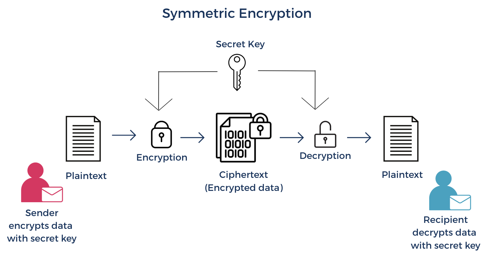
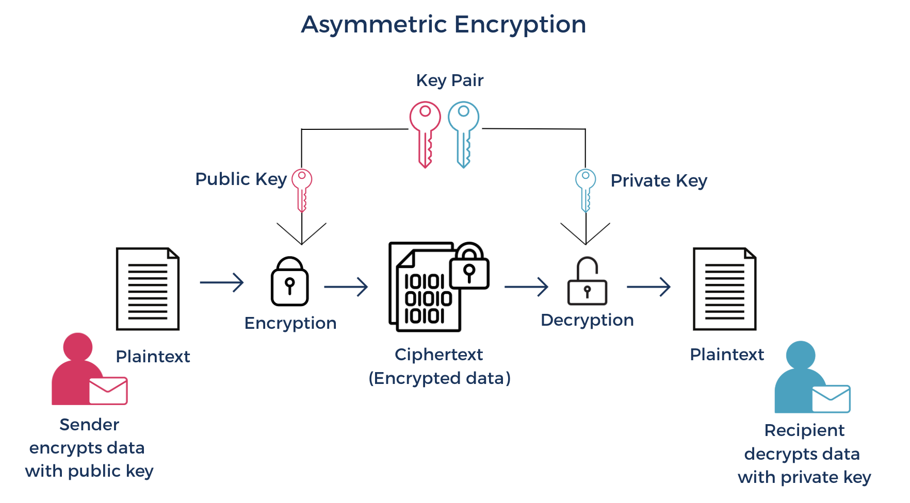

# Introduction to Encryption

## Learning Goals

- Explain what encryption is and describe why it is a critical component of a secure software system.
- Explain the difference between symmetric and asymmetric encryption and describe appropriate use cases for each.
- Describe how symmetric and asymmetric encryption are used together in practice.
- Explain what key management is and describe why it is a critical component of a secure encryption strategy.
- Describe the key lifecycle, including generation, storage, rotation, and revocation.

### What Is Encryption?

**Encryption** is the process of transforming data into an unreadable form using a mathematical algorithm and a key, so that it can only be read by a party that possesses the means to reverse that transformation. It is one of the most fundamental mechanisms used to protect sensitive information in computing, and it underpins a wide range of the security controls that modern software systems rely on, from securing network communications to protecting stored data to verifying the identity of servers and services.

Encryption does not prevent an attacker from accessing data. If an attacker gains access to an encrypted database or intercepts encrypted network traffic, they still have the data in their possession. What encryption ensures is that the data is unreadable and unusable without the corresponding key. This is what makes it such a critical security control: it provides protection even when other security measures, such as access controls or network boundaries, have been bypassed or compromised.

Before exploring how encryption works in practice, let's review the definitions for three key terms.

#### Key Terms

| Vocab | Definition | Synonyms | How to Use in a Sentence |
| --------- | --------- | -------- | --------- |
| Plaintext | Data in its original, unencrypted, readable form. Some examples of plaintext could be a database password stored as the string `correct-horse-battery-staple`, a credit card number, or the contents of a confidential document are all examples of plaintext. Plaintext does not have to be text in the literal sense: any data, including images, audio files, and binary data, can be plaintext if it has not been encrypted. | Unencrypted data | "The database password was stored as plaintext in the configuration file, making it immediately readable to anyone who gained access to that file." |
| Ciphertext | The output of an encryption process. A scrambled, unreadable representation of plaintext that can only be converted back into its original form by a principal that possesses the correct decryption key. | Encrypted data | "After the file was encrypted, it was stored as ciphertext in the database, ensuring it could not be read directly even if an attacker gained access to the storage layer." |
| Encryption key | A value used by an encryption or decryption algorithm to transform data. The same plaintext encrypted with two different keys produces two different ciphertext outputs. Without the correct key, decrypting ciphertext is computationally infeasible. | Key, Cryptographic key | "The application used an encryption key stored in the secrets management tool to encrypt sensitive user data before writing it to the database." |

### Symmetric Encryption

Encryption algorithms can be broadly divided into two categories based on how they use keys: symmetric encryption and asymmetric encryption. **Symmetric encryption** uses a single secret key to encrypt and decrypt data. It is the simpler of the two approaches and is widely used in modern software systems due to its computational efficiency, particularly when encrypting large volumes of data.

In symmetric encryption, a sender uses the key to transform plaintext into ciphertext, and the recipient uses the same key to transform the ciphertext back into plaintext. The security of symmetric encryption depends entirely on keeping the key secret: anyone who possesses the key can decrypt any data that was encrypted with it.

The process can be summarized as follows:
1. A shared key is generated and distributed to all parties that need to encrypt or decrypt data.
2. The sender uses the key and an encryption algorithm to transform plaintext into ciphertext.
3. The ciphertext is transmitted or stored.
4. The recipient uses the same key and the corresponding decryption algorithm to transform the ciphertext back into plaintext.

*Fig. Diagram representing how data gets encrypted and decrypted with symmetric encryption.*

Symmetric encryption is well suited to scenarios where large volumes of data need to be encrypted efficiently and where the parties involved can securely share a key in advance. Common use cases include:
- **Encrypting data at rest**: Databases, file systems, and storage volumes are commonly encrypted using symmetric encryption. The key is stored securely, often in a key management service, and used to encrypt and decrypt data as it is written to and read from storage.
- **Encrypting data in transit**: Protocols such as TLS use symmetric encryption to encrypt the bulk of data transmitted over a secure connection due to its efficiency.
- **Encrypting backups and archives**. Backup files and archives containing sensitive data are commonly encrypted with symmetric encryption to protect them at rest.

#### Strengths

- **Computational efficiency**: Symmetric encryption algorithms are significantly faster than asymmetric encryption algorithms, making them practical for encrypting large volumes of data.
- **Simplicity**: The use of a single key for both encryption and decryption makes symmetric encryption conceptually straightforward to implement and reason about.

#### Limitations

- **Key distribution**: Because the same key must be shared between all parties that need to encrypt or decrypt data, securely distributing that key is a challenge. If the key is intercepted during distribution, the security of all data encrypted with it is compromised. This is known as the key distribution problem and is one of the primary motivations for asymmetric encryption.
- **Key management at scale**: In a system with many services or users that need to communicate securely with each other, managing a unique symmetric key for each pair of communicating parties becomes operationally complex. If the same key is shared across many parties, a single compromised party exposes all data encrypted with that key.

### Asymmetric Encryption

**Asymmetric encryption** differs from symmetric encryption in one fundamental way: instead of using a single shared key for both encryption and decryption, it uses a pair of mathematically related keys. One key is used to encrypt data, and only the other key in the pair can decrypt it. This key pair relationship is what makes asymmetric encryption a powerful tool for securing communication between parties.

An asymmetric key pair consists of two keys: a **public key** and a **private key**. The two keys are mathematically related in such a way that data encrypted with one key can only be decrypted with the other. Despite this relationship, it is computationally infeasible to derive the private key from the public key, which is what makes the system secure. The public key, as its name suggests, can be shared openly without compromising security. It is made available to any party that needs to send encrypted data to the key pair's owner: a sender uses the recipient's public key to encrypt a message, ensuring that only the recipient, who holds the corresponding private key, can decrypt it. The private key must be kept secret by its owner and is never shared or transmitted. It is used to decrypt data that was encrypted with the corresponding public key.

#### Public Keys and Private Keys

The same key pair can be used for two distinct purposes: encrypting and decrypting messages, and creating and verifying digital signatures. These two uses serve different security goals and the keys are used in opposite directions depending on the purpose.

Encrypting and decrypting a message is concerned with confidentiality. The goal is to ensure that only the intended recipient can read a message. The sender encrypts the message using the recipient's public key. Since the recipient is the only party that holds the corresponding private key, only the recipient can decrypt and read the message. This answers the question: "Can anyone other than the intended recipient read this message?" A typical asymmetric encryption workflow for secure communication works as follows:

1. The recipient, Person B, generates an asymmetric key pair. The public key can be used by potential senders to encrypt data.
2. Person B shares their public key with the sender, Person A.
3. Person A uses Person B's public key to encrypt plaintext data and then the ciphertext is sent back to Person B.
4. Person B uses their private key to decrypt the ciphertext. Only Person B can decrypt it because only they hold the corresponding private key.

*Fig. Diagram representing how data gets encrypted and decrypted with asymmetric encryption.*

Digital signatures are concerned with authenticity and integrity. The goal is not to hide the content of a message but to prove that it was created by a specific party and has not been modified since it was signed. The process works in the opposite direction from encryption: the sender signs the message using their own private key, and anyone with access to the sender's public key can verify that signature. This answers two questions: "Did this message actually come from who it claims to be from?" and "Has this message been tampered with?" 

The key distinction between the two uses is:
- Encryption uses the recipient's public key to encrypt data. Only the recipient can decrypt the data with their private key.
- Digital signatures use the sender's private key to sign. Anyone can verify the signature with the sender's public key.

In practice, the two mechanisms are often used together. A message can be both signed and encrypted: the sender signs it with their own private key to prove authenticity, then encrypts it with the recipient's public key to ensure confidentiality. The recipient decrypts it with their private key, then verifies the signature with the sender's public key.

Common use cases for asymmetric encryption are:
- **Secure key exchange**: One of the most important applications of asymmetric encryption is establishing a shared symmetric key between two parties who have not previously communicated. Asymmetric encryption is used to securely exchange the symmetric key that will be used for encryption. This is how the key distribution problem described in the previous section is solved in practice.
- **Digital signatures**: As described above, asymmetric encryption is used to sign data in a way that allows the recipient to verify both the identity of the sender and the integrity of the data.
- **Authentication**: SSH keys use asymmetric encryption to authenticate access to remote systems. The public key is placed on the remote system and the private key is held by the connecting party. The remote system issues a cryptographic challenge that can only be answered by the holder of the corresponding private key.

#### Strengths

- **Solves the key distribution problem**: Because the public key can be shared openly, two parties can establish a secure communication channel without needing to exchange a secret key in advance. This makes asymmetric encryption practical for securing communication between parties that have never previously interacted.
- **Supports digital signatures**: The asymmetric key pair structure enables digital signatures, which provide both authentication and data integrity guarantees that symmetric encryption alone cannot provide.

#### Limitations

- **Computational cost**: Asymmetric encryption algorithms are significantly more computationally expensive than symmetric encryption algorithms. This makes asymmetric encryption impractical for encrypting large volumes of data directly.
- **Key management complexity**: Managing asymmetric key pairs, including generating, distributing, storing, and revoking them, is more complex than managing symmetric keys. 

### Comparing Symmetric and Asymmetric Encryption

Symmetric and asymmetric encryption are not competing approaches. They are complementary tools that address different problems, and understanding when to use each, and how they work together, is an important part of reasoning about encryption in practice. The most fundamental difference between the two approaches is how they use keys. Symmetric encryption uses a single shared key for both encryption and decryption. Asymmetric encryption uses a key pair, where one key encrypts and only the other can decrypt. This difference in key structure is what drives most of the other differences between the two approaches.

| Characteristic | Symmetric Encryption | Asymmetric Encryption | 
| --------- | --------- | --------- | 
| Keys used | Single shared key | Public and private key pair | 
| Speed | Fast | Slower | 
| Best suited for | Encrypting large volumes of data | Key exchange, authentication, digital signatures | 
| Primary limitation | Key distribution problem | Computational cost | 
| Common examples | Encrypting databases, file systems, backups | TLS handshake, SSH authentication, digital signatures | 

### Key Management

Encryption is only as secure as the keys used to perform it. A strong encryption algorithm provides no meaningful protection if the keys it relies on are generated poorly, stored insecurely, or never rotated or revoked. **Key management** is the set of practices and systems used to handle encryption keys securely throughout their entire lifecycle, from the moment they are created to the moment they are retired.

Key management encompasses every decision and process involved in handling encryption keys: how they are generated, where they are stored, who and what can access them, how long they remain valid, and how they are retired when they are no longer needed. Each of these decisions has direct security implications. Poor key management practices are a common source of encryption failures in real-world systems. An encryption key that is stored in plaintext alongside the data it encrypts provides no meaningful protection: an attacker who gains access to the storage layer has access to both the data and the key needed to decrypt it. A key that is never rotated accumulates the same risks as any other long-lived credential. A key that cannot be revoked when it is compromised leaves all data encrypted with it exposed indefinitely.

Encryption keys have a lifecycle that mirrors the lifecycle of other secrets covered in the previous lesson: they are created, used, and eventually retired. Managing that lifecycle deliberately and consistently is what separates a secure encryption strategy from one that only appears secure. The key lifecycle encompasses many stages from creation to retirement. The following outlines the most foundational stages to provide a conceptual understanding, but a complete key lifecycle involves additional steps that are beyond the scope of this lesson.

**Generation** is the process of creating a new encryption key. Keys must be generated using a cryptographically secure process that produces values that are sufficiently random and unpredictable. A key that is generated using a weak or predictable process is vulnerable to being guessed or reconstructed by an attacker, regardless of how strong the encryption algorithm itself is. Some common algorithms are AES/DES for symmetric encryption and RSA/DSA for asymmetric encryption.

**Storage** is where key management most commonly fails in practice. Encryption keys must be stored separately from the data they protect. A key stored in the same location as the encrypted data it secures provides no meaningful protection if that location is compromised. Keys should be stored in a dedicated, access-controlled system such as a key management service, where access is governed by IAM policies and all access events are logged.

**Rotation** is the process of replacing an existing key with a new one and re-encrypting any data that was protected by the old key. Key rotation limits the amount of data that is exposed if a key is compromised, and reduces the risk of a key being used long past the point where it should have been retired. The rotation practices described in the [Secret Management](./secret-management.md) lesson apply equally to encryption keys.

**Revocation** is the process of invalidating a key before the end of its intended lifecycle, typically in response to a known or suspected compromise. A revoked key should no longer be used to encrypt new data, and any data encrypted with it should be re-encrypted with a new key as soon as possible. The ability to revoke a key quickly and reliably is a critical capability in any key management system: the longer a compromised key remains in use, the greater the potential damage.

Managing encryption keys manually at scale is operationally complex and error-prone. Cloud platforms provide dedicated key management services that automate and centralize the key lifecycle processes described above. These services typically provide:
- **Secure key generation**: Keys are generated using cryptographically secure processes within the service, eliminating the risk of weak key generation in application code.
- **Encrypted key storage**: Keys are stored in a dedicated, secure environment that is isolated from the data they protect.
- **Access control**: Access to keys is governed by IAM policies, ensuring that only authorized principals and services can use a key to encrypt or decrypt data. This integrates directly with the IAM concepts covered in the first lesson of this topic.
- **Automated rotation**: Keys can be configured to rotate automatically on a defined schedule.
- **Audit logging**: Every use of a key is recorded, providing a clear audit trail of what data was encrypted or decrypted, by which principal, and when.

## Summary

Encryption is the process of transforming data into an unreadable form using a mathematical algorithm and a key, ensuring that data can only be read by a party that possesses the means to reverse that transformation. It is a foundational security control that provides protection even when other security measures have been bypassed or compromised. **Plaintext**, **ciphertext**, and **encryption keys** are the three core concepts that underpin how encryption works. Plaintext is data in its original readable form. Ciphertext is the unreadable output of the encryption process. Encryption keys are the values that drive the transformation between the two.

**Symmetric encryption** uses a single shared key for both encryption and decryption. It is computationally efficient and well suited to encrypting large volumes of data, but introduces the key distribution problem: the shared key must be securely exchanged between parties before encrypted communication can begin. **Asymmetric encryption** uses a mathematically related key pair, a public key and a private key, to separate the encryption and decryption operations. It solves the key distribution problem by allowing the public key to be shared openly, and supports additional capabilities such as digital signatures that provide authenticity and integrity guarantees. Its primary limitation is computational cost, which makes it impractical for encrypting large volumes of data directly. In practice, symmetric and asymmetric encryption are often used together, with each approach handling the tasks it is best suited for.

**Key management** is the set of practices and systems used to handle encryption keys securely throughout their lifecycle. The foundational stages of that lifecycle include generation, storage, rotation, and revocation, though a complete key lifecycle involves additional stages beyond the scope of this lesson. Poor key management is one of the most common sources of encryption failures in real-world systems: an encryption key that is generated weakly, stored insecurely, or never rotated or revoked undermines the protection that encryption is intended to provide. Cloud-based key management services support the key lifecycle by providing secure key generation and storage, access control through IAM policies, automated rotation, and audit logging.
Together, the concepts covered across these three lessons, identity and access management, secrets management, and encryption, form an interconnected foundation for thinking about how modern software systems protect access to resources and sensitive data. Each layer builds on the others: IAM defines who can access a system and under what conditions, secrets management governs how the credentials that prove identity are handled, and encryption ensures that data remains protected even when other controls are bypassed.

## Check for Understanding

### !challenge
<!-- Question 1 -->
* type: multiple-choice
* id: 4eda80b7-3e12-4ddb-992e-e9a7c25db07c
* title: Introduction to Encryption

##### !question
A developer stores an encryption key in the same database as the data it encrypts. Which of the following best describes the security risk this introduces?
##### !end-question

##### !options
a| There is no risk as long as the database itself is encrypted.
b| The risk is limited because encryption keys are unreadable without the correct algorithm.
c| If an attacker gains access to the database, they have access to both the encrypted data and the key needed to decrypt it, rendering the encryption ineffective.
d| The risk is limited to the encryption key itself and does not affect the encrypted data.

##### !end-options

##### !answer
c|
##### !end-answer

#### !explanation 
Storing an encryption key alongside the data it protects defeats the purpose of encryption: if an attacker gains access to the storage layer, they have everything they need to decrypt the data, making the encryption provide no meaningful protection.
#### !end-explanation 
### !end-challenge

<!-- Question 2 -->
### !challenge
* type: multiple-choice
* id: 003950c9-b73d-4b09-a97f-0f37fb4a2f9d
* title: Introduction to Encryption

##### !question
A system needs to send a confidential message from Person A to Person B using asymmetric encryption. Which key does Person A use to encrypt the message, and why?
##### !end-question

##### !options
a| Person B's public key, because only Person B holds the corresponding private key and can therefore decrypt the message.
b| Person A's public key, because public keys are designed for encryption.
c| Person A's private key, because only Person A should be able to encrypt messages they send.
d| Person B's private key, because the private key is the most secure key available.
##### !end-options

##### !answer
a|
##### !end-answer

#### !explanation 
In asymmetric encryption, a sender encrypts a message using the recipient's public key so that only the recipient, who holds the corresponding private key, can decrypt and read it. This ensures confidentiality without requiring the private key to ever be shared or transmitted.
#### !end-explanation 
### !end-challenge

<!-- Question # 3 -->
### !challenge
* type: multiple-choice
* id: 091ce488-d2c7-4a42-bdca-a5c06d023453
* title: Introduction to Encryption

##### !question
A team is designing a system that needs to encrypt large volumes of data efficiently, but also needs to securely establish an encrypted connection with a remote server it has never previously communicated with. Which of the following approaches best addresses both requirements?
##### !end-question

##### !options
a| Use asymmetric encryption for all data, since it supports both secure key exchange and bulk data encryption.
b| Use symmetric encryption for all data, since it is faster and more efficient than asymmetric encryption.
c| Use symmetric encryption to establish the connection and asymmetric encryption to encrypt the bulk of the data.
d| Use asymmetric encryption to securely establish a shared symmetric key, then use symmetric encryption to encrypt the bulk of the data.
##### !end-options

##### !answer
d|
##### !end-answer

#### !explanation 
Asymmetric encryption solves the key distribution problem by allowing a shared symmetric key to be established securely between two parties that have never previously communicated, and symmetric encryption handles the performance requirement of encrypting large volumes of data efficiently. Using each approach for the task it is best suited for combines the strengths of both.
#### !end-explanation 
### !end-challenge