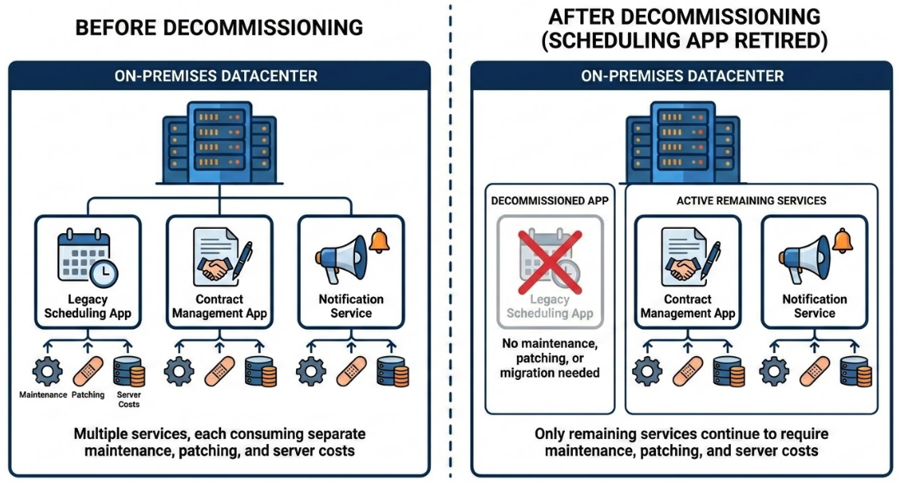
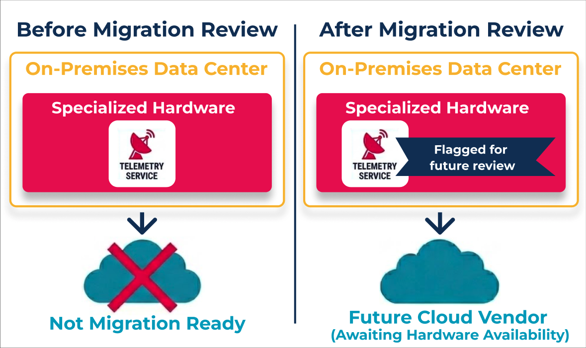
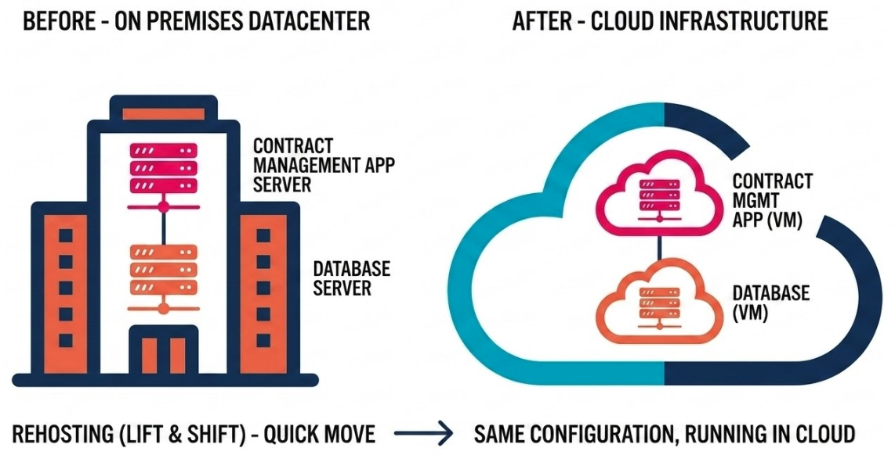
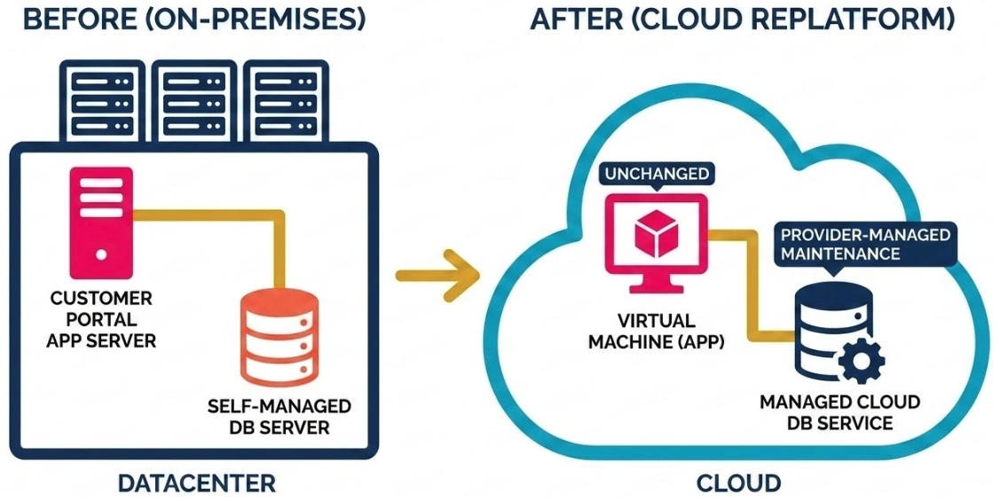
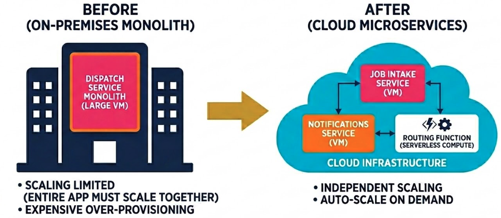
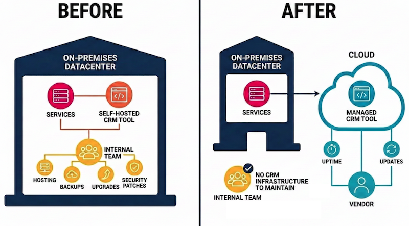

# Cloud Migration Strategies

## Learning Goals
- Identify each of the 7 Rs of migration and describe when each is appropriate.
- Explain the tradeoffs between lift-and-shift and re-architecture approaches across speed, cost, complexity, and long-term value.
- Describe why governance matters in cloud and hybrid environments and how the shared responsibility concept applies in this context.

## Vocabulary and Synonyms

| Vocab | Definition | Synonyms | How to Use in a Sentence |
| --------- | --------- | -------- | --------- |
| **Lift-and-shift** | Moving an application from on-premises to the cloud without making changes to the code or architecture | Rehost, migrate-as-is | "We used a lift-and-shift approach for the payroll system because we needed to be out of the data center by the end of the quarter." |
| **Re-architecture** | Redesigning an application to take advantage of cloud-native features, such as containers, managed services, or serverless compute | Refactor, cloud-native rewrite | "Re-architecting the API layer took three months, but it cut our infrastructure costs by half and made the service horizontally scalable." |
| **Legacy system** | An existing system built with older technologies or architectures that may be difficult to change, integrate with modern tooling, or migrate | Old system, technical debt | "Our billing service is a legacy system running on a 2011 OS version, it's a migration priority because the vendor stopped releasing patches." |
| **Cloud-Native** | An application designed to run in the cloud and take full advantage of cloud capabilities, typically emphasizing scalability, resilience, and automation. | Cloud-Optimized | "We built the order system as a cloud-native service with policies to auto-scale horizontally when traffic spikes around sales and holidays" |
| **Workload** | A unit of work running on a system, such as an application, service, database, or batch job | Application, service, system | "We mapped every workload to one of the 7 Rs before deciding which to migrate in the first phase." |
| **Migration readiness** | An assessment of how prepared an organization's systems, teams, and processes are to support a cloud migration | Migration assessment, cloud readiness | "Before committing to a timeline, our team ran a migration readiness assessment to identify which workloads had unresolved dependencies." |
| **Cloud governance** | The policies, controls, and processes that define how cloud resources can be used, provisioned, and secured within an organization | Cloud policy, cloud guardrails | "Without cloud governance in place, developers were spinning up resources in every region and the monthly bill was impossible to predict." |
| **Policy guardrail** | An automated rule or constraint that prevents cloud resources from being created or configured in ways that violate an organization's policies | Policy boundary, preventive control | "A policy guardrail prevented engineers from opening port 22 to the public internet, even if they tried to do it accidentally." |

## The 7 Rs of Migration

When an organization decides to move to the cloud, a common instinct is to treat migration as a single event: pick up everything on-premises and set it down in the cloud. That rarely works in practice. Organizations have dozens or hundreds of applications, each with different technical complexity, business value, and readiness for the cloud. 
- Some systems are worth investing in and modernizing, while others might be barely used and should be turned off. Other services may need to move quickly for business reasons, with improvements deferred to later.

The **7 Rs** are a framework for thinking through these complexities. Rather than treating every application the same, we assess each workload individually and assign it a migration strategy. The 7 Rs give us a shared vocabulary for those decisions and a way to communicate them clearly across technical and business teams. 

The 7 Rs are: 
- Retire
- Retain
- Rehost
- Replatform
- Refactor / Re-Architect
- Repurchase
- Relocate

### Lift-and-Shift vs. Re-Architecture

Before walking through each R, it helps to understand the two ends of the spectrum that most migration decisions fall on: lift-and-shift and re-architecture.

**Lift-and-shift** 

Lift-and-shift (also called Rehost) means picking up an application as-is and setting it down in a cloud environment. 
- Nothing about the code or architecture changes: the application runs on a cloud virtual machine the same way it ran on an on-premises server. 
- This is typically the fastest path, it requires less cloud expertise, carries a lower upfront cost than refactoring, and brings less risk of introducing new bugs. 

The tradeoff is that the application won't take advantage of cloud-native features like auto-scaling, managed databases, or serverless compute. It will likely cost more to run in the cloud than an equivalent application that was designed for the cloud.

**Re-architecture** 

Re-architecture (also called Refactor) means redesigning the application to take full advantage of what the cloud offers. 
- An application that was built as a monolith might be decomposed into microservices. 
- A database that was managed in-house might be replaced with a fully managed cloud equivalent. 

These changes can take significantly longer and require more resources, but they can transform how a system scales, how it recovers from failures, and what it costs to run at scale. Re-architecting delivers the most long-term value for high-traffic, business-critical applications.

Neither approach is universally correct, the right choice depends on the workload, the business constraints, and the team's capacity. Most real migration plans include both strategies applied to different workloads. Lift-and-shift handles the applications that need to move quickly or that don't justify significant investment. Re-architecture handles the systems where cloud-native investment will pay long-term dividends.

| | Lift-and-Shift (Rehost) | Re-Architecture (Refactor) |
|---|---|---|
| **Speed** | Fast (weeks to months) | Slow (months to years) |
| **Cost to migrate** | Low | High |
| **Long-term cloud costs** | Higher (not cloud-optimized) | Lower (optimized for cloud) |
| **Risk** | Lower | Higher |
| **Cloud-native benefits** | Low to None | Full |
| **Best for** | Speed or compliance pressure; applications that will be replaced soon | High-value, long-lived systems where cloud benefits justify the investment |

### 1. Retire

> **A Running Scenario: FieldOps Inc.**
>
> To make the 7 Rs concrete, we'll follow a fictional mid-sized company called FieldOps Inc. as we explore the 7 Rs. FieldOps provides field service management software to utility companies. They have 40+ workloads running across aging on-premises servers, a data center contract expiring in 18 months, and a leadership team that wants to move entirely to the cloud before renewal. Their CTO has just finished a portfolio assessment and is assigning each workload to a migration strategy.

The first question to ask of any workload is: does it still need to exist at all?

As organizations grow and evolve, applications accumulate. An internal tool built for a project that ended three years ago. A reporting dashboard that duplicates something a newer platform provides. A service kept running because no one has confirmed it's safe to turn off. These workloads don't deliver value, but they do carry cost in infrastructure, maintenance overhead, security surface area, and the cognitive burden of tracking systems that no one is responsible for.

Before investing time to migrate a workload, it's worth asking whether migration is the right decision. **Retiring** a workload removes it from the migration plan entirely and simplifies the resulting cloud environment.

Let's see how this applies to our example organization! At FieldOps Inc., the portfolio assessment turns up a legacy employee scheduling tool built in 2014. 
- When the team pulls access logs, they find it hasn't been used by anyone in 11 months. The company now uses a commercial HR platform that handles scheduling natively. 
- The CTO assigns this workload to be retired. The server is decommissioned, and the migration plan shrinks by one workload.

  
*Fig. Resources used before and after retiring an unused service. ([Full Size Image](assets/retire.png))*

### 2. Retain

Some workloads aren't ready to migrate, and that's a legitimate outcome of a migration assessment. Some systems have dependencies, constraints, or circumstances that make migration impractical *right now*.

A workload might depend on specialized hardware that has no cloud equivalent. It might be deeply integrated with other on-premises systems in ways that would make isolation too costly or risky right now. It might be scheduled for replacement within the next year, making migration a poor investment. Or the team simply may not have the bandwidth to migrate everything at once, and this workload doesn't justify reprioritizing other work.

**Retaining** a workload means keeping it on-premises intentionally, not indefinitely. This is not the same as ignoring the workload, it means acknowledging the constraints, documenting them, and scheduling a future reassessment rather than letting the workload quietly persist without a plan.

Over at FieldOps Inc., one of their workloads is a real-time telemetry processing service that ingests data from physical sensors on utility equipment. The service runs on bare-metal servers with specialized network interface cards that the cloud can't replicate.
- The vendor has a cloud-compatible version on their roadmap, but it won't be available for at least 12 months. 
- The CTO assigns this workload to be retained and schedules a migration readiness review for the following year.

  
*Fig. The plan for a hard to move service before and after review for migration readiness.*

### 3. Rehost (Lift and Shift)

As we saw earlier in this lesson, rehosting or "lifting and shifting" is the fastest migration path and the one that requires the least cloud expertise. 
- It's particularly appropriate when speed is the primary constraint: a regulatory deadline, a contract obligation, an expiring data center lease. 
- It's also a reasonable starting point when an organization wants to exit on-premises infrastructure quickly and is prepared to optimize once the application is in the cloud.

The tradeoffs are that a rehosted application likely:
- won't benefit from cloud-native features
- will cost more to run than an equivalent application designed for the cloud
- will carry the same architectural limitations it had on-premises

Let's check in with FieldOps Inc.. Their contract management application is a ten-year-old Java application that processes field service contracts. It works reliably, but it was designed as a single-instance application with no scaling logic. 
- The data center lease expires in 18 months, and redesigning the application isn't in the current budget. 
- The CTO assigns this workload to be rehosted. It will move to a cloud virtual machine as-is. Optimization is logged as future work.

  
*Fig. Rehosting an app and its database from on-prem to the cloud.*

### 4. Replatform (Lift, Tinker, and Shift)

Replatforming sits between rehosting and re-architecture; it takes more time than rehosting but less than a full re-architecture. We move the application to the cloud, but we make targeted improvements along the way to take meaningful advantage of cloud capabilities, without redesigning the application from scratch. 
- This can deliver meaningful reductions in operational overhead, particularly through managed services that eliminate the need to patch and maintain database servers or operating systems.

Common replatforming moves include switching from a self-managed database to a managed cloud database service, upgrading to a supported operating system version, or moving from a self-hosted application server to a platform-as-a-service environment. The core application logic stays the same; what changes is the infrastructure it runs on.

In our example comanpy FieldOps Inc., their customer portal uses a relational database that the operations team manages manually on-premises. During the migration planning, the engineering lead points out that the database server requires significant hands-on maintenance every time there's a version update, and the team has had two unplanned outages in the past year due to storage running out. 
- The CTO assigns the portal to be replatformed: the application moves to a cloud virtual machine, but the database is migrated to a managed cloud database service. 
- The application requires minor code changes for the new connection configuration, but no logic changes.

  
*Fig. Replatforming an app to the cloud and migrating to a vendor managed database.*

### 5. Refactor / Re-Architect

We saw earlier in the lesson that refactoring in this context means redesigning the application to take full advantage of cloud-native capabilities. Where rehosting and replatforming _treat the cloud as a better place to run the same application_, refactoring _treats the cloud as an opportunity to build a better application_.

This might mean:
- decomposing a monolith into microservices that can be scaled independently
- replacing a batch processing job with an event-driven architecture that processes records in real time
- containerizing services so they can be deployed and scaled through an orchestration platform
- adopting serverless compute for components with highly variable traffic patterns

Refactoring requires more time and resources than any other migration strategy. The engineering team needs to understand not just the existing system but also the cloud-native patterns that will replace it. The risk of introducing bugs or regressions is higher because the scope of change is larger.

The return on that investment, for the right workload, can be substantial. Applications that have been properly refactored for the cloud can scale to handle orders-of-magnitude more traffic, recover automatically from failures, and may cost significantly less to operate than their on-premises equivalents.

In our example company FieldOps Inc., their dispatch and routing service is the core of their product. It processes thousands of field job assignments per day, and on peak days (after a storm event, when utilities need emergency repairs across a wide area) it gets hit with ten times the normal volume. The current monolithic application can't scale fast enough for those spikes. 
- The CTO assigns it to be refactored. The team breaks the service into independently deployable components: job intake, routing logic, and notifications. 
- The routing component, the most compute-intensive, is moved to serverless compute that scales automatically with demand.

  
*Fig. Refactoring a monolithic app into cloud microservices and serverless compute functions.*

### 6. Repurchase (Drop and Shop)

Sometimes the most efficient way to move a workload to the cloud is to stop maintaining it and subscribe to a commercial alternative that already does what we need.

This is most common for general-purpose business software: CRM platforms, email systems, HR tools, accounting software, document management. If an organization is self-hosting a CRM on-premises, migrating that infrastructure to the cloud might require more effort than simply switching to a commercially hosted CRM that's maintained by a dedicated vendor and already runs in the cloud.

Repurchasing eliminates the migration problem by eliminating the workload. The infrastructure goes away, and responsibility for uptime, updates, and security patches shifts to the vendor. The tradeoffs are a loss of customization, potential complexity in migrating existing data to the new platform, and an ongoing subscription cost.

Let's look at how FieldOps Inc. handled migrating their CRM tool. Their sales team uses a self-hosted CRM that was originally chosen because it could be customized. Over the years, most of those customizations have been worked around using other tools, and the CRM runs on aging hardware that's going to need significant attention. 
- The sales team evaluates a commercial hosted CRM and finds it covers everything they need. 
- The CTO assigns the self-hosted CRM to be repurchased: the team migrates the customer data to the commercial platform and decommissions the on-premises CRM server.

  
*Fig. Purchasing a commercial vendor managed tool to replace a self-hosted on-prem tool.*

### 7. Relocate

Relocate is sometimes listed as optional in the 7Rs because it applies to a narrower set of scenarios than the other Rs. It's a specialized strategy for organizations that are already running virtualized workloads and want to move them to the cloud with minimal disruption. This generally requires compatible virtualization platforms on both ends.

Rather than copying an application and setting it up fresh in the cloud, relocation transfers virtual machine images directly between environments, keeping the same virtual infrastructure configuration. This approach is designed for speed and minimal reconfiguration. It's particularly useful when an organization uses the same virtualization platform in both their on-premises environment and the cloud environment they're migrating to. 
- No application code changes, no reconfiguration of the guest operating system — the VM moves and continues running!

At our example company FieldOps Inc., their infrastructure team manages a cluster of virtual machines running on a hypervisor platform that their cloud provider also supports. 
- Rather than setting up new cloud VMs and reinstalling each application, the team exports the VM images and imports them directly into the cloud environment. 
- The workloads come up running without any reconfiguration. The team estimates this saves three weeks compared to a traditional rehost approach.

### Choosing the Right Strategy

Migration strategies aren't mutually exclusive. A real migration plan will use several of them simultaneously across different workloads. The decision for each workload comes down to a few core questions:

- Is this workload still valuable? If not, **Retire** it.
- Is this workload ready to move at all? If not, **Retain** it.
- Does this workload need to move fast? If yes, **Rehost** or **Relocate**.
- Can we get meaningful operational wins with targeted improvements? If yes, **Replatform**.
- Is this a high-value, long-lived system where cloud-native investment pays off? If yes, **Refactor**.
- Does a better commercial product exist for this function? If yes, **Repurchase**.

For FieldOps Inc. a summary of their migration plan for the covered services looks like:
| R | Scenario | Outcome | 
| --------- | --------- | -------- |
| **Retire** | A self-hosted legacy employee scheduling tool has not been used for 11 months | The workload is retired, no migration is necessary. |
| **Retain** | A real-time telemetry processing service runs on physical infrastructure that the cloud can't replicate yet | The workload is retained and a migration readiness review is scheduled for the following year.|
| **Rehost** | A ten-year-old Java contract management application needs to move before the data center lease expires, but a redesign isn't in the budget. | The application moves to a cloud virtual machine as-is, with optimization logged as future work. |
| **Replatform** | A customer portal's manually managed on-premises database has caused two unplanned outages in the past year due to high maintenance overhead. | The application moves to a cloud VM and the database is migrated to a managed cloud database service with only minor configuration changes. |
| **Refactor** | The core dispatch and routing service runs as a monolith that can't scale fast enough to handle ten times the normal volume during peak events. | The service is decomposed into independently deployable microservices, with the most compute-intensive component moved to auto-scaling serverless compute. |
| **Repurchase** | The sales team's self-hosted CRM runs on aging hardware and its original customizations have all been worked around using other tools. | Customer data is migrated to a commercial hosted CRM and the on-premises server is decommissioned. |
| **Relocate** | The infrastructure team runs VMs on a hypervisor platform that their cloud provider also supports, making direct image transfer possible. | VM images are exported and imported directly into the cloud environment. |

The goal when creating a migration plan is to make a deliberate decision for each workload rather than applying the same strategy across the board. Lift-and-shifting everything into the cloud and we pay cloud prices for on-premises thinking. Refactor everything and we run out of time and budget before we move anything. A thoughtful mix gets workloads moved efficiently while investing engineering effort where it delivers the most long-term value.

## Cloud Governance

As we previously discussed in the [Core Principles of Governance & Cost
](../governance-and-cost/principles-of-governance-and-cost.md), moving workloads to the cloud introduces something that on-premises environments rarely surfaced as an explicit concern: the ease of creating new infrastructure. In an on-premises environment, provisioning a new server requires physical hardware, a procurement process, and coordination with an operations team. The friction is natural. In the cloud, a developer with the right credentials can spin up a virtual machine, create a database, or open a network port in minutes, without anyone else knowing.

That speed is one of the cloud's greatest benefits. It's also one of its most significant risks if it isn't managed deliberately. **Cloud governance** is the set of policies, controls, and processes that define how cloud resources are allowed to be created, configured, and operated within an organization.

### Why Governance Matters

Without governance, cloud environments tend to drift. Teams create resources in unexpected regions. Test databases get left running and billed indefinitely. Security groups accumulate permissive rules as engineers debug problems and forget to tighten them afterward. None of these are malicious decisions; they're the natural result of moving fast in an environment where mistakes are easy to make and hard to detect.

The consequences aren't just operational: 
- A misconfigured storage bucket or database that's exposed to the public internet is a data security incident waiting to happen. 
- Uncontrolled resource creation makes cloud bills unpredictable and hard to attribute to specific teams or products. 

Without governance, it becomes difficult to answer basic questions like: "What's running?", "Who's responsible for it?", or "Is it compliant?".

Governance addresses this not by slowing teams down, but by encoding constraints into the environment itself. 
- A policy guardrail that prevents storage buckets from being created without encryption doesn't require engineers to remember the rule, it enforces the rule automatically at creation time. 
- A budget alert that triggers at 80% of a team's monthly cloud allocation doesn't require a finance review, it notifies the responsible team directly.

The goal isn't "compliance theater", it's about making safe behavior the default and making violations visible.

### Policy and Cost Control

Cloud governance typically covers two related areas: security policy and cost control.

**Security policies** defines what configurations are allowed. Examples include: 
- which regions workloads can be deployed to
- what ports may be opened on virtual machines
- whether storage must be encrypted
- what authentication mechanisms are required

These rules can be enforced through automated policy controls that prevent non-compliant resources from being created at all, rather than relying on humans to catch violations after the fact.

**Cost control** establishes budgets, alerts, and spending limits. This could look like:
- Teams or projects are assigned cloud budgets, then if spending approaches a threshold, alerts notify the responsible team. 
- Organizations configure hard limits that prevent resources from being created if they would breach the budget. 

Cost governance also includes tagging policies, which require all resources to be labeled with the team, project, and environment they belong to, so that spending can be attributed accurately.

### The Shared Responsibility Model and Migration

We've covered the shared responsibility model in previous lessons: it defines the boundary between what the cloud provider is responsible for and what our organization is responsible for. That model becomes particularly relevant during migration.

When we move a workload to the cloud, we hand off responsibility for the physical layer: the hardware, the data center, the power and cooling, and the hypervisor. But we don't hand off responsibility for how we configure what runs on top of it. Access policies, security group rules, encryption settings, database configurations, application secrets, all of that remains our responsibility.

The shift from on-premises to cloud doesn't reduce our security obligations. It changes what they look like. On-premises, we secured a physical perimeter: who could enter the data center, which cables were connected to which ports. In the cloud, we secure a configuration surface: who has permission to access which services, which network rules govern what traffic can flow. Governance frameworks are how we make those responsibilities concrete and enforce them consistently across every team that touches cloud resources.

### Why Governance Becomes More Important in Hybrid Environments

A fully on-premises environment is governed through physical and organizational controls: who has access to the data center, what change management processes exist, what the network perimeter looks like. Those controls, while sometimes slow, are inherently centralized.

A fully cloud environment can be governed through cloud-native policy tools: organization-level policies, role-based access controls, automated compliance checks.

A hybrid environment combines both, and that's where governance complexity compounds. Data flows across the boundary between on-premises and cloud systems. Access controls that were designed for one environment may not apply consistently in the other. Teams that work primarily in the cloud may not be familiar with on-premises constraints, and vice versa. Monitoring and visibility tools often don't span both environments by default, which means it's harder to detect misconfigurations or anomalous behavior that crosses the boundary.

This is why hybrid migrations require governance to be planned proactively rather than applied retroactively. Decisions about who owns what, how policy enforcement works across both environments, and how access is managed consistently need to be made before workloads start moving, not after problems surface in production.

## Summary

Every application in a migration portfolio has a different risk profile, business value, and readiness for the cloud, which is why the **7 Rs** exist as a decision framework rather than a single prescribed path. 
- some workloads are candidates to be switched off entirely
- others need to move quickly with no changes
- critical or long lived system are often worth the time and investment to be re-architected to enable cloud-native benefits

The decision for each workload sits on a spectrum between speed and optimization: moving fast keeps costs low and risk contained, while investing in cloud-native redesign pays off in lower long-term operating costs and greater scalability. A well-constructed migration plan assigns each workload a deliberate strategy based on its specific characteristics, rather than treating the entire portfolio the same way.

Once workloads land in the cloud, **governance** becomes the mechanism that keeps the environment coherent as it grows. The same speed that makes the cloud attractive also makes it easy for environments to sprawl in ways that are expensive to untangle later. 
- Automated policy controls prevent misconfigured resources from being created in the first place, rather than relying on engineers to catch problems manually. 
- Budget alerts and tagging requirements ensure spending stays attributable and predictable. 

The **shared responsibility model** means our teams retain ownership of how cloud resources are configured and secured, even as the provider takes on the physical infrastructure layer. **Governance** is how we make that ownership concrete across every team working in the environment.

## Check for Understanding

<!-- prettier-ignore-start -->
### !challenge
* type: multiple-choice
* id: aB3kR7mNpQ2xW9vLtY4dF6hJ8c
* title: Cloud Migration Strategies
##### !question

A logistics company needs to exit their data center lease in 60 days. Their inventory management system is tightly coupled to the database and hasn't been touched in five years. Engineering bandwidth is limited. Which migration approach is the most realistic given these constraints?

##### !end-question
##### !options

* Refactor the application into microservices before moving it to the cloud
* Rehost the application by moving it to cloud infrastructure without making changes
* Repurchase the application with a commercial SaaS alternative
* Retain the application on-premises until a better migration window opens

##### !end-options
##### !answer

* Rehost the application by moving it to cloud infrastructure without making changes

##### !end-answer
##### !explanation

When the primary constraint is time, rehost (lift-and-shift) is the appropriate strategy. It allows the team to meet the deadline by moving the application as-is without requiring code changes or re-architecture. Refactoring would take far longer than the available window, and retaining it on-premises defeats the purpose of exiting the data center.

##### !end-explanation
### !end-challenge
<!-- prettier-ignore-end -->

<!-- prettier-ignore-start -->
### !challenge
* type: multiple-choice
* id: hV6yD4fB0mZ2cN8wLsQ1pR5eT3
* title: Cloud Migration Strategies
##### !question

A company completes a major cloud migration and grants all engineers permissions to provision any cloud resource in any region. Three months later, the finance team reports the cloud bill has tripled and is impossible to break down by team or product. What is the most likely root cause?

##### !end-question
##### !options

* The migration strategy selected was too aggressive for the organization's size
* The cloud provider's pricing model changed unexpectedly after the migration
* Cloud governance policies were not established to control how resources are created and managed
* The organization failed to retire enough on-premises workloads before migrating

##### !end-options
##### !answer

* Cloud governance policies were not established to control how resources are created and managed

##### !end-answer
##### !explanation

Without governance controls in place, engineers can freely spin up resources across any region, making costs unpredictable and impossible to attribute. Governance policies define who can create resources, in which regions, and with what tagging requirements, all of which enable cost tracking and accountability. The tripling of costs and inability to attribute spending are classic symptoms of ungoverned cloud environments.

##### !end-explanation
### !end-challenge
<!-- prettier-ignore-end -->

<!-- prettier-ignore-start -->
### !challenge
* type: multiple-choice
* id: gC1xN6hT8eU3wF5yP0bA7mJ4oQ
* title: Cloud Migration Strategies
##### !question

A media company uses a self-hosted project management tool that required heavy customization when it was first deployed. Over time, those customizations were abandoned, and the team now uses the tool in its default configuration. A fully managed SaaS version of the tool exists and covers all current needs. Which migration strategy applies?

##### !end-question
##### !options

* Replatform by switching to a managed database to reduce the hosting overhead
* Refactor the tool to improve performance before moving it to the cloud
* Repurchase by migrating to the commercial hosted version and decommissioning the self-hosted instance
* Relocate by transferring the virtual machine image directly to cloud infrastructure

##### !end-options
##### !answer

* Repurchase by migrating to the commercial hosted version and decommissioning the self-hosted instance

##### !end-answer
##### !explanation

Repurchase makes sense when a commercial product already covers the organization's needs and the self-hosted version no longer provides unique value. Since the customizations are unused and a hosted SaaS alternative exists, switching to it eliminates infrastructure maintenance without losing functionality.

##### !end-explanation
### !end-challenge
<!-- prettier-ignore-end -->