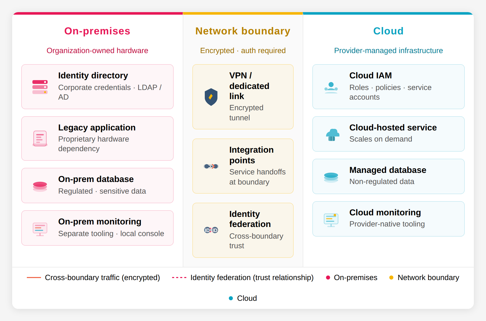

# Hybrid and Multi-Cloud Environments

## Learning Goals

- Distinguish between transitional hybrid environments and intentional long-term hybrid architectures.
- Explain why organizations adopt multi-cloud strategies and what tradeoffs come with them.
- Identify governance and operational challenges that arise when systems span multiple environments.

## Vocabulary and Synonyms

| Vocab | Definition | Synonyms | How to Use in a Sentence |
| --------- | --------- | -------- | --------- |
| **Multi-cloud** | A strategy in which an organization runs workloads across two or more cloud providers | , multi-cloud strategy, Polycloud | "We run our machine learning workloads on AWS and our analytics pipeline on Google Cloud; this multi-cloud environment lets us use the best tool for each job." |
| **Vendor lock-in** | The degree to which an organization's systems depend on a single provider's proprietary tools, making switching costly | Provider dependency | "Because we used the provider's proprietary event bus extensively, we hit significant vendor lock-in when we tried to move the service to a different cloud." |
| **Control plane** | The layer of infrastructure responsible for managing, configuring, and orchestrating systems (as opposed to the data plane, which handles actual traffic) | Management layer | "Losing access to the control plane didn't stop traffic from flowing, but it meant we couldn't push any configuration changes until access was restored." |
| **Federation** | The practice of linking separate identity systems so that a principal authenticated in one can be trusted by another | Identity federation, cross-domain trust | "We federated our on-premises Active Directory with the cloud identity provider so that engineers could log into cloud resources with their existing corporate credentials." |
| **Cost attribution** | The practice of tracking and assigning cloud costs to specific teams, services, or business units | Showback, chargeback | "Without cost attribution, it took us three months to realize that one team's overnight batch job was responsible for 40% of our cloud bill." |

## Hybrid Environments

In a hybrid environment, on-premises systems and cloud systems coexist and typically communicate across the boundary we covered in the hybrid networking lesson: VPN tunnels, dedicated connections, or managed transit gateways. 
- From a user perspective, the application may feel like a single system. 
- Behind the scenes, a single user action might touch services in multiple locations. 
  - A request might originate in the cloud, hit a service that runs on-premises, query a database that is also on-premises, and return a response assembled in the cloud!

When we covered cloud migration strategies in the previous lesson, we looked at how most migrations are incremental. Organizations rarely move everything at once; they move workload by workload, team by team. The period between "everything is on-premises" and "everything is in the cloud" is a hybrid environment, and it's a state most organizations spend significant time in. However, some organizations end up in a hybrid environment permanently, and by choice. 

### Transitional vs. long-term hybrid environments

The most important question to ask about any hybrid environment is: is this temporary, or is it intended to last?

**Transitional hybrid environments** exist because a migration is still in progress. Workloads remain on-premises not by design, but because they're next in the migration queue, waiting on a dependency to be resolved, or lower in priority than the systems that have already moved. The goal is full cloud adoption; the hybrid state is a phase.

In transitional environments, governance decisions can be made with an expiration date in mind. We invest in cross-environment monitoring and access management knowing those investments will be simplified once the remaining workloads migrate.

**Long-term hybrid environments** are intentional. The on-premises component is not a workload waiting to be migrated, it's a permanent part of the architecture. Some of the most common reasons organizations maintain long-term hybrid environments are:
- **Regulatory requirements.** Certain industries are governed by rules that specify where data must be stored and who must have physical access to it. Healthcare organizations, government agencies, and some financial services firms may be required to keep specific data on hardware they directly control—regardless of how capable cloud storage has become.
- **Specialized hardware.** Manufacturing control systems, scientific computing clusters, and certain types of real-time processing run on hardware that has no direct cloud equivalent. Moving those workloads is not a configuration exercise—it may be technically infeasible.
- **Economics.** For workloads with consistent, predictable demand and long expected lifespans, owning the hardware may genuinely be cheaper than paying cloud usage costs indefinitely.

A concrete example: a large hospital network uses cloud services for its patient scheduling system, analytics platform, and public-facing portals. But patient health records governed by strict regulatory requirements stay on-premises on infrastructure the organization controls directly. This is not a migration in progress, it is the intended architecture!

The distinction between temporary and long-term matters operationally. In a long-term hybrid environment, we need permanent solutions for cross-environment identity management, monitoring, and cost governance. We can't treat those as temporary scaffolding waiting to be removed.

  
*Fig. The boundaries between self-hosted and cloud infrastructure in a hybrid environment.*

## Multi-Cloud Environments

A **multi-cloud environment** is one in which an organization runs workloads across two or more separate cloud providers simultaneously within the same organization. Each provider hosts a different set of services or workloads, and the organization manages the relationships with multiple vendors.

Multi-cloud is distinct from hybrid environments, though both involve complexity that a single-cloud or fully on-premises setup does not. Where hybrid means mixing on-premises and cloud infrastructure, multi-cloud means mixing providers within the cloud. Many large organizations are doing both at the same time!

### Why organizations adopt multi-cloud

Multi-cloud adoption usually traces back to a combination of strategic intent and organizational reality.

**Provider specialization.** 

Different cloud providers have genuinely different strengths. An organization running large-scale machine learning workloads might find one provider's GPU infrastructure and managed ML tooling significantly more capable than another's. The same organization might rely on a different provider for enterprise identity management because its existing corporate identity systems integrate more cleanly there. Rather than forcing all workloads onto a single provider's tooling, multi-cloud allows teams to use the best available tool for each job.

**Avoiding vendor lock-in.** 

Organizations that have built deeply on a single provider's proprietary services sometimes find that switching is more expensive than they anticipated. Proprietary API formats, native data storage systems, data transfer costs, and tight integrations with managed services all create migration friction. Distributing workloads across providers is one way to preserve optionality: no single provider holds the entire relationship.

**Regulatory distribution.** 

Some organizations operate in regions or industries where no single provider can meet all regulatory requirements. A financial services firm might need to satisfy data residency requirements across multiple countries, and different providers may be the approved choice in different jurisdictions. 

**Resilience.** 

A provider-level outage, while rare, affects every workload running on that provider. Organizations that can tolerate no single failure point across their entire infrastructure sometimes distribute critical workloads across providers so that a failure in one doesn't bring down everything.

**Acquisition and merger history.** 

Multi-cloud environments can be an artifact of organizational history rather than a planned architecture. For example, a team might choose a particular cloud vendor, then their organization acquires a company who was using a different cloud vendor. The new org brings its systems and cloud infrastructure along, and the overall system now has multiple cloud relationships to manage.

### Operational tradeoffs

The advantages of a multi-cloud strategy come with corresponding costs.

**Increased operational complexity.** 

Each provider has different APIs, different tooling, different deployment mechanisms, different networking models, and different pricing structures. Teams that operate across multiple providers need to maintain fluency, and often separate tooling, for each system. A runbook that works for deploying to one provider will not necessarily transfer to another.

**Harder to achieve consistency.** 

Security policies, tagging conventions, network configurations, and access models need to be defined and enforced independently across each provider. What is a policy attached to an IAM role in one provider could be a different configuration object with different syntax in another. Maintaining consistent policy enforcement across providers requires deliberate investment.

**Data transfer costs.** 

Moving data between cloud providers is not free, and the costs can be significant. An architecture where services in different providers communicate frequently or share large datasets may incur data egress fees that erode the cost benefits of using the better-suited provider.

**Reduced negotiating leverage.** 

Concentrating spend with a single provider often unlocks enterprise discount agreements and committed use pricing. Splitting spend across multiple providers may reduce access to those arrangements.

## Operational & Governance Implications
Identity and access challenges
Observability complexity
Cost visibility
Increased failure surface area

## Summary

## Check for Understanding
What is a primary challenge of hybrid systems?
What increases as environments become more distributed?

Written Reflection Discussion question in class:
Describe what new operational risks could appear when a company operates in both on-prem and cloud environments?