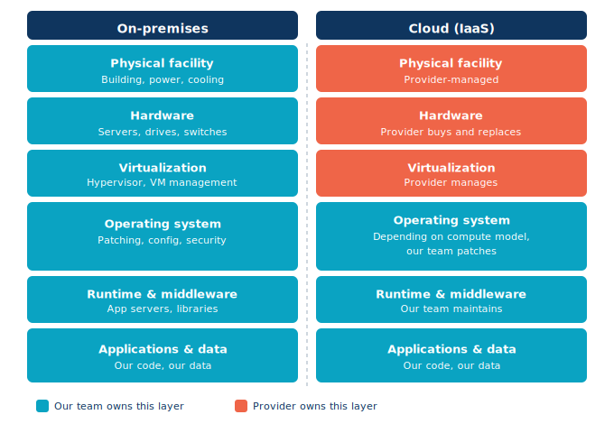

# Introduction to Cloud Migration

## Learning Goals
- Describe the difference between on-premises and cloud environments.
- Describe what cloud migration is and motivations for companies to move to hybrid or cloud environments.

## Vocabulary and Synonyms

| Vocab | Definition | Synonyms | How to Use in a Sentence |
| --------- | --------- | -------- | --------- |
| **On-premises (on-prem)** | Infrastructure that an organization owns and operates on its own physical hardware, in a location it controls | Self-hosted, locally hosted | "The payment service is still on-premises, we haven't moved it to the cloud yet because of a hardware dependency we haven't resolved." |
| **Cloud migration** | The process of moving an organization's applications, data, and infrastructure from an on-premises environment into a cloud environment | Cloud adoption, cloud transition | "Our cloud migration took eight months, mostly because we had to rearchitect the database layer before it could run in the new environment." |
| **Hybrid environment** | A setup where some systems run on-premises and others run in the cloud | Hybrid cloud, mixed environment | "We're currently in a hybrid environment; our analytics stack is fully in the cloud, but the transaction database is still on-prem." |
| **Capital expenditure (CapEx)** | A large, upfront purchase of a physical or long-term asset that is owned and depreciates over time | Capital investment, upfront cost | "Buying servers for our data center was a significant CapEx commitment that locked us into a three-year depreciation schedule." |
| **Operational expenditure (OpEx)** | Ongoing costs for running systems or services, typically billed by usage | Operating cost, recurring cost | "Moving to cloud storage converted our storage infrastructure from a CapEx purchase into a monthly OpEx expense that scales with usage." |
| **Hardware refresh cycle** | The recurring process of replacing aging physical infrastructure when it reaches end-of-life | Hardware lifecycle, hardware replacement | "We accelerated our migration timeline specifically to exit the upcoming hardware refresh cycle and avoid a costly server procurement." |
| **End-of-life (EOL)** | The point at which a vendor stops providing security patches, support, or replacement parts for hardware or software | Sunset, deprecated, end-of-support | "Our database server hit end-of-life last year, which means we're no longer receiving security patches and are carrying unaddressed vulnerabilities." |

## On-premises vs Cloud Infrastructure

Throughout the previous topics, we've been mostly looking at cloud environments: investigating compute types, configuring virtual networks, exploring release pipelines, and how these various components scale. Many organizations aren't starting from scratch when looking at cloud infrastructure, they already have systems running somewhere. Before we can talk about how organizations move *to* the cloud, it's worth being precise about what they're moving *from*.

As we've touched on previously, **On-premises infrastructure** means that an organization owns and operates its own physical hardware (servers, storage, and networking equipment) in a location it controls. 
- This could be a private data center, a co-location facility, or even a server room in an office. 
 
Everything we've worked with in the cloud has a physical equivalent here: the instances we provision are physical servers, the block volumes are physical drives, the VPC is a physical network with physical switches and firewalls. The key difference is that in an on-premises model, the organization is responsible for every layer of that stack, including the building's power and cooling, the hardware, the operating systems, and everything running on top.

When we've looked at IaaS, we've already seen the contrast: a cloud provider takes responsibility for the physical layers and hands us a virtual machine. In an on-premises environment, our organization is the cloud provider. Teams buy the hardware, rack it, configure it, patch it, and eventually replace it when it ages out.

*Fig. The differences in operational responsibility between on-premises and Cloud infrastructures*

The diagram above shows how operational responsibility is distributed across the two models. Notice that the line where our team's responsibility begins is lower in the cloud than on-premises. 
- When we've updated an OS, configured a security group, or designed a database schema, we have been operating in the layers our team still owns in both models. 
- What the cloud removes is the physical infrastructure underlying the OS.

### Scaling

Scaling looks very different between the two models. Cloud scaling is a software-level decision, often automated in response to real-time demand signals. We talked about horizontal auto-scaling and vertical scaling strategies in the compute unit; the same mechanics that feel like configuration in the cloud would be a procurement project on-premises.

In an on-premises environment, scaling out means ordering physical servers. They must be shipped, installed, and configured before a single new instance can serve traffic, a process that can take weeks or months. There's also no equivalent to "scale to zero" on-premises when traffic severely dips. Idle hardware still costs money in power, cooling, and space even when nothing is running on it.

### Ownership

Ownership works differently between these models too. Physical hardware is purchased outright as a large, upfront capital expense. That investment depreciates over time and must eventually be replaced, on a hardware refresh cycle that typically runs three to five years, regardless of whether the organization's compute needs have changed. 

Cloud resources are an ongoing operational expense, billed by usage. This shift from capital expenses to operational expenses is a significant business decision that organizations weighing migration plans need to evaluate.

## What Is Cloud Migration?

Cloud migration is the process of moving an organization's existing applications, data, and infrastructure from an on-premises environment into a cloud environment. It can also refer to moving between cloud providers, though the on-premises-to-cloud transition is the focus here.

The word "moving" requires careful interpretation in this context. 
- Some applications can be picked up and placed in a cloud environment with minimal changes. 
- Others depend on specific hardware configurations, operating system versions, or network topologies that don't have direct equivalents in a cloud provider's environment.

The latter requires rework before those services can run in the cloud. The degree of change required, and the cost and risk that change introduces, is one of the central questions of any migration plan.

Every layer of a system we've studied so far has questions we need to answer to be able to migrate: 
- How will networking be configured? 
- How will data be stored and accessed? 
- What deployment pipeline will govern releases in the new environment? 
- How will observability be maintained during and after the move? 

Migration surfaces all of these architectural decisions and more at the same time. The answer to these questions in the cloud environment may differ from how they were answered on-premises. That scope is why migrations are complex and why they take time.

The choice to migrate is both a business decision and a technical decision. It is never purely a technical exercise. Organizations migrate because they expect a business return: lower infrastructure costs, improved scalability, faster product delivery, or compliance with regulatory requirements. At the same time, the technical realities of existing systems determine what migration paths are achievable and at what cost. A **migration plan** is the document that reconciles business goals with technical constraints.

Most migrations are incremental rather than all-at-once. It is normal for organizations to operate in a **hybrid state** for extended periods: some systems in the cloud, others still on-premises, all connected through the VPN tunnels and dedicated connections we covered in the hybrid networking lesson. A hybrid state isn't a compromise or a failure; it's often the most responsible way to modernize while keeping critical systems running for users.

## Why Do Companies Migrate to the Cloud?

### Cost 

On-premises infrastructure involves substantial upfront hardware investment that must be refreshed on a fixed cycle. Cloud infrastructure shifts that cost to ongoing usage-based billing. For workloads with variable demand, this shift can be significant: rather than provisioning for peak load at all times, a cloud environment can scale to meet demand and scale back when traffic drops. This directly reduces cost in a way that idle on-premises hardware cannot.

### Scalability

Cloud scaling strategies like horizontal auto-scaling, vertical resizing, and scale-to-zero for serverless workloads are configuration and policy decisions. In the previous section we mentioned that on-prem equivalents require physical hardware to be procured and installed ahead of demand, which means organizations must forecast capacity months or years in advance. Forecasting inaccurately leads to either over-provisioning (wasted spend) or under-provisioning (degraded performance under load). Cloud scaling turns what was a capital planning problem into a configuration problem.

### Speed of delivery 

Cloud providers offer managed services that abstract away infrastructure our teams would otherwise have to stand up and maintain. Every managed service we've touched on in this curriculum is an example of something an on-premises team would have had to provision and operate themselves. Reducing that operational overhead allows engineering teams to shift more time and focus to building and shipping software.

### End-of-life hardware

Hardware has a finite supported lifespan. When a vendor stops releasing security patches for a server OS or a storage appliance, an organization faces a choice:
- replace the hardware (another large capital investment) 
- run outdated and potentially vulnerable systems
- migrate to the cloud and exit the hardware refresh cycle entirely. 

End-of-life events are a fairly common occurrence that can influence teams taking on or accelerating migration timelines.

### Compliance and geographic expansion

Cloud providers operate data centers globally across many regions. Organizations with data residency requirements (obligations to store and process data within specific geographic boundaries) can meet those requirements through cloud region selection without building physical infrastructure in those locations.

We've encountered regions and availability zones as reliability and latency concepts; for organizations with compliance obligations or plans to serve users in new markets, they also function as compliance infrastructure!

## Summary

Running our own data center means owning the full stack: the building, the power, the cooling, and every piece of hardware inside it. That hardware demands large upfront investment, ages on a fixed timeline, and can't be cheaply right-sized when our needs change. The cloud shifts that responsibility boundary: a provider absorbs the physical layer and you inherit a virtual environment where capacity is a setting, not a purchase order. That difference in who owns what, and what it costs to change, is foundational to why migration conversations get started.

Choosing to migrate is a decision that lives at the intersection of business priorities and technical reality, and is rarely a clean, one-time cutover. There are many cases for migration:
- lower ongoing costs
- elastic capacity
- freedom from hardware refresh cycles
- the ability to serve users in new regions without building physical infrastructure

No matter the business reasons, organizations migrating to the cloud face the same underlying challenge: existing systems were designed around assumptions that don't always map cleanly to cloud environments. 

Some services transition smoothly; others require significant rework before they can run reliably in a new environment. Most organizations spend extended periods with some workloads in the cloud and others still running on-prem, connected across environments while teams work through the technical and organizational complexity of moving each service. A migration plan is what bridges that gap between where an organization wants to go and what its systems actually make possible.

## Check for Understanding

<!-- prettier-ignore-start -->
### !challenge
* type: multiple-choice
* id: 4Kw9mRxJ2pLsQ7nYbTcV3hZeA8
* title: Introduction to Cloud Migration
##### !question

A regional logistics company has been growing steadily, but their finance team keeps flagging that server procurement is eating into the capital budget every three years. Which cloud migration benefit most directly addresses this concern?

##### !end-question
##### !options

* Eliminating the need for a deployment pipeline
* Converting large, periodic hardware purchases into ongoing usage-based billing
* Automatically rewriting legacy applications to use microservices
* Removing the need for an in-house engineering team

##### !end-options
##### !answer

* Converting large, periodic hardware purchases into ongoing usage-based billing

##### !end-answer
##### !explanation

On-premises infrastructure requires large upfront capital expenditures (CapEx) that repeat on a hardware refresh cycle. Moving to the cloud shifts that cost to operational expenditure (OpEx), billed by usage. This can reduce the recurring capital budget pressure the finance team is experiencing.

##### !end-explanation
### !end-challenge
<!-- prettier-ignore-end -->

<!-- prettier-ignore-start -->
### !challenge
* type: multiple-choice
* id: 9dNv5FsY1oCmW6uHpXkL4bRtE2
* title: Introduction to Cloud Migration
##### !question

After a healthcare company migrates its patient portal to the cloud, which of the following responsibilities is the company still expected to own?

##### !end-question
##### !options

* Maintaining the physical servers in the data center
* Managing power and cooling for the hosting facility
* Ensuring their application code and data are properly configured and secured
* Replacing failed hard drives in the underlying storage hardware

##### !end-options
##### !answer

* Ensuring their application code and data are properly configured and secured

##### !end-answer
##### !explanation

Cloud migration shifts physical infrastructure responsibility for buildings, power, cooling, and hardware, to the cloud provider. However, the organization retains responsibility for what runs on top of that infrastructure: their application code, data, access controls, and configuration. The cloud does not manage what you build on it.

##### !end-explanation
### !end-challenge
<!-- prettier-ignore-end -->

<!-- prettier-ignore-start -->
### !challenge
* type: multiple-choice
* id: 7gPz3QjM8wEsB5rDtUyN6iCxF1
* title: Introduction to Cloud Migration
##### !question

An e-commerce company wants to migrate to the cloud but discovers that its order management system was built around a custom hardware component that has no equivalent in any cloud provider's environment. What does this scenario best illustrate?

##### !end-question
##### !options

* That cloud migration is never the right choice for e-commerce businesses
* That technical constraints in existing systems can limit or delay migration paths
* That the company should immediately retire the order management system
* That cloud providers don't support e-commerce workloads

##### !end-options
##### !answer

* That technical constraints in existing systems can limit or delay migration paths

##### !end-answer
##### !explanation

Cloud migration is both a business and a technical decision. Existing systems are often built around assumptions like specific hardware configurations, OS versions, or network topologies that don't map cleanly to cloud environments. A hardware dependency with no cloud equivalent is exactly the kind of technical constraint that shapes what migration paths are achievable and at what cost.

##### !end-explanation
### !end-challenge
<!-- prettier-ignore-end -->
