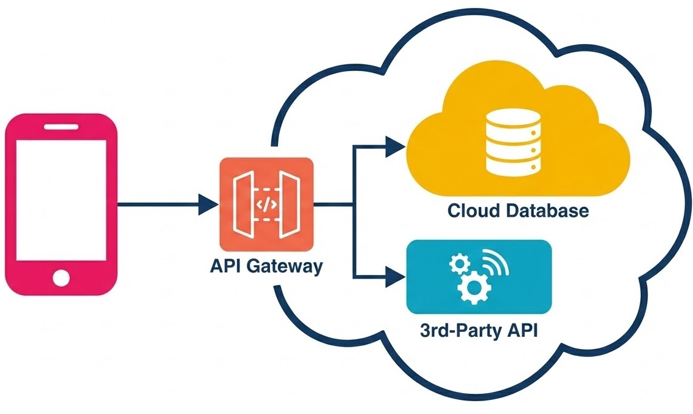
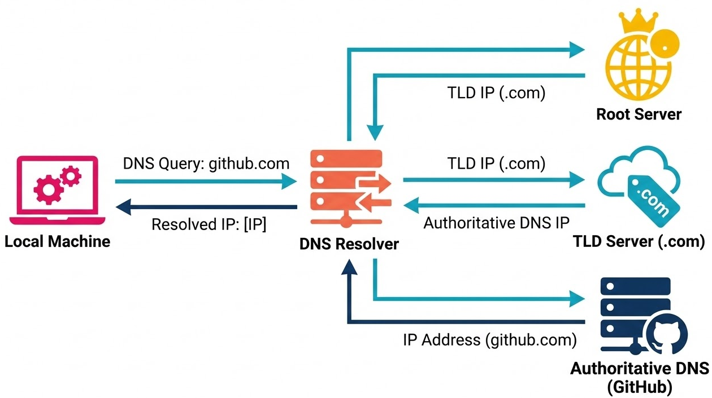
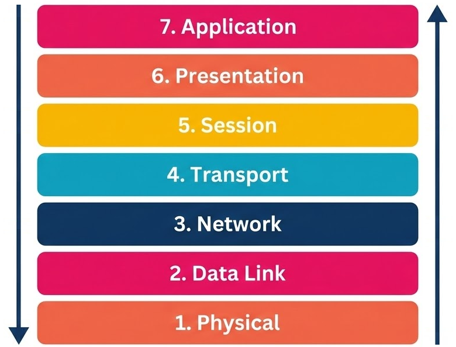

# Networking Basics

## Learning Goals

By the end of this lesson, you will be able to:

* Explain the fundamental purpose of computer networking in modern software architecture.
* Distinguish between **IP addresses**, **MAC addresses**, and **ports**, and describe how they facilitate communication.
* Identify the seven layers of the **OSI Model** and their specific roles.
* Categorize common network protocols and hardware (like routers and switches) within the appropriate OSI layers.

## Computer Networking, Capability via Connectivity

Think about the applications you tend use on your laptop or phone. How many of them continue to work if you disconnect from the internet? Probably not many. Modern applications rely heavily on networking to function. Networking enables distant components to work together, vastly expanding the capabilities of a piece of software beyond what a single machine can do.

At its core, **computer networking** is the practice of connecting computing devices so they can exchange data and share resources. In a modern full-stack environment, your application is rarely a single monolithic block. Applications rely on databases, web servers, and external APIs to provide their functionality to users. At its heart, most modern applications are a collection of services that must talk to each other.

  
*Fig. Mobile apps get most of their capabilities from networked resources.*

Without a robust network, these components can't share information. Networking allows us to ensure that a frontend hosted in one location can securely fetch data from a private database in another. By understanding these connections, we can build systems that are both functional and secure, while remaining efficient enough to handle high volumes of traffic.

## Addresses Ensure Data Reaches the Correct Destination

For any two devices to communicate, they must have a way to identify one another. The two most common identifiers in networking are **MAC addresses** and **IP addresses**.

### MAC Address (Media Access Control)

This is a unique hardware identifier built into a device's network interface card at the factory. It functions like a serial number specific to the physical hardware, and is primarily used to identify a device on a network of locally connected devices (like your home Wi-Fi).

A collection of locally connected devices is called a **Local Area Network (LAN)**. Within a LAN, devices use MAC addresses to communicate directly with each other. When a device wants to send data to another device on the same LAN, it uses the destination's MAC address to ensure the data reaches the correct hardware.

Traditionally, this has meant that a computer wanting to send a message to another computer on the same LAN would broadcast a message that included the destination's MAC address. All devices on the LAN would receive the message, but only the device with the matching MAC address would process it. This worked fine when there were only a few devices on the network, but as networks grew larger it became more likely that multiple devices would try to send messages at the same time, leading to **collisions**. We will discuss how modern switches help to avoid collisions later in this lesson, but the image of computers shouting to each other on a shared network is a useful one to understand the original purpose of MAC addresses.

There are standards that describe how MAC addresses are structured, and how vendors assign them.

MAC addresses are 48-bit identifiers. It's difficult for humans to work with a 48 digit number made of 1s and 0s, so for convenience, they are commonly written in a more compact format, for example: `00:1A:2B:3C:4D:5E`.

- Each digit we see in this example is a **hexadecimal** digit. While binary digits can be 0 or 1, and decimal digits go from 0 to 9, hexadecimal digits go from 0 to 9 and then continue with letters A to F, where A though F have the decimal values 10 through 15. Each hexadecimal digit represents 4 bits, so two hexadecimal digits (like `00`, `1A`, etc.) represent 8 bits, or one byte. Since a MAC address is 48 bits, it consists of 6 bytes, which is why we see 6 pairs of hexadecimal digits.
- The first three bytes (24 bits) are the OUI (Organizationally Unique Identifier) and identify the device vendor: `00:1A:2B`.
- The last three bytes (24 bits) are assigned by the vendor to identify the specific network interface: `3C:4D:5E`.

  
*Fig. Delivery of data on a LAN relies on MAC addresses.*

Historically, this is how addresses have been assigned. Note that two devices from different vendors cannot have the same MAC address since they would have different OUIs. However, two devices from the same vendor could have the same MAC address if the vendor does not assign unique identifiers to each device. 24 bits (the size of the vendor-assigned portion) allows for slightly over 16 million unique identifiers per vendor. However, if a vendor produces hundreds of millions of devices, they may run out of unique MAC addresses to assign. In practice, since MAC addresses are used only within a local network, this tends not to be a problem.

In our more privacy conscious world, some devices now support **MAC address randomization**, which allows them to use a different MAC address each time they connect to a network. This makes it more difficult to track a device across different networks, but it also means that the MAC address is no longer a permanent identifier for the device. Again, since MAC addresses are only used within a local network, it only needs to be unique relative to the other devices on that network. A computer joining a LAN can generate a random MAC address that is not currently in use on that LAN, and it will work just fine.

So with a MAC address, a device can identify itself and be identified by other devices on the same LAN. However, MAC addresses are not used to route data between different LANs. For that, we need IP addresses.

### IP Address (Internet Protocol)

IP Addresses are used to identify devices across different networks. The term "internet" comes from the idea of having interconnected networks (LANs) that can communicate with each other. An IP address is a logical identifier that allows devices to find each other across these interconnected networks.

Why can't we just use MAC addresses for this? Because MAC addresses are only unique within a local network. In fact, not all local networks are even required to use MAC addresses at all! Though largely historical, older networking technologies might have just assigned a number to each device on the network without using MAC addresses. Introducing a new identifier (IP address) that is used for routing between networks allows us to use whatever local addressing scheme we want within a LAN, and still have a universal way to identify devices across the entire internet.

  
*Fig. Delivery of data across the internet relies on IP addresses.*

#### IPv4, the Workhorse

The first stable version of the Internet Protocol, known as **IPv4**, was developed in the early 1980s. It uses a 32-bit address space. That is, a device address is represented by a number made from 32 bits (0s and 1s).

Similar to how MAC addresses are often written in a more human-friendly format, IPv4 addresses are commonly written in **dotted decimal notation**. This means that the 32 bits are divided into four groups of 8 bits (called octets), and each group is converted to its decimal representation. For example, the binary IP address `11000000 10101000 00000000 00000001` would be written as `192.168.0.1` in dotted decimal notation.

Note that this is smaller than the address space for MAC addresses, which was 48 bits. Though for any vendor, there were only 16 million unique MAC addresses. With 32 bits, there were about 4.3 billion unique IPv4 addresses. This seemed like more than enough at the time, but as the internet grew, we quickly ran out of unique IPv4 addresses to assign to individual devices! This problem is termed the **IPv4 address exhaustion problem**.

One way this problem has been mitigated is through the use of **Network Address Translation (NAT)**, which allows multiple devices on a local network to share a single public IPv4 address when accessing the internet. However, this is more of a workaround than a true solution.

The long-term solution to the IPv4 address exhaustion problem is **IPv6**!

#### IPv6, the Future

IPv6 was developed in the late 1990s to address the limitations of IPv4. It uses a much larger 128-bit address space, allowing for vastly more unique addresses. How many more? With 128 bits, there are approximately 3.4 x 10^38 (340 undecillion) unique IPv6 addresses. This is an astronomically large number, enough to assign a unique address to every grain of sand on Earth and still have plenty left over! Even that explanation doesn't do this number justice! Consider that in the observable universe, there are an estimated 10^24 stars. With IPv6, we could assign a unique address to every star in the observable universe and still have more than 10^14 addresses left over!

As IPv6 addresses are 4 times longer than IPv4 addresses, their human-friendly representations (while straining the definition of "human-friendly") also gets an update. Instead of being written in dotted decimal notation, IPv6 addresses are written more like MAC addresses, using groupings of 4 hexadecimal digits (called hextets, segments, or words) and colons, for example: `2001:0db8:85a3:0000:0000:8a2e:0370:7334`.

Currently, IPv4 and IPv6 coexist on the internet, and most devices and networks support both protocols. However, as IPv6 adoption continues to grow, we can expect to see a gradual transition away from IPv4 in the coming years.

Greater deployments of small devices (internet of things, or IoT) and the continued growth of the internet will make IPv6 increasingly important. For now, it's important to be aware of both protocols.

### Ports, Identifying Services

Closely related to IP addresses are **ports**. While an IP address gets you to the right "building" (the device), a port gets you to the right "apartment" (the specific service running on that device). A single device can run multiple services, each listening on a different port.

Many services have default ports that they commonly use. Some are internet standards, while others are just conventions that have become widely adopted.

Service | Default Port | Description
--- | --- | ---
HTTP (Hypertext Transfer Protocol) | 80 | Unencrypted web traffic
HTTPS (HTTP Secure) | 443 | Encrypted web traffic
SSH (Secure Shell) | 22 | Secure remote management
PostgreSQL (Database) | 5432 | Database communication

Ports are 16 bits long, which means there are 65,536 possible ports (numbered 0 to 65535). The first 1024 ports (0-1023) are known as "well-known ports" and are reserved for common services. Ports 1024-49151 are registered ports that can be used by applications, and ports 49152-65535 are dynamic or private ports that can be used for temporary purposes.

Why such strange ranges? It has to do with the structure of the bits that represent the port number.
- For well-known services, the high 6 bits are all 0s, which results in a port number between 0 and 1023. So all well-known ports have the form `00000000 00000000` to `00000011 11111111` in binary.
- For registered services, the high 2 bits must not both be 1s, the next 4 bits can be from `0001` to `1111`, and the last 10 bits can be anything. This means registered ports have the form `00000100 00000000` to `10111111 11111111` in binary, which corresponds to port numbers 1024 to 49151.
- For dynamic/private use, the high 2 bits must both be 1s, which means the port number is between 49152 and 65535. So dynamic/private ports have the form `11000000 00000000` to `11111111 11111111` in binary.

Thinking about the underlying bit structure of a value can help understand why strange numbers exist in networking and elsewhere in computer science. The cutoffs here might seem arbitrary from a human perspective, but they often have a logical basis in how the numbers are represented in binary.

The fact that ports higher than 1023 are not considered "well-known" can lead to confusion. While PostgreSQL almost _always_ uses port 5432, it's not reserved for PostgreSQL's use, and some other service could be configured to use that port instead.

MacOS Flask developers encountered this issue when Apple introduced the AirPlay Receiver service as part of MacOS. Flask development servers typically default to listen on port 5000, but Apple decided to use port 5000 for the AirPlay Receiver service. This results in a port conflict, requiring either the Flask development server to be configured to use a different port, or the AirPlay service to be disabled!

## DNS Maps Human-Friendly Names to Machine Addresses

Computers are great at using IP addresses to route data, but humans are not. We do much better with names. And especially before the widespread use of search engines, it was important for users to be able to remember the names of websites they wanted to visit.

For example, it's much easier for us to remember `github.com` than it is to remember its IP address. Although its address was `140.82.113.4` at the time this was written, this can change over time, as organizations make changes to their network infrastructure, or use techniques like load balancing that can cause the IP address associated with a domain name to change frequently.

The **Domain Name System (DNS)** was created to solve the problem of mapping human-friendly domain names to machine-friendly IP addresses. DNS is essentially a distributed database that allows users to access websites using easy-to-remember names instead of having to remember complex IP addresses.

When we type a URL into the browser, a DNS query is sent to a DNS server, which looks up the corresponding IP address for that domain name. The browser can then use that IP address to establish a connection to the web server hosting the website you want to visit.

The distributed nature refers to the fact that there are many DNS servers around the world, and they work together to provide this mapping service. When making a DNS query, it may be handled by multiple DNS servers before it reaches the one that has the information we need. This distributed architecture allows DNS to be highly scalable and resilient, ensuring that users can reliably access websites even if some DNS servers are down or experiencing issues.

  
*Fig. Getting the IP address of internet resources makes use of the Domain Name System (DNS).*

For example, in order to make a DNS request for the address of `github.com`, a DNS resolver (usually provided by our ISP) starts by asking a root DNS server where to get information about the `com` top level domain (TLD). It then asks the `com` server where to get information about `github.com`. It then asks the authoritative DNS for `github.com` for the IP address associated with that domain name. The authoritative DNS server for `github.com` responds with the IP address (or addresses) associated with that domain name, and the resolver can then return that information to the user's device.

## The OSI Model Standardizes How Data Moves Across a Network

The considerations involving network communication are complex, and become even more so when we understand that different network configurations may have different transmission characteristics. We've already seen that there are different types and parts of addresses (MAC, IP, ports) that are used for different communication purposes. Beyond the different types of addresses, there are also different protocols that govern how data is transmitted, how connections are established and maintained, how errors are handled, and so on.

To manage the complexity of networking, the industry uses the **Open Systems Interconnection (OSI) Model**. This seven-layer framework partitions network communication into logical steps.

### The Seven Layers of the Internet

| Layer (number) | Role & common protocols / hardware | Primary data unit |
| --- | --- | --- |
| **Application (Layer&nbsp;7)** | User-facing protocols and application logic — HTTP, FTP, SSH, DNS | Data |
| **Presentation (Layer&nbsp;6)** | Data format and encryption — TLS/SSL, compression, serialization | Data |
| **Session (Layer&nbsp;5)** | Session and connection management — setup/teardown, authentication context | Data |
| **Transport (Layer&nbsp;4)** | End-to-end delivery and multiplexing — TCP (reliable), UDP (low-latency) | Segment |
| **Network (Layer&nbsp;3)** | Routing between networks — IP addressing, routers, route tables | Packet |
| **Data Link (Layer&nbsp;2)** | Local delivery within a LAN — MAC addresses, switches, ARP | Frame |
| **Physical (Layer&nbsp;1)** | Physical media and signaling — cables, fiber, radio; raw bits on the wire | Bits |

Data is transformed as it moves down the layers on the sending device and is "unwrapped" as it moves up the layers on the receiving device.

But doesn't having so many layers just make communication even more complex? It's true that more layers tends to have more complexity than fewer layers. However, the layered approached lets us think about communication in a modular way. Each layer has a specific role and can be developed and improved independently of the others, as long as it adheres to the interfaces defined by the layers above and below it. This modularity allows for greater flexibility and innovation in networking technologies, while still maintaining a common framework for understanding how data moves across a network.

Sometimes the OSI model is taught with only 5 layers, where the Presentation and Session layers are combined into the Application layer. This is a simplification that can be useful as we are first getting used to thinking about layered network communication. But it's important to understand that these responsibilities are often handled by separate protocols and technologies, which is why the 7-layer model is more commonly used in industry.

  
*Fig. Layers of the OSI network stack.*

At its best, the OSI model lets us think about communication happening at one particular layer, without needing to worry about the details of how the other layers work. For example, when we think about how a web browser communicates with a web server, we can focus on the Application Layer (Layer 7) and the protocols that operate there (like HTTP), without needing to worry about how the data is physically transmitted over the network (Physical Layer, Layer 1) or how it is routed between different networks (Network Layer, Layer 3).

A particular point of interest about the network stack is that we see TCP and IP mentioned in different layers, even though we often see them written together as TCP/IP. TCP is a protocol that operates at the Transport Layer (Layer 4) and provides reliable, ordered delivery of data between applications. IP, on the other hand, operates at the Network Layer (Layer 3) and is responsible for routing packets of data between different networks based on their IP addresses. This separation allows for greater flexibility and modularity in networking, as different transport protocols (like UDP) can be used with the same underlying network protocol (IP).

The idea of ports is considered a Transport Layer (Layer 4) concept. When a packet arrives at a device, the Network Layer (Layer 3) looks at the destination IP address to determine which device should receive the packet. Once the packet reaches the correct device, the Transport Layer (Layer 4) looks at the destination port number to determine which application or service on that device should receive the data.

### Data is Wrapped in Layers of Headers

As data moves down the layers on the sending device, each layer adds its own header (and sometimes a footer) to the data. The headers contain information relevant to that layer's responsibilities. For example, the Network Layer (Layer 3) header will include the source and destination IP addresses, while the Transport Layer (Layer 4) header will include the source and destination port numbers.

  
*Fig. A simplified view of HTTP data being prepared for transmission. As the data from one layer moves down to the next, it gets wrapped in a header that contains information relevant to that layer. The headers are removed in reverse order as the data moves up the layers on the receiving device.*

When the data reaches the receiving device, it moves up the layers in reverse order. Each layer reads and processes its corresponding header, and then removes it before passing the remaining data up to the next layer. By the time the data reaches the Application Layer (Layer 7) on the receiving device, all of the headers have been removed, and the application can work with just the original data.

## Switches and Routers Direct Traffic Within and Between Networks

On a local network, devices need a way to reach all of the other devices on that network. In the early days of networking, this was often done using a shared medium where all devices would listen for messages and pick out the ones addressed to them. Originally, this could have been a thick cable with "vampire taps" that allowed a device to monitor the signals being carried. As networks migrated to use Ethernet cables, a simple component called a **hub** allowed multiple devices to be plugged into the same local network. All a hub did was repeat any messages received from one device to all other connected devices. However, as networks grew larger, this approach led to collisions and inefficiencies.

  
*Fig. A Switch is responsible for efficiently directing traffic within a local network.*

In the diagram of the local network from earlier in the lesson, we saw an additional box sitting between the three devices on the LAN. This box is a **switch**. Unlike a hub which simply echoes any data it receives, a switch operates at the Data Link Layer (Layer 2) and uses MAC addresses to forward data only to the intended recipient, rather than broadcasting it to all devices on the network. This allows for more efficient communication and reduces collisions.

When we want to connect different networks together (for example, connecting a home network to the internet), we use a **router**. The earlier diagram showing data being sent over the internet to a computer on another network included a router as a part of each LAN. A router is a device that operates at the Network Layer (Layer 3) and is responsible for routing packets of data between different networks based on their IP addresses.

The most basic routers typically distinguish between the local network, and everywhere else. They have a routing table that tells them to send any packets destined for the local network to the appropriate device on that network, and to send any packets destined for other networks to the next router along the path to the destination. To deliver a packet to a device on the local network, the router might just send the data to a switch on the local network. But many routers also have integrated switch functionality that allows them to directly connect to devices on the local network.

More complex routers might span multiple networks and have more complex routing tables that allow them to make more informed decisions about where to send packets. For example, a router in a data center might be connected to multiple internal networks, as well as the internet, and would need to have routing rules for all of those networks.

Routers also often have additional functionality beyond just routing packets. They might include features like firewall capabilities, network address translation (NAT), and support for virtual private networks (VPNs). This allows them to not only direct traffic, but also to provide security and privacy features for the networks they connect. Network Address Translation is especially important for allowing multiple devices on a local network to share a single public IPv4 address when accessing the internet, which is a common practice in home networks. If your local devices have IP addresses in a "private" range (like `192.168.x.x`), then your router is likely using NAT to allow those devices to access the internet through a single public IP address.

Consumer terminology can be a bit confusing when it comes to networking hardware.

The device provided by your internet service provider (ISP) is often called a "modem", but it is actually a combination of a modem and a router, and sometimes also includes switch functionality. It connects to the ISP's network using a modem (which converts signals from the ISP into digital data), and then provides routing and switching functionality for your home network.

Wireless routers, which are commonly used in home networks, also combine routing and switching functionality, and include a wireless access point that allows devices to connect to the network over Wi-Fi. They often have multiple Ethernet ports for wired connections as well.

## Summary

Networking is the foundation of modern software engineering. By assigning **MAC addresses** to hardware, **IP addresses** to locations, and **ports** to specific services, we create a network landscape where data can be directed to the right place.

The **Domain Name System (DNS)** adds a layer of human-friendliness by mapping memorable domain names to IP addresses.

The **OSI Model** provides a structured way to understand how data moves across a network, with each layer responsible for specific aspects of communication.

**Switches** and **routers** play crucial roles in directing traffic within and between networks, ensuring that data reaches its intended destination efficiently and securely.

By understanding these concepts, we can design and troubleshoot complex networked applications with confidence, knowing that we have a clear map of how data flows through the interconnected network systems.

## Check for Understanding

<!-- >>>>>>>>>>>>>>>>>>>>>> BEGIN CHALLENGE >>>>>>>>>>>>>>>>>>>>>> -->

### !challenge

* type: ordering
* id: 00d00509-a96b-4335-9ffb-33e54656f4b1
* title: Networking Basics

##### !question

Reorder the following definitions to match the order of the terms:

1. MAC Address
1. IP Address
1. Port

##### !end-question

##### !answer

1. A permanent hardware ID unique to a specific network card.
1. A logical address used for routing across different networks.
1. A specific "apartment" on a server assigned to a service like a database.

##### !end-answer

### !end-challenge

<!-- ======================= END CHALLENGE ======================= -->

<!-- >>>>>>>>>>>>>>>>>>>>>> BEGIN CHALLENGE >>>>>>>>>>>>>>>>>>>>>> -->

### !challenge

* type: ordering
* id: 84489c24-13de-45a6-aeff-7d6e15e716e6
* title: Networking Basics

##### !question

Put the following OSI layers in order from the closest to the user (top) to the closest to the wire (bottom):

##### !end-question

##### !answer

1. Application
1. Presentation
1. Session
1. Transport
1. Network
1. Data Link
1. Physical

##### !end-answer

### !end-challenge

<!-- ======================= END CHALLENGE ======================= -->

<!-- >>>>>>>>>>>>>>>>>>>>>> BEGIN CHALLENGE >>>>>>>>>>>>>>>>>>>>>> -->

### !challenge

* type: checkbox
* id: 2c5674fa-d5f5-48d4-b274-eb91b01f73fc
* title: Networking Basics

##### !question

Which of the following protocols operate at the Application Layer (Layer 7)?

##### !end-question

##### !options

a| HTTP
b| TCP
c| SSH
d| SSL
e| IP

##### !end-options

##### !answer

a|
c|

##### !end-answer

##### !explanation
- HTTP (Hypertext Transfer Protocol) is an Application Layer protocol used for transmitting hypermedia documents, such as web pages. It is the foundation of data communication on the World Wide Web.
- TCP (Transmission Control Protocol) operates at the Transport Layer (Layer 4) and is responsible for providing reliable, ordered delivery of data between applications.
- SSH (Secure Shell) is an Application Layer protocol used for secure remote login and other secure network services over an unsecured network.
- SSL (Secure Sockets Layer) operates at the Presentation Layer (Layer 6) and is responsible for encrypting data to provide secure communication over a network.
- IP (Internet Protocol) operates at the Network Layer (Layer 3) and is responsible for routing packets of data between different networks based on their IP addresses.
##### !end-explanation

### !end-challenge

<!-- ======================= END CHALLENGE ======================= -->

<!-- >>>>>>>>>>>>>>>>>>>>>> BEGIN CHALLENGE >>>>>>>>>>>>>>>>>>>>>> -->

### !challenge

* type: multiple-choice
* id: 7bb062d4-d0ff-4faa-b859-a772604a526b
* title: Networking Basics

##### !question

A Router is primarily responsible for which of the following tasks?

##### !end-question

##### !options

a| Assigning MAC addresses to new laptops.
b| Managing SSL encryption for a website.
c| Determining the path for packets between different networks using IP addresses.
d| Converting bits into electrical signals on a physical cable.

##### !end-options

##### !answer

c|

##### !end-answer

##### !explanation
Routers operate at the Network Layer (Layer 3) of the OSI model and are responsible for routing packets of data between different networks based on their IP addresses. They use routing tables to determine the best path for forwarding packets to their destination.
- *Assigning MAC addresses* is incorrect because assigning MAC addresses is typically done by the device's network interface card (NIC) and is not the responsibility of a router.
- *Managing SSL encryption* is incorrect because managing SSL encryption is typically handled at the Presentation Layer (Layer 6) and is not the primary function of a router.
- *Converting bits into electrical signals* is incorrect because converting bits into electrical signals on a physical cable is the responsibility of the Physical Layer (Layer 1) and is not the primary function of a router.
##### !end-explanation

### !end-challenge

<!-- ======================= END CHALLENGE ======================= -->